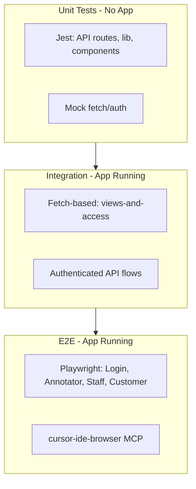

# Extensive Testing Plan for Running App

## Current State

- **Jest** (unit/API/component): 23 test files, mocks for fetch/auth. Run via `npm test`. No app required.
- **Integration** (`[__tests__/integration/views-and-access.e2e.test.ts](__tests__/integration/views-and-access.e2e.test.ts)`): Fetch-based, targets `BASE_URL` (default `http://localhost:3007`). Skips when app not running. Only 3 tests (login 200, / redirect, /api/sources 401).
- **CI** (`[.github/workflows/ci.yml](.github/workflows/ci.yml)`): Python-only (db_check, pytest). No Jest or Node app.
- **App** (`[app/](app/)`): Next.js 16, login at `/login`, annotator at `/`, customer at `/customer`, staff pipeline at `/staff/pipeline`. Auth via JWT cookie `annotator_session`. Credentials in `[lib/auth.ts](lib/auth.ts)` (`USER_CREDENTIALS`).

## Architecture

---

## Phase 1: Playwright E2E Setup

### 1.1 Install and Configure Playwright

- Add `@playwright/test` to devDependencies.
- Create `playwright.config.ts`:
  - `baseURL: process.env.BASE_URL || 'http://localhost:3007'`
  - `webServer`: `command: 'npm run dev:test'`, `url: baseURL`, `reuseExistingServer: !process.env.CI`
  - `timeout: 15000`, `retries: 1`
- Add scripts: `test:e2e`, `test:e2e:ui`, `test:e2e:headed`.

### 1.2 Auth Helper and Fixtures

- Create `e2e/fixtures/auth.ts`:
  - `loginAs(user: 'staff'|'annotator'|'customer')` — POST to `/api/login`, store cookies in `storageState`.
  - Use `USER_CREDENTIALS` from env or hardcoded fallback (`123123`).
- Create `e2e/fixtures/annotator.ts` extending base test with `storageState` for each role.

### 1.3 E2E Specs

| File                         | Scope                                                                                                                                   |
| ---------------------------- | --------------------------------------------------------------------------------------------------------------------------------------- |
| `e2e/login.spec.ts`          | Unauthenticated: / redirects to /login; login form submits; invalid creds show error; valid staff/annotator/customer redirect correctly |
| `e2e/annotator-flow.spec.ts` | Login as annotator → load sources → select db-1 → load queries → click query → save → verify sync success                               |
| `e2e/staff-flow.spec.ts`     | Login as staff (admin) → /staff/pipeline loads → tasks by phase; login as annotator → /staff/pipeline redirects                         |
| `e2e/customer-flow.spec.ts`  | Login as customer → /customer loads → tasks table, charts, export CSV/JSON links work                                                   |
| `e2e/api-access.spec.ts`     | Unauthenticated: /api/sources 401, /api/queries 401; customer: /api/export 200; annotator: /api/export 403                              |

---

## Phase 2: Expand Integration Tests (Fetch-Based)

### 2.1 Authenticated Flows

- Add `__tests__/integration/authenticated-flows.e2e.test.ts`:
  - Helper: `loginAndGetCookies(user)` — POST form to `/api/login`, return `Set-Cookie` header.
  - Tests: GET `/api/sources` with cookie → 200; GET `/api/queries?source=db-1` → 200; GET `/api/export?source=db-1&format=json` as customer → 200, as annotator → 403.
- Use `undici` or native `fetch` with `credentials: 'include'` and manual cookie handling (or `node-fetch` with `redirect: 'manual'` and cookie jar).

### 2.2 Test Lifecycle Script

- Create `scripts/test-app-running.sh`:
  - Start `npm run dev:test` in background (port 3007).
  - Wait for health (curl `BASE_URL/login` until 200).
  - Run `npm run test:integration` and `npm run test:e2e`.
  - Kill dev server on exit (trap).
- Add `test:app` npm script that runs this.

---

## Phase 3: Mock/Stub Strategy and Full Build

### 3.1 Current Mocks

- API tests: `jest.mock('@/lib/auth')`, `jest.mock('@/lib/data')`, `jest.mock('fs')`.
- Component tests: `global.fetch = jest.fn()`.

### 3.2 MSW (Optional Enhancement)

- Consider `msw` for API mocking in component tests to avoid per-test `mockFetch` setup.
- Not required for Phase 1–2; add only if test maintenance becomes costly.

### 3.3 Full Build Verification

- Ensure `npm run test:build` (build-succeeds) and `npm run test` pass.
- Add `test:all` script: `npm run test && npm run test:quality`.

---

## Phase 4: Cursor Rules Updates

### 4.1 New Rule: `testing-app-running.mdc`

Create `[.cursor/rules/testing-app-running.mdc](.cursor/rules/testing-app-running.mdc)`:

- **When to run app**: Integration and E2E tests require `npm run dev:test` (port 3007).
- **Commands**: `npm run test:integration`, `npm run test:e2e`, `npm run test:app`.
- **Playwright**: Use `e2e/*.spec.ts`; run with `--project=chromium` for speed.
- **Debugging**: Use `test:e2e:ui` or `test:e2e:headed`; leverage cursor-ide-browser MCP for live inspection.
- **Auth**: Credentials `staff`/`annotator`/`customer` = `123123` (from `lib/auth.ts`).

### 4.2 Update `qa-workflow-cursor.mdc`

- Add **Test Suites** subsection:
  - Jest (unit): `npm test`
  - Integration (app running): `npm run dev:test` then `npm run test:integration`
  - E2E (Playwright): `npm run test:e2e` (starts app automatically)
  - Full app test: `npm run test:app`
- Add **Debugging Tests**:
  - Use `cursor-ide-browser` MCP: `browser_navigate`, `browser_snapshot`, `browser_click` to reproduce failures.
  - Playwright trace: `npx playwright show-trace trace.zip` after `trace: 'on-first-retry'`.

---

## Phase 5: Specialized Skill and Advanced Cursor Features

### 5.1 Skill: Debug Test Failures

Create `[.cursor/skills/debug-test-failures/SKILL.md](.cursor/skills/debug-test-failures/SKILL.md)`:

- **Trigger**: User reports test failure or asks to debug a failing test.
- **Steps**:
  1. Run the failing test with `--verbose` or `--no-cache`.
  2. Parse error (AssertionError, timeout, 404, etc.).
  3. If E2E: run `test:e2e:headed` for the specific spec; use browser MCP to inspect DOM/network.
  4. If integration: verify app is running; check BASE_URL; add `console.log` or increase timeout.
  5. Propose fix (assertion, selector, mock, or code change).
  6. Re-run test to verify.

### 5.2 Advanced Cursor Usage

- **@-references**: `@__tests__/`, `@e2e/`, `@.cursor/rules/testing-app-running.mdc` when working on tests.
- **MCP cursor-ide-browser**: Use for live debugging when Playwright fails — navigate to URL, snapshot, click, type to reproduce.
- **Background Agent**: For large refactors (e.g., adding MSW), use Background Agent with plan.

---

## Phase 6: CI Integration 

- Add Jest to CI: `npm ci`, `npm test`, `npm run test:quality`.
- Add E2E job (optional, slower): Start app, run `npm run test:e2e` with `CI=true` (no UI, reuse server).

---

## File Summary

| File                                                    | Purpose                               |
| ------------------------------------------------------- | ------------------------------------- |
| `playwright.config.ts`                                  | Playwright config, webServer, baseURL |
| `e2e/fixtures/auth.ts`                                  | Login helper, storageState            |
| `e2e/login.spec.ts`                                     | Login flow E2E                        |
| `e2e/annotator-flow.spec.ts`                            | Annotator save flow                   |
| `e2e/staff-flow.spec.ts`                                | Staff pipeline, role redirect         |
| `e2e/customer-flow.spec.ts`                             | Customer portal, export               |
| `e2e/api-access.spec.ts`                                | API 401/403 by role                   |
| `__tests__/integration/authenticated-flows.e2e.test.ts` | Fetch-based auth API tests            |
| `scripts/test-app-running.sh`                           | Start app, run integration + E2E      |
| `.cursor/rules/testing-app-running.mdc`                 | New rule for app-running tests        |
| `.cursor/rules/qa-workflow-cursor.mdc`                  | Updated with test pyramid             |
| `.cursor/skills/debug-test-failures/SKILL.md`           | Debug test failures skill             |

---

## Dependencies

- `@playwright/test` (devDependency)
- No new runtime deps for integration (use native fetch + cookie handling)

---

## Execution Order

1. Phase 1: Playwright setup + E2E specs
2. Phase 2: Authenticated integration tests + lifecycle script
3. Phase 4: Cursor rules
4. Phase 5: Skill
5. Phase 3: Verify full build and mock coverage
6. Phase 6: CI

