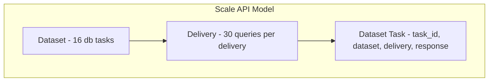

# Data Engine Platform: Tests, Scale Replication, Message Queue, OSS Integration

## Current State

- **Annotator**: [AnnotatorWorkbench](components/AnnotatorWorkbench.tsx) loads/saves via `/api/queries` and `/api/queries/sync`; [apps/annotator](apps/annotator/) is a Next.js app with same flows
- **Staff**: [scale_staff_fix_workflow.py](scripts/scale_staff_fix_workflow.py) replicates Accept/Fix/Reject; [TaskPipeline](components/TaskPipeline.tsx) shows task board
- **Customer**: [CustomerPortal](app/customer/CustomerPortal.tsx) loads tasks, export; Python annotator has Chart.js visualizations (Task Status, Audit Status, Completion)
- **Privileges**: [RoleGuard](components/RoleGuard.tsx), [lib/privileges.ts](lib/privileges.ts), [app/api/privileges/route.ts](app/api/privileges/route.ts)
- **Queue**: [lib/queue.ts](lib/queue.ts) — in-memory only; no Redis
- **Tests**: Jest at root; `testPathIgnorePatterns` excludes `apps/`; existing **[tests**/user-stories](__tests__/user-stories/), **[tests**/api](__tests__/api/), **[tests**/integration](__tests__/integration/)

## Scale AI Data Engine Model (from docs.genai.scale.com)

- **Dataset Task**: `{ task_id, dataset, delivery, response }` — individual unit
- **Endpoints**: `GET /v2/datasets/task?task_id=`, `GET /v2/datasets/delivery?delivery_id=`, `GET /v2/datasets/tasks` (search)
- **Pagination**: `next_token`, limit 100

## Phase 1: Jest Tests for Core Flows

### 1.1 Annotator Submission Tests

- **File**: `__tests__/flows/annotator-submit.test.ts`
- **Scope**: Mock `fetch` to `/api/queries` and `/api/queries/sync`; assert AnnotatorWorkbench calls sync with correct payload on save; assert 401 when unauthenticated
- **Reference**: [AnnotatorWorkbench](components/AnnotatorWorkbench.tsx) `handleSave` → POST `/api/queries/sync`

### 1.2 Staff Fix and Verify Tests

- **File**: `__tests__/flows/staff-fix-verify.test.ts`
- **Scope**: Mock staff fix API (update task with `audit_status=Fixed`); assert TaskPipeline or equivalent can load tasks, filter by audit status, and that staff-only paths return 403 for annotator
- **Reference**: [scale_staff_fix_workflow.py](scripts/scale_staff_fix_workflow.py), **[tests**/api/queries-sync-access.test.ts](__tests__/api/queries-sync-access.test.ts)

### 1.3 Customer View and Visualizations Tests

- **File**: `__tests__/flows/customer-view.test.ts`
- **Scope**: CustomerPortal loads `/api/queries?source=db-1`; assert tasks render; assert export URLs are correct; assert Chart.js or viz data structure (if using a lightweight viz lib in React)
- **Performance**: Add test that customer load completes within threshold (e.g. 2s) for 30 queries — use `jest.setTimeout` and mock fast responses

### 1.4 Query Validation Tests

- **File**: `__tests__/flows/query-validation.test.ts`
- **Scope**: Assert `queries.json` structure per db: 30 queries, required fields (`number`, `title`, `sql`, etc.); optionally call a validation API if one exists
- **Reference**: [source/db-1/app/QUERIES/queries.json](source/db-1/app/QUERIES/queries.json) structure

### 1.5 Privilege Enforcement Tests

- **File**: `__tests__/flows/privileges-enforcement.test.ts`
- **Scope**: Extend **[tests**/lib/privileges.test.ts](__tests__/lib/privileges.test.ts) and **[tests**/api/privileges-access.test.ts](__tests__/api/privileges-access.test.ts); add tests for:
  - Annotator blocked from `/customer`, `/api/export`
  - Customer allowed `/customer`, `/api/export`
  - Staff (admin mode) allowed all paths including `/admin/privileges`
- **Integration**: **[tests**/integration/views-and-access.e2e.test.ts](__tests__/integration/views-and-access.e2e.test.ts) — add authenticated flows with cookie/session mock

## Phase 2: Scale-Style Data Engine API

### 2.1 Dataset/Delivery/Task Model

- **New types**: `lib/scale-types.ts` — `DatasetTask`, `DatasetDelivery`, `Dataset` matching Scale schema
- **Mapping**: 1 Dataset = 1 db-N (db-1..db-16); 1 Delivery = 1 "delivery" of 30 queries; 1 Task = 1 query (question_id 1..30)

### 2.2 API Routes (Scale-compatible)

- `**app/api/v2/datasets/route.ts**`: `GET` — list datasets (db-1..db-16)
- `**app/api/v2/datasets/task/route.ts**`: `GET ?task_id=&dataset=` — single task by task_id
- `**app/api/v2/datasets/delivery/route.ts**`: `GET ?delivery_id=` — tasks in delivery (paginated, next_token)
- `**app/api/v2/datasets/tasks/route.ts**`: `GET ?dataset=&delivery=` — search tasks

**Data source**: Read from `source/db-N/app/QUERIES/queries.json` or `source/db-N/queries/queries.json`; map to `{ task_id, dataset, delivery, response }` where `response` holds query metadata + SQL.

### 2.3 Jest Tests for Scale API

- **File**: `__tests__/api/scale-datasets.test.ts`
- **Scope**: Mock filesystem or use `template`; assert GET returns correct structure; assert pagination with `next_token`

## Phase 3: Message Queue for Multi-Session

### 3.1 Extend lib/queue.ts

- **Current**: In-memory array, `push`/`pop`
- **Enhancement**:
  - Add `subscribe(type, callback)` for session-aware consumers (in-memory event emitter pattern)
  - When `REDIS_URL` set: use `ioredis` for Redis Streams or List; same `push`/`pop` interface
  - Message types: `task_assigned`, `task_updated`, `audit_complete`, `session_sync`

### 3.2 Integration Points

- **Annotator save**: `push('task_updated', { source, question_id, user })` — notify other sessions
- **Staff fix**: `push('audit_complete', { source, question_id, audit_status })`
- **API route**: `GET /api/queue/poll?since=` — optional SSE or long-poll for real-time updates (if needed)

### 3.3 Jest Tests for Queue

- **File**: `__tests__/lib/queue.test.ts`
- **Scope**: `push`/`pop` FIFO; `subscribe` receives messages; no Redis in tests (mock or skip when REDIS_URL unset)

## Phase 4: Customer View — Fast Visualizations

### 4.1 Current Gaps

- **Next.js CustomerPortal**: Loads tasks but no Chart.js visualizations (unlike Python CUSTOMER_HTML)
- **Performance**: 30 queries × 16 DBs = 480 tasks max; need fast load

### 4.2 Add Visualizations to CustomerPortal

- **Library**: Use `recharts` (React) or `chart.js` with `react-chartjs-2` — both Next.js compatible
- **Charts**: Task Status doughnut, Audit Status doughnut, Completion progress bar (match Python CUSTOMER_HTML)
- **Lazy load**: Load one source at a time; cache in client state

### 4.3 Performance Tests

- **File**: `__tests__/flows/customer-performance.test.ts`
- **Scope**: Mock `/api/queries` to return 30 items in &lt;100ms; assert CustomerPortal renders within 500ms (or configurable threshold)

## Phase 5: OSS Annotation Integration (awesome-open-data-annotation)

### 5.1 Recommended OSS Tools (from zenml-io/awesome-open-data-annotation)

| Use Case           | Tool                                                        | License  | Integration                                                                     |
| ------------------ | ----------------------------------------------------------- | -------- | ------------------------------------------------------------------------------- |
| Multi-modal / Text | [Label Studio](https://github.com/heartexlabs/label-studio) | Apache-2 | Already in repo: `label_studio_adapter.py`, `export_queries_to_label_studio.py` |
| Text               | [doccano](https://github.com/doccano/doccano)               | MIT      | Add optional export format for doccano                                          |
| Text               | [refinery](https://github.com/code-kern-ai/refinery)        | Apache-2 | Document as alternative for NLP labeling                                        |

### 5.2 Cannibalize / Adapt

- **Label Studio**: Already integrated; ensure `db_check label-studio` works with 16 DBs × 30 queries
- **Export formats**: Add `doccano` JSONL export in `/api/export?format=doccano` for text classification
- **Documentation**: Add `docs/OSS_ANNOTATION_TOOLS.md` — table of supported OSS tools (Label Studio, doccano) with setup links

### 5.3 Jest Tests for Export Formats

- **File**: `__tests__/api/export-formats.test.ts`
- **Scope**: Assert `format=json`, `format=csv`, `format=md` work; add `format=doccano` when implemented

## Phase 6: Jest Config and Test Infrastructure

### 6.1 Include apps/annotator in Jest (Optional)

- **Current**: `testPathIgnorePatterns` excludes `apps/`
- **Option A**: Keep root tests only; root app (`app/`) is the primary annotator
- **Option B**: Add `apps/annotator/__tests__` and configure Jest projects for multi-app testing
- **Recommendation**: Phase 1–5 use root `__tests__/`; apps/annotator mirrors root app, so root tests cover behavior. Add apps/annotator tests only if they diverge.

### 6.2 Playwright for E2E (Optional)

- **Next.js recommendation**: Use Playwright for E2E (see [Next.js testing docs](https://nextjs.org/docs/14/app/building-your-application/testing))
- **Scope**: Login → Annotator → Save; Login → Staff → Fix task; Login → Customer → View + Export
- **File**: `e2e/annotator-flow.spec.ts` (if Playwright added)

## File Summary

| File                                             | Purpose                         |
| ------------------------------------------------ | ------------------------------- |
| `__tests__/flows/annotator-submit.test.ts`       | Annotator save → sync API       |
| `__tests__/flows/staff-fix-verify.test.ts`       | Staff fix, audit status         |
| `__tests__/flows/customer-view.test.ts`          | Customer load, export, viz data |
| `__tests__/flows/customer-performance.test.ts`   | Load time threshold             |
| `__tests__/flows/query-validation.test.ts`       | queries.json structure          |
| `__tests__/flows/privileges-enforcement.test.ts` | Role-based access               |
| `__tests__/api/scale-datasets.test.ts`           | Scale-style API                 |
| `__tests__/lib/queue.test.ts`                    | Message queue                   |
| `lib/scale-types.ts`                             | Dataset/Delivery/Task types     |
| `app/api/v2/datasets/**`                         | Scale-compatible routes         |
| `lib/queue.ts`                                   | Extend with subscribe, Redis    |
| `app/customer/CustomerPortal.tsx`                | Add Recharts/Chart.js           |
| `docs/OSS_ANNOTATION_TOOLS.md`                   | OSS tools doc                   |

## Dependencies

- `recharts` or `react-chartjs-2` + `chart.js` for CustomerPortal
- `ioredis` (optional) for Redis queue backend

## Execution Order

1. Phase 1 (Jest tests) — immediate value, no API changes
2. Phase 2 (Scale API) — enables external integrations
3. Phase 3 (Queue) — enables multi-session
4. Phase 4 (Customer viz) — UX improvement
5. Phase 5 (OSS) — doccano export, docs
6. Phase 6 (Config) — as needed
7. Phase 7 (Testing) - to ensure it works and use test /source/db-1 to test out if it works. 

