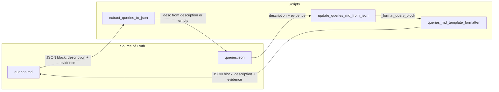

# Description/Evidence Fix Plan (TDD + BDD)

## Context

- **Problem**: `description` and `evidence` in `queries.json` are identical or overlapping (violates `.cursor/rules/query-abstraction-requirement.mdc`).
- **Root cause**: ae341aa restructured source and re-ran extraction; `extract_queries_to_json.py` falls back to `evidence` when `description` is missing; `queries_md_template_formatter.py` does not output `description` in JSON blocks.
- **User choices**: Scope=all db-1..16; Restore=git from 38ce1cd; Template=add description to JSON block; Extraction=empty string when description missing.

---

## Phase 1: TDD — Write Failing Tests First

### 1.1 Unit test: description and evidence must be distinct

**File**: [tests/test_description_evidence_distinct.py](tests/test_description_evidence_distinct.py) (new)

```python
def test_queries_json_description_evidence_distinct():
    """TDD: No query may have description == evidence (or evidence starting with description)."""
    for db_num in range(1, 17):
        qj = SOURCE / f"db-{db_num}" / "queries" / "queries.json"
        if not qj.exists():
            qj = SOURCE / f"db-{db_num}" / "app" / "QUERIES" / "queries.json"
        if not qj.exists():
            continue
        data = json.loads(qj.read_text())
        for q in data.get("queries", []):
            desc = (q.get("description") or "").strip()
            ev = (q.get("evidence") or "").strip()
            assert desc != ev, f"db-{db_num} query {q.get('number')}: description == evidence"
            assert not (ev.startswith(desc) and len(desc) > 50), f"db-{db_num} query {q.get('number')}: evidence overlaps description"
```

### 1.2 Unit test: extraction does not use evidence as description fallback

**File**: [tests/test_extract_queries_description.py](tests/test_extract_queries_description.py) (new)

```python
def test_extract_queries_missing_description_uses_empty_not_evidence():
    """TDD: When JSON block has no description, extraction sets description='' not evidence."""
    # Create temp queries.md with JSON block: evidence="Technical...", no description
    # Run extract_queries() -> assert entry["description"] != entry["evidence"]
```

### 1.3 Unit test: formatter outputs description in JSON block

**File**: Extend [tests/test_queries_md_compile_tdd_bdd.py](tests/test_queries_md_compile_tdd_bdd.py)

```python
def test_format_query_block_includes_description_when_present():
    """TDD: _format_query_block outputs description in JSON when q has both."""
    q = {"number": 1, "description": "Context.", "evidence": "Technical.", "SQL": "SELECT 1", ...}
    block = _format_query_block(q, "db-1", bit_by_bit=True)
    obj = json.loads(re.search(r"

```json\n(.*?)

```", block, re.DOTALL).group(1))
    assert "description" in obj
    assert obj["description"] == "Context."
    assert obj["evidence"] == "Technical."
```

### 1.4 BDD scenario: round-trip preserves description/evidence

**File**: [tests/features/queries_md_compile.feature](tests/features/queries_md_compile.feature)

Add scenario:

```gherkin
Scenario: Description and evidence remain distinct after round-trip
  Given queries.json has distinct description and evidence for query 1
  When update_queries_md_from_json runs for db-1
  And extract_queries_to_json runs for db-1
  Then queries.json still has distinct description and evidence for query 1
```

---

## Phase 2: Script Fixes (Red-Green-Refactor)

### 2.1 Fix extract_queries_to_json.py

**File**: [scripts/extract_queries_to_json.py](scripts/extract_queries_to_json.py)

**Change** (lines 88-90): When `description` is missing from JSON block, use empty string instead of evidence:

```python
# Before
desc = (obj.get("description") or evidence)[:500]

# After
desc = (obj.get("description") or "")[:500]  # Do not fallback to evidence
```

**Legacy format** (lines 72-74): Same logic for `**Evidence:`**-only sections — do not set `desc = evidence` when description is absent.

### 2.2 Fix queries_md_template_formatter.py

**File**: [scripts/queries_md_template_formatter.py](scripts/queries_md_template_formatter.py)

**Change 1** (line 56): In `_normalize_query`, when `bit_by_bit=True`, use `evidence` only; do not fallback to `description` for evidence:

```python
evidence = q.get("evidence", "") if bit_by_bit else q.get("evidence", q.get("description", ""))
# Keep as-is for bit_by_bit=False (backward compat); bit_by_bit=True already uses evidence only
```

**Change 2** (lines 126-147): In `_format_query_block`, add `description` to output JSON when present:

```python
out = {
    "db_id": nq["db_id"],
    "question_id": nq["question_id"],
    "question": nq["question"],
    "SQL": nq["SQL"],
    "evidence": nq["evidence"],
    "difficulty": nq["difficulty"],
    ...
}
if nq.get("description"):
    out["description"] = nq["description"]
```

**Change 3** (line 55): In `_normalize_query`, pass through `description` from `q`:

```python
# Add to normalization
description = q.get("description", "")
# Include in out dict when building
```

**Change 4** (lines 273-274): In `format_query_block_template`, do not set `evidence = description`:

```python
# Before
"evidence": description,

# After: pass both
"description": description,
"evidence": kwargs.get("evidence", description),  # or require evidence explicitly
```

### 2.3 Fix update_queries_md_from_json.py

**File**: [scripts/update_queries_md_from_json.py](scripts/update_queries_md_from_json.py)

No code change needed if `_format_query_block` is updated — it already uses `bit_by_bit=True` and passes the full `q` dict. Ensure `q` includes `description` from `queries.json`.

### 2.4 Update fix_description_evidence.py paths

**File**: [scripts/fix_description_evidence.py](scripts/fix_description_evidence.py)

**Change** (line 1282): Use `get_queries_dir` from db_paths to support both `queries/` and `app/QUERIES/`:

```python
from db_paths import SOURCE, get_queries_dir
# ...
for n in dbs:
    db_dir = SOURCE / f"db-{n}"
    qd = get_queries_dir(db_dir)
    src = qd / "queries.json"
    if not src.exists():
        continue
```

---

## Phase 3: Restore Metadata from 38ce1cd

### 3.1 Restore script (one-time)

**File**: [scripts/restore_queries_from_38ce1cd.py](scripts/restore_queries_from_38ce1cd.py) (new)

```python
#!/usr/bin/env python3
"""One-time restore of queries.json from 38ce1cd for db-1..16.
Source at 38ce1cd: source/db-N/app/QUERIES/queries.json
Target: source/db-N/queries/queries.json (current structure)
Updates source_file in JSON to new path."""
```

Logic:

1. For each db in 1..16, run `git show 38ce1cd:source/db-{n}/app/QUERIES/queries.json`
2. If not found, skip (some db may not have had app/QUERIES)
3. Parse JSON, set `source_file` to `source/db-{n}/queries/queries.md`
4. Write to `source/db-{n}/queries/queries.json`
5. Run `update_queries_md_from_json.py --db N` to propagate to queries.md (after formatter outputs description)

### 3.2 Execution order

1. Implement script fixes (2.1, 2.2, 2.4) so formatter outputs description
2. Run restore script
3. Run `update_queries_md_from_json.py --db 1` … `--db 16` to sync JSON → queries.md
4. Run `resync_client_db.py` to copy source → client

---

## Phase 4: Template and Schema Updates

### 4.1 Add description to template config

**File**: [template/template_config.yaml](template/template_config.yaml)

- Add `description` to `backward_compat_fields` (already present)
- Update `field_mappings` to not conflate: keep `description` and `evidence` as separate fields (remove or clarify `description: evidence` mapping if it implies equivalence)

### 4.2 Update queries_format_schema / qa_anchor

**File**: [template/qa_anchor.json](template/qa_anchor.json) (if it defines query block schema)

- Add `description` as optional field in query block schema

---

## Phase 5: BDD Acceptance and Integration

### 5.1 Run full test suite

```bash
.venv/bin/pytest tests/test_description_evidence_distinct.py tests/test_extract_queries_description.py tests/test_queries_md_compile_tdd_bdd.py -v
```

### 5.2 Run QA workflow

```bash
/QA -a
```

Ensure zero warnings (per qa-workflow-cursor.mdc).

---

## Data Flow (After Fix)




---

## Files to Modify


| File                                                                                       | Action                                                          |
| ------------------------------------------------------------------------------------------ | --------------------------------------------------------------- |
| [scripts/extract_queries_to_json.py](scripts/extract_queries_to_json.py)                   | Remove evidence fallback for description                        |
| [scripts/queries_md_template_formatter.py](scripts/queries_md_template_formatter.py)       | Add description to JSON output; fix format_query_block_template |
| [scripts/fix_description_evidence.py](scripts/fix_description_evidence.py)                 | Use get_queries_dir for path resolution                         |
| [template/template_config.yaml](template/template_config.yaml)                             | Clarify description/evidence as distinct                        |
| [tests/test_description_evidence_distinct.py](tests/test_description_evidence_distinct.py) | New                                                             |
| [tests/test_extract_queries_description.py](tests/test_extract_queries_description.py)     | New                                                             |
| [tests/test_queries_md_compile_tdd_bdd.py](tests/test_queries_md_compile_tdd_bdd.py)       | Add format test                                                 |
| [tests/features/queries_md_compile.feature](tests/features/queries_md_compile.feature)     | Add scenario                                                    |
| [scripts/restore_queries_from_38ce1cd.py](scripts/restore_queries_from_38ce1cd.py)         | New (one-time)                                                  |


---

## Execution Order

1. **TDD**: Add failing tests (Phase 1)
2. **Implement**: Script fixes (Phase 2)
3. **Restore**: Run restore script (Phase 3)
4. **Sync**: update_queries_md_from_json, resync_client_db
5. **Verify**: Tests pass, QA passes
