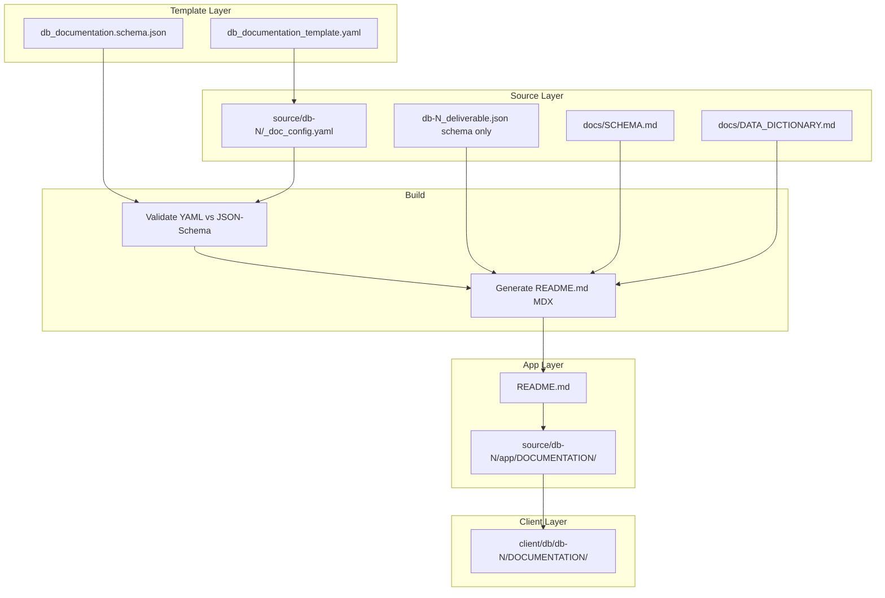

# DOCUMENTATION Workflow Fix

## Current State

- **DOCUMENTATION flow**: [populate_app_trifecta.py](scripts/populate_app_trifecta.py) copies `db-N_documentation.html`, `db-N_deliverable.json`, `db-N.md` from deliverable into `source/db-N/app/DOCUMENTATION/`
- **db-N.md** includes all 30 SQL queries (from [format.py](scripts/format.py) `generate_comprehensive_deliverable`)
- **resync_client_db.py** copies `app/DOCUMENTATION/` to `client/db/db-N/DOCUMENTATION/`
- **Existing template**: [template/_doc_config.yaml](template/_doc_config.yaml) has database, overview, schema, usage—but no installation guide or specs
- **No JSON schema** for documentation structure; [queries.schema.json](scripts/schemas/queries.schema.json) only covers queries

## Target Architecture

## Todo Milestones

| #   | Milestone                                                                            | Status  |
| --- | ------------------------------------------------------------------------------------ | ------- |
| 1   | Create `db_documentation.schema.json` (installation, specs, schema, data_dictionary) | Pending |
| 2   | Create `db_documentation_template.yaml` correlating to schema                        | Pending |
| 3   | Implement `generate_documentation_readme.py` with validation                         | Pending |
| 4   | Update `populate_app_trifecta.py` to generate/copy README.md, replace db-N.md        | Pending |
| 5   | Verify `resync_client_db.py` includes README.md in DOCUMENTATION                     | Pending |
| 6   | Update `db_check.py` compliance for DOCUMENTATION/README.md                          | Pending |
| 7   | End-to-end test: template → source → app → client                                    | Pending |

---

## Implementation Plan

### 1. Create JSON Schema for Documentation

**File**: [scripts/schemas/db_documentation.schema.json](scripts/schemas/db_documentation.schema.json)

Define schema for:

- `installation_guide`: steps (array of { title, description, commands? })
- `specifications`: requirements (PostgreSQL version, extensions, disk, etc.)
- `schema`: aligned with `db-N_deliverable.json` schema section (database.id, schema.tables)
- `data_dictionary`: column-level metadata (table, column, type, constraints, description)

Exclude `queries` entirely. Use JSON Schema draft 2020-12 (same as queries.schema.json).

### 2. Create YAML Template

**File**: [template/db_documentation_template.yaml](template/db_documentation_template.yaml)

Structure correlating to the JSON schema:

- `installation_guide`: template steps (placeholders for db-specific values)
- `specifications`: template for PostgreSQL version, extensions, etc.
- `schema`: reference to deliverable JSON schema section (no inline SQL)
- `data_dictionary`: reference to docs/DATA_DICTIONARY.md structure

Extend [template/_doc_config.yaml](template/_doc_config.yaml) or create a dedicated template. Each `source/db-N/` can have `_doc_config.yaml` that overrides template defaults.

### 3. README.md Generator Script

**File**: [scripts/generate_documentation_readme.py](scripts/generate_documentation_readme.py)

- **Inputs**: `_doc_config.yaml` (or template), `db-N_deliverable.json` (schema section only), `docs/SCHEMA.md`, `docs/DATA_DICTIONARY.md`
- **Output**: `README.md` in MDX-JS format (markdown compatible with MDX; optional JSX)
- **Content**: Installation guide, specifications, schema overview (from SCHEMA.md + deliverable), data dictionary (from DATA_DICTIONARY.md)
- **No SQL queries** in output
- **Validation**: Before generation, validate YAML config against `db_documentation.schema.json` using `jsonschema` (already in CI deps)

### 4. MDX-JS Format for README.md

MDX-JS format = markdown that compiles with `@mdx-js/mdx`. Use:

- Standard markdown (headers, lists, tables, mermaid code blocks)
- Optional: export frontmatter for metadata
- Reuse [scripts/queries-convert/mdx-format.js](scripts/queries-convert/mdx-format.js) pattern: `compile(md, { outputFormat: 'function-body' })` for validation if needed

The README.md file itself is plain markdown; "MDX-JS format" means it is valid MDX input (no invalid syntax that would break MDX compilation).

### 5. Update populate_app_trifecta.py

**File**: [scripts/populate_app_trifecta.py](scripts/populate_app_trifecta.py)

- **Change**: In DOCUMENTATION step (lines 106–115), add generation of `README.md`:
  1. Call `generate_documentation_readme.py` for db-N (or copy if already generated)
  2. Copy `README.md` to `app/DOCUMENTATION/README.md`
  3. Keep `db-N_documentation.html` and `db-N_deliverable.json` (unchanged)
  4. **Remove** copy of `db-N.md` as the main doc; `README.md` replaces it
- **Fallback**: If README.md cannot be generated (missing YAML, schema, etc.), copy existing `db-N.md` but strip query sections, or fail with clear error.

### 6. Update resync_client_db.py

**File**: [scripts/resync_client_db.py](scripts/resync_client_db.py)

- Ensure `README.md` is included when copying `DOCUMENTATION/` (it will be, since it copies the whole dir)
- Update `vercel.json` rewrite if needed: currently points to `db-N_documentation.html`; README.md is for docs, not the default route—no change required unless README should be the index.

### 7. Update format.py and QA Workflow

**File**: [scripts/format.py](scripts/format.py)

- **Option A**: Format continues to produce `db-N.md` (with queries) for the web-deployable HTML; the new README.md is a separate, query-free doc for installation/schema.
- **Option B**: Format produces README.md instead of db-N.md for DOCUMENTATION. Given user said "replace db-N.md", choose **Option B** for `app/DOCUMENTATION/` only.

**Clarification**: `db-N.md` with queries remains in `deliverable/dbN-*/` for HTML generation. The `app/DOCUMENTATION/` folder gets `README.md` (no queries) as the main human-readable doc. So:

- `deliverable/dbN-*/db-N.md` — full doc with queries (for HTML)
- `app/DOCUMENTATION/README.md` — install + specs + schema + data dictionary (no queries)

### 8. Propagation Path

| Step             | Action                                                                                                              |
| ---------------- | ------------------------------------------------------------------------------------------------------------------- |
| 1. Template      | `template/db_documentation_template.yaml` + `scripts/schemas/db_documentation.schema.json`                          |
| 2. Per-DB config | `source/db-N/_doc_config.yaml` (extends template)                                                                   |
| 3. Validate      | `generate_documentation_readme.py --validate` checks YAML vs schema                                                 |
| 4. Generate      | `generate_documentation_readme.py db-N` → `source/db-N/docs/README.md` or `source/db-N/app/DOCUMENTATION/README.md` |
| 5. Populate      | `populate_app_trifecta.py` ensures README.md in `app/DOCUMENTATION/`                                                |
| 6. Resync        | `resync_client_db.py` copies `app/DOCUMENTATION/` → `client/db/db-N/DOCUMENTATION/`                                 |

### 9. Integration with db_check.py qa-suite

**File**: [scripts/db_check.py](scripts/db_check.py)

- QA suite already runs: populate → format → resync → audit → compliance → integrity
- Add validation step: before or after populate, run `generate_documentation_readme.py --validate` for each db-N
- Compliance check: verify `DOCUMENTATION/README.md` exists (update [db_check.py](scripts/db_check.py) compliance logic around line 231)

### 10. CI Workflow

**File**: [.github/workflows/ci.yml](.github/workflows/ci.yml)

- No change required if `db_check.py qa-suite` handles validation
- Optional: add explicit step to validate documentation schema if desired

## File Summary

| File                                           | Action                                                      |
| ---------------------------------------------- | ----------------------------------------------------------- |
| `scripts/schemas/db_documentation.schema.json` | Create                                                      |
| `template/db_documentation_template.yaml`      | Create                                                      |
| `scripts/generate_documentation_readme.py`     | Create                                                      |
| `scripts/populate_app_trifecta.py`             | Modify (README.md generation, replace db-N.md)              |
| `scripts/resync_client_db.py`                  | Verify (README.md included)                                 |
| `scripts/db_check.py`                          | Modify (compliance: README.md)                              |
| `template/_doc_config.yaml`                    | Extend (installation, specs) or reference from new template |

## Open Points

- **README.md placement**: Generate to `source/db-N/app/DOCUMENTATION/README.md` directly (populate writes it) or to `source/db-N/docs/README.md` then copy to app? Recommend: generate to `source/db-N/docs/README.md`, populate copies to `app/DOCUMENTATION/README.md` for consistency with docs/ as source of truth.
- **MDX compilation**: README.md is MDX-compatible markdown. Add optional `npm run validate:mdx` using `@mdx-js/mdx` to compile and catch syntax errors?
