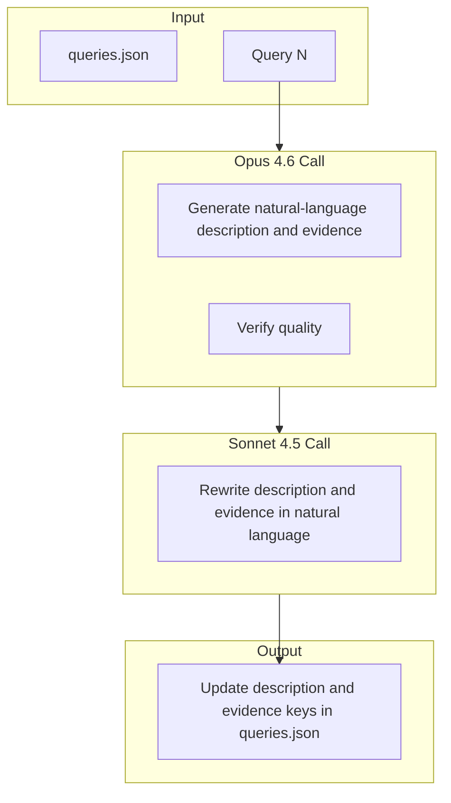

# Evidence and Description Update Plan: Claude Opus 4.6 + Sonnet 4.5 per Query

## Scope

- **Databases**: db-1 through db-16 (16 databases)
- **Queries per database**: 30 (480 total queries)
- **Keys updated per query**: `description` and `evidence`
- **API calls per query**: 2 (Opus 4.6 + Sonnet 4.5) — each call produces/refines both keys
- **Total API calls**: 960
- **Source files**: [source/db-N/queries/queries.json](source/db-1/queries/queries.json) (canonical; some db-N use app/QUERIES/)

## Current State

- **Description and evidence format**: Both use "Situation, Task, Action, Result" (STAR)
- **Target format**: Natural language for overall context (no STAR)
- **Existing script**: [scripts/claude_rewrite_evidence.py](scripts/claude_rewrite_evidence.py) uses batched calls; must be changed to 1 call per query
- **API keys**: [.env](.env) has `ANTHROPIC_API_KEY` and `ANTHROPIC_API_KEY_2` for rotation/rate limiting

## Architecture

## Implementation Approach

### 1. Script Modifications

Create or extend a script (e.g. `scripts/claude_rewrite_evidence_natural.py`) that:

- Reads from `source/db-N/queries/queries.json` (or `app/QUERIES/queries.json` where applicable)
- For each query: makes **one Opus 4.6 call** and **one Sonnet 4.5 call**
- Alternates between `ANTHROPIC_API_KEY` and `ANTHROPIC_API_KEY_2` for rate limiting
- Uses prompts that explicitly forbid STAR and require natural-language context
- Writes the updated `description` and `evidence` values back to the same JSON file

### 2. Prompt Requirements

**Opus 4.6** (per query):

- Input: `question`, current `description`, `sql` (truncated), current `evidence`
- Output: Natural-language `description` (1–2 sentences) and `evidence` (2–4 sentences) describing the query’s purpose and context
- Constraint: No "Situation", "Task", "Action", "Result" labels or structure in either field

**Sonnet 4.5** (per query):

- Input: Same as Opus, plus Opus output for both keys
- Output: Refined natural-language `description` and `evidence`
- Constraint: Same natural-language requirement, no STAR

### 3. API Key Rotation

- Use `ANTHROPIC_API_KEY` for odd-numbered calls (e.g. db-1 Q1 Opus, db-1 Q1 Sonnet)
- Use `ANTHROPIC_API_KEY_2` for even-numbered calls
- Or: alternate per database to spread load

### 4. File Sync

After updating `source/db-N/queries/queries.json`, run:

- `extract_queries_to_json.py` or equivalent to sync `queries.md`
- `/format` and `/QA` to propagate to `client/` and deliverables

## TODO Breakdown (Per API Call)

TODOs are organized by database and query. Each TODO = one API call.

### db-1 (30 queries × 2 calls = 60 TODOs)

| TODO ID        | Call       | Query    | Description                                                          |
| -------------- | ---------- | -------- | -------------------------------------------------------------------- |
| db1-q01-opus   | Opus 4.6   | Query 1  | Generate natural-language description and evidence for db-1 Query 1  |
| db1-q01-sonnet | Sonnet 4.5 | Query 1  | Rewrite description and evidence for db-1 Query 1                    |
| db1-q02-opus   | Opus 4.6   | Query 2  | Generate natural-language description and evidence for db-1 Query 2  |
| db1-q02-sonnet | Sonnet 4.5 | Query 2  | Rewrite description and evidence for db-1 Query 2                    |
| ...            | ...        | ...      | ...                                                                  |
| db1-q30-opus   | Opus 4.6   | Query 30 | Generate natural-language description and evidence for db-1 Query 30 |
| db1-q30-sonnet | Sonnet 4.5 | Query 30 | Rewrite description and evidence for db-1 Query 30                   |

### db-2 through db-16

Same pattern: 60 TODOs per database (30 × Opus + 30 × Sonnet).

**Total**: 16 × 60 = **960 TODOs** (one per API call).

## Execution Order

1. **Setup**: Create `claude_rewrite_evidence_natural.py` with per-query, non-batched logic
2. **db-1**: Run all 60 calls, validate output, then apply to `queries.json`
3. **db-2 through db-16**: Repeat for each database
4. **Propagation**: Run format/QA to update client and deliverables

## Incremental Execution (TODOs)

Run with `--apply --incremental` to save after each query and avoid losing progress:

| TODO      | Command                                                                       |
| --------- | ----------------------------------------------------------------------------- |
| inc-db1   | `python3 scripts/claude_rewrite_evidence_natural.py 1 --apply --incremental`  |
| inc-db2   | `python3 scripts/claude_rewrite_evidence_natural.py 2 --apply --incremental`  |
| ...       | ...                                                                           |
| inc-db16  | `python3 scripts/claude_rewrite_evidence_natural.py 16 --apply --incremental` |
| propagate | `/format` then `/QA`                                                          |

## Rate Limiting and Resilience

- Add `time.sleep(1)` (or configurable) between calls
- Use `--incremental` to save after each query (avoid losing progress)
- Support `--db N` and `--query Q` for resuming or targeting specific queries

## Key Files

- [.env](.env) – `ANTHROPIC_API_KEY`, `ANTHROPIC_API_KEY_2`
- [scripts/claude_rewrite_evidence.py](scripts/claude_rewrite_evidence.py) – Reference implementation
- [source/db-1/queries/queries.json](source/db-1/queries/queries.json) – Example structure with `description` and `evidence` keys

