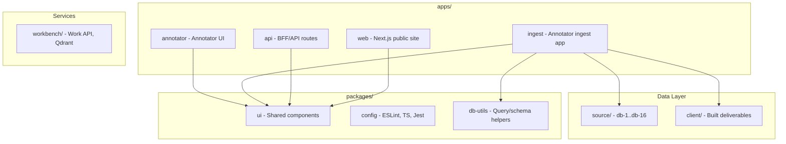

# MDC Industry Guides, Repo Reorganization, and AppSessions Logging

## 1. Enrich *.mdc with Industry Guides

### 1.1 Add Industry References and Expanded Guidance

Update all relevant `.mdc` files to include:

- **TDD**: Kent Beck "Test-Driven Development: By Example" (2002); Red-Green-Refactor cycle; Martin Fowler [bliki](https://martinfowler.com/bliki/TestDrivenDevelopment.html); Practical Test Pyramid
- **BDD**: Cucumber/Gherkin-style acceptance criteria; user-story-first specs; Dan North origins
- **DDD**: Eric Evans "Domain-Driven Design"; bounded contexts, aggregates, ubiquitous language
- **Distributed patterns**: Vercel microfrontends, Turborepo monorepos, serverless/edge; GCP Cloud Run compatibility

### 1.2 Files to Update


| File                                                                           | Additions                                                                |
| ------------------------------------------------------------------------------ | ------------------------------------------------------------------------ |
| [testing-app-running.mdc](.cursor/rules/testing-app-running.mdc)               | Industry refs (Beck, Fowler), Test Pyramid, microservice test boundaries |
| [qa-workflow-cursor.mdc](.cursor/rules/qa-workflow-cursor.mdc)                 | Same refs; Turborepo/Vercel deployment notes                             |
| [database-compatibility.mdc](.cursor/rules/database-compatibility.mdc)         | DDD bounded-context mapping; distributed query patterns                  |
| [database-creation-workflow.mdc](.cursor/rules/database-creation-workflow.mdc) | TDD validation-first; DDD per-db context                                 |
| [query-validation-suite.mdc](.cursor/rules/query-validation-suite.mdc)         | BDD acceptance criteria; phase-driven TDD                                |
| [project-requirements.mdc](.cursor/rules/project-requirements.mdc)             | Industry guides section; Next.js/Vercel/GCP compliance                   |
| [repo-organization.mdc](.cursor/rules/repo-organization.mdc)                   | Turborepo structure; microservice layout; `packages/` shared code        |


### 1.3 New Rule: Next.js/Vercel/GCP Microservice Compliance

Create [.cursor/rules/microservice-nextjs-vercel-gcp.mdc](.cursor/rules/microservice-nextjs-vercel-gcp.mdc):

- Next.js App Router conventions
- Vercel deployment (serverless, edge, ISR)
- GCP: Cloud Run, Cloud Storage, BigQuery compatibility
- Microservice boundaries: ingest, website, work-api, annotator
- Environment variables and secrets (Vercel env, GCP Secret Manager)

---

## 2. Full Repo Reorganization (Turborepo-Style)

### 2.1 Target Structure




### 2.2 Directory Layout

```
db/
├── apps/
│   ├── web/           # Rename from website - public DB documentation portal
│   ├── api/           # NEW: BFF/API microservice (or consolidate into web)
│   ├── ingest/        # Existing ingest app (port 3006/3007)
│   └── annotator/     # Existing annotator (port 3001)
├── packages/
│   ├── ui/            # Shared React components (from components/)
│   ├── config-eslint/ # Shared ESLint config
│   ├── config-typescript/ # Shared tsconfig
│   └── db-utils/      # Shared lib for queries, schema, build-intent
├── source/            # Unchanged - db-1..db-16
├── client/            # Unchanged - built deliverables
├── workbench/         # Unchanged - Work API, Qdrant
├── scripts/           # Unchanged
├── logs/
│   ├── AppSessions/   # NEW: NDJSON per session
│   ├── telemetry.ndjson
│   └── ...
├── turbo.json         # NEW: Turborepo config
└── package.json       # workspaces: ["apps/*", "packages/*"]
```

### 2.3 Migration Steps

1. Add `turbo.json` and update root `package.json` workspaces
2. Create `packages/ui`, `packages/config-eslint`, `packages/config-typescript`, `packages/db-utils`
3. Move shared components from `components/` and app-specific `lib/` into `packages/ui` and `packages/db-utils`
4. Rename `apps/website` to `apps/web` (or keep `website` and document as "web" in rules)
5. Add `apps/api` if BFF separation is desired; otherwise document API routes in `apps/web` or `apps/ingest`
6. Update import paths in all apps
7. Update [repo-organization.mdc](.cursor/rules/repo-organization.mdc) and [microservice-nextjs-vercel-gcp.mdc](.cursor/rules/microservice-nextjs-vercel-gcp.mdc)

---

## 3. Continue Tests per .cursor/rules

### 3.1 Test Strategy (TDD/BDD/DDD)

- **Unit**: `__tests__/lib/`, `__tests__/api/` in each app; `packages/*/__tests__/`
- **Integration**: `__tests__/integration/` (app running)
- **E2E**: `e2e/*.spec.ts` (Playwright)
- **User-story**: `__tests__/user-stories/` for staff/annotator/customer

### 3.2 New Tests to Add

- `packages/db-utils/__tests__/build-intent-display.test.ts` (move from apps/website)
- `packages/ui/__tests__/` for shared components
- E2E for `apps/web` query intent display (already exists in website)
- Integration tests for Work API + Qdrant (if not present)

---

## 4. AppSessions Logging

### 4.1 New: `logs/AppSessions/`

- **Format**: One NDJSON file per session, e.g. `logs/AppSessions/YYYYMMDD-HHMM-sessionId.ndjson`
- **Schema**:

```json
{"ts": 1739481234.5, "sessionId": "abc123", "event": "mdc_updated", "data": {"file": "testing-app-running.mdc", "changes": ["Added industry refs"]}}
{"ts": 1739481235.0, "sessionId": "abc123", "event": "repo_changed", "data": {"paths": ["apps/web/"], "action": "reorg"}}
```

### 4.2 Extend `logs/telemetry.ndjson`

- Add `component: "AppSession"` events when:
  - `.mdc` files change (via script or pre-commit hook)
  - Repo structure changes (e.g. new app, new package)

### 4.3 Implementation

- **Script**: `scripts/app-session-logger.js` or extend `scripts/db_check.py` with `app-session` subcommand
- **Trigger**: Pre-commit hook or manual `npm run log:session`; optionally CI step
- **Input**: Git diff of `.cursor/rules/*.mdc` and `apps/`, `packages/`; or explicit `--mdc-changes`, `--repo-changes`

---

## 5. Iterative .mdc Development Workflow

### 5.1 When Repo Changes

1. Run validation/tests
2. If `.mdc` rules need updates (e.g. new app, new package), update rules
3. Run `scripts/app-session-logger.js` (or equivalent) to log:
  - `logs/AppSessions/<timestamp>-<id>.ndjson`
  - Append to `logs/telemetry.ndjson` with `component: "AppSession"`

### 5.2 Automation (Optional)

- Pre-commit: If `.cursor/rules/*.mdc` or `apps/` or `packages/` changed, run session logger
- CI: After successful build, append AppSession event with `event: "ci_build"`, `data: { branch, sha }`

---

## 6. Todos (Broken Down)


| ID  | Task                                                     | Depends |
| --- | -------------------------------------------------------- | ------- |
| T1  | Enrich .mdc with industry guides (TDD/BDD/DDD refs)      | -       |
| T2  | Create microservice-nextjs-vercel-gcp.mdc                | -       |
| T3  | Add turbo.json, update package.json workspaces           | -       |
| T4  | Create packages/ui, packages/config-*, packages/db-utils | T3      |
| T5  | Migrate shared components and lib to packages/           | T4      |
| T6  | Rename/restructure apps/ (web, api if needed)            | T4      |
| T7  | Update import paths across apps                          | T5, T6  |
| T8  | Add/move tests for packages and apps                     | T7      |
| T9  | Implement logs/AppSessions/ and app-session-logger       | -       |
| T10 | Extend telemetry.ndjson with AppSession events           | T9      |
| T11 | Add pre-commit or npm script for session logging         | T9, T10 |
| T12 | Update repo-organization.mdc with new structure          | T7      |


---

## 7. Key Files

- [.cursor/rules/testing-app-running.mdc](.cursor/rules/testing-app-running.mdc) - Primary test rule
- [.cursor/rules/qa-workflow-cursor.mdc](.cursor/rules/qa-workflow-cursor.mdc) - QA and Cursor techniques
- [.cursor/rules/repo-organization.mdc](.cursor/rules/repo-organization.mdc) - Directory structure
- [package.json](package.json) - Root workspaces
- [logs/README.md](logs/README.md) - Log format docs
- [docker/docker-compose.work-microservices.yml](docker/docker-compose.work-microservices.yml) - Microservices (Qdrant, Work API, Annotator)

