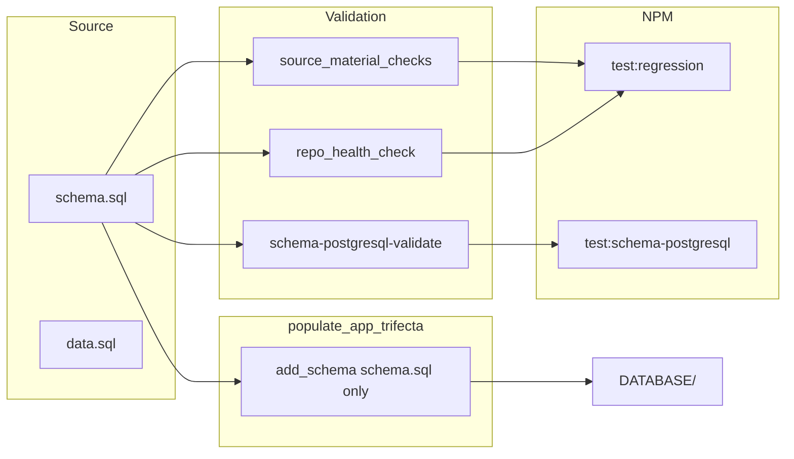

# PostgreSQL-Only Schema Refactor (TDD/BDD/DDD)

## Goal

Ensure only PostgreSQL-compliant SQL exists in the repo. Integrate validation into the existing NPM-invoked tool suite (`db_check.py`, `run_all_tests.sh`). Single canonical schema file: `schema.sql` (PostgreSQL-only); delete `*_postgresql.sql` variants.

---

## 1. Schema File Consolidation

**Current state:** Dual files: `schema.sql` and `schema_postgresql.sql`. [populate_app_trifecta.py](scripts/populate_app_trifecta.py) prefers `schema_postgresql.sql` (lines 92-95).

**Change:** Use only `schema.sql` as canonical (PostgreSQL-only). Delete all `*_postgresql.sql` files.

- **populate_app_trifecta.py**: Change `add_schema("schema.sql", "schema_postgresql.sql", "schema.sql")` to `add_schema("schema.sql", "schema.sql", "schema.sql")` (and equivalent for schema_extensions, insurance_schema, nexrad_satellite_schema). Remove `schema_postgresql.sql` preference.
- **resync_client_db.py**: Same logic in legacy path (uses same `add_schema` pattern).
- **Delete** all `*_postgresql.sql` files in `source/db-N/data/` and `source/db-N/deliverable/` (schema_postgresql.sql, schema_extensions_postgresql.sql, insurance_schema_postgresql.sql, nexrad_satellite_schema_postgresql.sql, schema_postgresql_large.sql).
- **Update** all scripts that reference `schema_postgresql.sql` to use `schema.sql` only: [db_check.py](scripts/db_check.py), [format.py](scripts/format.py), [gdpval_validation.py](scripts/gdpval_validation.py), [pre_commit_db.py](scripts/pre_commit_db.py), [sync_readme_from_db.py](scripts/sync_readme_from_db.py), [repo_health_check.py](scripts/repo_health_check.py), [tests/test_schema_data_validation_tdd_bdd.py](tests/test_schema_data_validation_tdd_bdd.py), [tests/test_single_source_of_truth.py](tests/test_single_source_of_truth.py), [apps/backend_test/main.py](apps/backend_test/main.py).

---

## 2. Rules: database-creation-workflow.mdc

**File:** [.cursor/rules/database-creation-workflow.mdc](.cursor/rules/database-creation-workflow.mdc)

- **Line 139** (Schema template): Replace `created_at TIMESTAMP_NTZ DEFAULT CURRENT_TIMESTAMP()` with `created_at TIMESTAMP DEFAULT CURRENT_TIMESTAMP`.
- **Lines 361-370** (Cross-Database Compatibility): Replace guidance:
  - Change "Use `TIMESTAMP_NTZ` instead of `TIMESTAMP` (for compatibility)" to "Use `TIMESTAMP` (PostgreSQL-only)."
  - Add: "Use `JSONB` for JSON data (not VARIANT). Use `CURRENT_TIMESTAMP` (not CURRENT_TIMESTAMP())."

---

## 3. Remove Runtime Conversions; Add Validation

**Scripts to simplify (remove TIMESTAMP_NTZ/VARIANT/CURRENT_TIMESTAMP() conversion):**


| Script                                                                                   | Action                                                                                                   |
| ---------------------------------------------------------------------------------------- | -------------------------------------------------------------------------------------------------------- |
| [postgresql_schema_loader.py](scripts/postgresql_schema_loader.py)                       | Remove `convert_to_postgresql()` calls; schema is already PostgreSQL. Keep GIST/PostGIS logic if needed. |
| [load_all_to_vercel_postgres.py](scripts/load_all_to_vercel_postgres.py)                 | Remove `convert_schema_for_postgres` TIMESTAMP_NTZ/VARIANT replacements. Keep GIST index skip logic.     |
| [reload_all_databases.py](scripts/reload_all_databases.py)                               | Remove `convert_to_postgresql` on data SQL.                                                              |
| [acid_and_query_test.py](scripts/acid_and_query_test.py)                                 | Remove TIMESTAMP_NTZ, VARIANT, GEOGRAPHY replacements.                                                   |
| [test_all_databases_consistency_acid.py](scripts/test_all_databases_consistency_acid.py) | Remove `convert_to_postgresql` usage.                                                                    |


**Add validation (fail if non-PG types):** Reuse `check_schema_postgresql_compliant` from [tests/test_schema_data_validation_tdd_bdd.py](tests/test_schema_data_validation_tdd_bdd.py) (NON_PG_TYPE_PATTERNS). Integrate into:

- [source_material_checks.py](scripts/source_material_checks.py): Add schema PostgreSQL compliance check; fail if TIMESTAMP_NTZ, VARIANT, ARRAY<, MAP< found.
- [repo_health_check.py](scripts/repo_health_check.py): Change NON_PG_TYPE_PATTERNS from "allowed" to "violations" — `check_schema_postgresql` should fail (not pass) when these patterns exist.

---

## 4. Cross-Database Compatibility Comments

**Files with comment** `"Use OBJECT for cross-database compatibility"` or similar:

- [source/db-6/data/schema_extensions.sql](source/db-6/data/schema_extensions.sql) (line 16)
- [source/db-6/DATABASE/schema_extensions.sql](source/db-6/DATABASE/schema_extensions.sql)
- [source/db-6/deliverable/data/schema_extensions.sql](source/db-6/deliverable/data/schema_extensions.sql)
- [source/db-6/deliverable/db6-weather-consulting-insurance/data/schema_extensions.sql](source/db-6/deliverable/db6-weather-consulting-insurance/data/schema_extensions.sql)
- [source/db-6/deliverable/db6-weather-consulting-insurance/data/schema.sql](source/db-6/deliverable/db6-weather-consulting-insurance/data/schema.sql)
- [source/db-6/deliverable/data/schema.sql](source/db-6/deliverable/data/schema.sql)
- [docs/archive/old_data_directory/schema_extensions.sql](docs/archive/old_data_directory/schema_extensions.sql)

**Change:** Replace with: `metadata JSONB,  -- PostgreSQL JSONB (repo is PostgreSQL-only)`.

---

## 5. generate_postgresql_sql_files.py and convert_schemas_to_postgresql.py

**Option B (user choice):** Integrate into pre-existing tool suite; turn into validator.

- **generate_postgresql_sql_files.py**: Repurpose as a **validator** that:
  - Scans all `schema*.sql` and `*_schema.sql` files.
  - Fails if TIMESTAMP_NTZ, VARIANT, CURRENT_TIMESTAMP(), ARRAY<, MAP< found.
  - Does NOT generate `*_postgresql.sql` files.
  - Expose via `db_check.py schema-postgresql-validate` (or similar).
- **convert_schemas_to_postgresql.py**: Remove or merge into the validator. Logic becomes: "check for non-PG types and exit 1 if found" — no conversion, only validation.

---

## 6. NPM Integration

**Current NPM scripts** ([package.json](package.json)): `test:regression` runs `db_check.py test all`.

**Add:**

```json
"test:schema-postgresql": "python3 scripts/db_check.py schema-postgresql-validate",
"test:source-checks": "python3 scripts/db_check.py source-checks -a"
```

**db_check.py:** Add subcommand `schema-postgresql-validate` that runs the PostgreSQL-only validation (from repurposed generate_postgresql_sql_files or source_material_checks).

**run_all_tests.sh:** Add `run "schema-postgresql-validate" "$PYTHON scripts/db_check.py schema-postgresql-validate"` (or equivalent) so it runs in the full test suite.

---

## 7. repo_health_check.py

**Current:** [repo_health_check.py](scripts/repo_health_check.py) lines 57-62 define NON_PG_TYPE_PATTERNS as tuples `(pattern, name)`. `check_schema_postgresql` returns violations when these match.

**Change:** Ensure violations cause failure. The logic already returns violations; verify the caller treats violations as fail (exit 1). Update CANONICAL_FILES / path logic to remove `schema_postgresql.sql` from expected files; only `schema.sql` is canonical.

---

## 8. TDD/BDD/DDD Test Updates

- **test_schema_data_validation_tdd_bdd.py**: `get_schema_paths()` currently prefers `schema_postgresql.sql` then `schema.sql`. Change to only look for `schema.sql` (and schema_extensions.sql, insurance_schema.sql, nexrad_satellite_schema.sql — no _postgresql variants).
- **test_single_source_of_truth.py**: Update assertion to require `schema.sql` only (remove `schema_postgresql.sql` fallback).
- **tests/features/schema_data_health.feature**: Update steps if they reference schema_postgresql.sql.

---

## 9. Data Flow (Post-Refactor)




---

## 10. Execution Order

1. Update [database-creation-workflow.mdc](.cursor/rules/database-creation-workflow.mdc) (rules first).
2. Fix cross-database comments in schema files.
3. Update populate_app_trifecta and resync to use schema.sql only; remove _postgresql preference.
4. Delete all `*_postgresql.sql` files.
5. Update all scripts that reference schema_postgresql.sql.
6. Simplify postgresql_schema_loader, load_all_to_vercel_postgres, reload_all_databases, acid_and_query_test, test_all_databases_consistency_acid (remove conversions).
7. Add PostgreSQL validation to source_material_checks; update repo_health_check to fail on violations.
8. Repurpose generate_postgresql_sql_files as validator; remove or merge convert_schemas_to_postgresql.
9. Add db_check schema-postgresql-validate; add NPM scripts; update run_all_tests.sh.
10. Update TDD/BDD tests (get_schema_paths, test_single_source_of_truth).
11. Run full test suite: `npm run test:regression`, `./scripts/run_all_tests.sh -a`.
