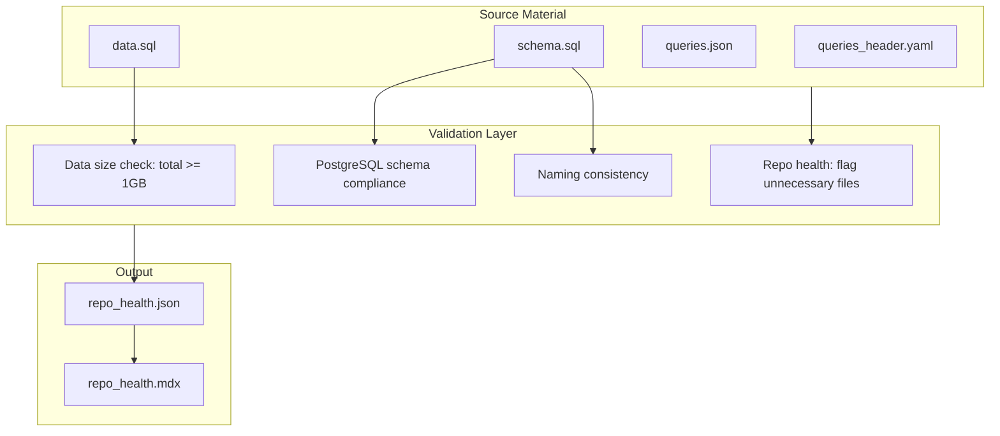

# Repo Health, Schema/Data Validation, and BDD/TDD/DDD Tests

## Architecture




## 1. Required Files for source/ to app/ Compilation

From [scripts/populate_app_trifecta.py](scripts/populate_app_trifecta.py), the minimal inputs are:


| Path                                                     | Purpose                        |
| -------------------------------------------------------- | ------------------------------ |
| `source/db-N/data/schema.sql` or `schema_postgresql.sql` | DDL (PostgreSQL)               |
| `source/db-N/data/data.sql`                              | Sample/seed data               |
| `source/db-N/queries/queries.json`                       | 30 queries                     |
| `source/db-N/queries_header.yaml` or `.json`             | Optional header for queries.md |


Output: `source/db-N/app/` (DATABASE/, DOCUMENTATION/, QUERIES/).

**Canonical required files per db-N**: `data/schema.sql`, `data/data.sql`, `queries/queries.json`. Header is optional.

## 2. BDD/TDD Tests for schema.sql and data.sql

### 2.1 New test file: [tests/test_schema_data_validation_tdd_bdd.py](tests/test_schema_data_validation_tdd_bdd.py)

**TDD unit tests**:

- `test_data_sql_total_size_at_least_1gb` — Sum of all `source/db-N/data/data.sql` and `source/db-N/app/DATABASE/data.sql` (or data_large.sql) >= 1GB
- `test_schema_sql_postgresql_compliant` — Parse schema with `sqlparse` or `EXPLAIN`; reject non-PostgreSQL types (e.g. `TIMESTAMP_NTZ` without mapping)
- `test_schema_sql_has_create_table` — Each schema file contains `CREATE TABLE`
- `test_schema_naming_snake_case` — Table and column names use `snake_case` (regex: `^[a-z][a-z0-9_]*$`)
- `test_data_sql_valid_insert_or_copy` — data.sql contains `INSERT` or `COPY` statements
- `test_schema_data_naming_consistent` — Table names in schema match tables referenced in data.sql (sample check)

**BDD scenarios**:

- Given source/db-N exists, When data.sql files are summed, Then total bytes >= 1_073_741_824
- Given schema.sql exists, When parsed, Then no non-PostgreSQL syntax
- Given schema and data, When naming is checked, Then tables use snake_case

**DDD-style tests** (bounded context):

- `test_db_bounded_context_schema_only_postgres` — Each db-N schema stays within PostgreSQL domain (no Snowflake/Databricks-specific DDL)
- `test_db_bounded_context_data_matches_schema` — data.sql INSERT targets exist in schema (spot-check first 5 tables)

### 2.2 Extend [tests/features/cdc_and_notebook.feature](tests/features/cdc_and_notebook.feature) or add [tests/features/schema_data_health.feature](tests/features/schema_data_health.feature)

```gherkin
Feature: Schema and data validation
  Scenario: Data volume meets 1GB total
    Given source/db-1..db-16 have data.sql or app/DATABASE/data.sql
    When total size is computed
    Then total >= 1GB

  Scenario: Schema is PostgreSQL compliant
    Given schema.sql exists per db-N
    When validated for PostgreSQL
    Then no incompatible types or syntax

  Scenario: Naming is consistent
    Given schema.sql and data.sql exist
    Then table names use snake_case
    And column names use snake_case
```

## 3. Repo Health Checker

### 3.1 New script: [scripts/repo_health_check.py](scripts/repo_health_check.py)

**Checks**:

1. **Data size**: Sum `data.sql` + `data_large.sql` across all db-N (from `data/` or `app/DATABASE/`) >= 1GB
2. **Schema compliance**: PostgreSQL-only; flag `TIMESTAMP_NTZ`, `GEOGRAPHY` without PostGIS, etc.
3. **Naming**: snake_case for tables/columns
4. **Unnecessary files in source/db-N**: Any file/dir not in:
  - `data/schema.sql`, `data/schema_postgresql.sql`
  - `data/data.sql`, `data/data_large.sql`, `data/data_large_postgresql.sql`
  - `queries/queries.json`, `queries/queries.md`
  - `queries_header.yaml`, `queries_header.json`
  - `app/` (output)
5. **Unnecessary files at repo root**: Files/dirs not in canonical list:
  - `source/`, `client/`, `template/`, `scripts/` (core), `tests/`, `docker/`, `notebooks/`
  - `docs/` (key docs only: ROADMAP, SOURCE_OF_TRUTH, QUERIES_MD_FORMAT)
  - `.cursor/`, `apps/`, `packages/`, `data/`, `results/`, `logs/`, `research/`
  - Root files: `pyproject.toml`, `Makefile`, `README.md`, `.gitignore`

**Output**: `results/repo_health.json`

### 3.2 repo_health.json schema

```json
{
  "generated_at": "YYYYMMDD-HHMM",
  "Pass": 1,
  "checks": {
    "data_size_gb": { "Pass": 1, "total_bytes": 1073741824, "required_bytes": 1073741824 },
    "schema_postgresql_compliant": { "Pass": 1, "databases": ["db-1", ...] },
    "naming_consistent": { "Pass": 1 },
    "unnecessary_source_files": { "flagged": ["source/db-1/deliverable/", ...] },
    "unnecessary_root_files": { "flagged": ["scripts/obsolete_script.py", ...] }
  },
  "databases": { "db-1": { "data_bytes": 123, "schema_pass": 1, "flagged": [] }, ... }
}
```

### 3.3 Compile to repo_health.mdx

New script: [scripts/compile_repo_health_mdx.py](scripts/compile_repo_health_mdx.py)

- Input: `results/repo_health.json`
- Output: `results/repo_health.mdx`
- Format: YAML frontmatter + Markdown sections (mirror [scripts/compile_commit_diff_report.py](scripts/compile_commit_diff_report.py))
- Sections: Summary, Data Size, Schema Compliance, Naming, Flagged Unnecessary Files (source), Flagged Unnecessary Files (root)

## 4. Integration

- Add `db_check.py repo-health` subcommand that runs `repo_health_check.py` and `compile_repo_health_mdx.py`
- Add `repo-health` to QA suite in [scripts/run_all_tests.sh](scripts/run_all_tests.sh) or [.cursor/commands/qa.md](.cursor/commands/qa.md)
- Ensure 1GB threshold is configurable via env `MIN_DATA_SQL_TOTAL_BYTES` (default 1073741824)

## 5. File Layout

```
scripts/
  repo_health_check.py      # New: run checks, write repo_health.json
  compile_repo_health_mdx.py # New: JSON to MDX

tests/
  test_schema_data_validation_tdd_bdd.py  # New: TDD/BDD/DDD
  test_repo_health.py                     # New: repo_health_check tests
  features/
    schema_data_health.feature            # New: BDD scenarios

results/
  repo_health.json          # Generated
  repo_health.mdx           # Generated
```

## 6. Implementation Order

1. `test_schema_data_validation_tdd_bdd.py` — TDD/BDD/DDD tests (some will fail until repo_health exists)
2. `repo_health_check.py` — Core checks
3. `compile_repo_health_mdx.py` — MDX report
4. `test_repo_health.py` — Tests for repo_health_check
5. `db_check.py repo-health` subcommand
6. Update QA workflow

## 7. Notes

- **1GB total**: If current total is below 1GB, tests will FAIL until data is added. Consider adding a `--lenient` flag or `REPO_HEALTH_LENIENT=1` to warn instead of fail during migration.
- **PostgreSQL compliance**: Use `sqlparse` for parsing; flag known non-PG types. `GEOGRAPHY` is valid with PostGIS.
- **Canonical root list**: Will be maintained in `repo_health_check.py`; extend as repo evolves.
