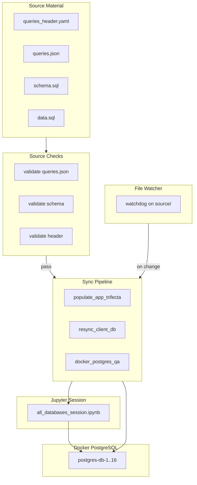

# Source Checks, Docker PostgreSQL Propagation, and Jupyter Session

## Current State

- **Docker**: 16 PostgreSQL containers (ports 5436-5451) via [docker/docker-compose.hardened.yml](docker/docker-compose.hardened.yml); [scripts/docker_postgres_qa.sh](scripts/docker_postgres_qa.sh) loads schema+data from `client/db` or `source/db-N/app/DATABASE`
- **Source flow**: `source/db-N/` (data/, queries/, queries_header.yaml) → `populate_app_trifecta` → `app/` (DATABASE/, DOCUMENTATION/, QUERIES/)
- **Resync**: [scripts/resync_client_db.py](scripts/resync_client_db.py) copies source → client/db
- **Notebooks**: Per-db ETL notebooks in `source/db-N/research/etl_elt_pipeline.ipynb`; query-testing notebooks in `notebooks/`

## Architecture




---

## 1. Source Material Checks

**Location**: Extend [tests/test_queries_md_compile_tdd_bdd.py](tests/test_queries_md_compile_tdd_bdd.py) and add `scripts/source_material_checks.py`

**Checks**:

- `queries.json`: valid JSON, 30 queries, required fields (number, SQL, evidence, etc.)
- `queries_header.yaml` (if present): valid YAML, required keys (db_name, database_overview, purpose, etc.)
- `schema.sql`: valid PostgreSQL DDL (parse with `sqlparse` or `EXPLAIN` dry-run)
- `data.sql`: valid INSERT syntax
- `queries.md`: header consistency (h1/h2/h3), 30 query blocks

**Integration**: Call from `db_check.py` as new subcommand `source-checks`, and from the Jupyter notebook.

---

## 2. Docker PostgreSQL + Change Propagation

**Current**: [docker_postgres_qa.sh](scripts/docker_postgres_qa.sh) loads schema+data once at startup.

**Enhancements**:

### 2a. Source-First Load Order

Ensure Docker load uses `source/db-N/app/DATABASE/` (or `source/db-N/data/`) as primary, so changes in source propagate to containers. [docker_postgres_qa.sh](scripts/docker_postgres_qa.sh) already prefers `client/db` then `source/db-N/app/DATABASE`. Add `source/db-N/app/` as explicit first choice when running in "source mode".

### 2b. File-Based CDC (Open-Source: `watchdog`)

Use Python [watchdog](https://pypi.org/project/watchdog/) to watch `source/` for changes to:

- `queries.json`, `queries_header.yaml`, `schema.sql`, `data.sql`

On change:

1. Run source material checks
2. Run `populate_app_trifecta` for affected db-N
3. Run `resync_client_db` for affected db-N
4. Optionally re-load schema/data into Docker PostgreSQL for affected db-N

**Script**: `scripts/watch_source_and_sync.py` (daemon mode)

### 2c. PostgreSQL Logical Replication (Optional)

For DB-level CDC (capturing INSERT/UPDATE/DELETE in PostgreSQL):

- **wal2json**: PostgreSQL extension for logical decoding (outputs JSON). Add to [Dockerfile.postgres-hardened](docker/Dockerfile.postgres-hardened) or use `postgres:15` with `wal_level=logical`.
- **pg_notify**: Simpler alternative—use `NOTIFY` on triggers for audit tables.

Scope: Add `wal_level=logical` and optional `wal2json` to Docker PostgreSQL for future CDC consumers (e.g., Debezium, custom consumer). Document in plan; implement if user confirms need for DB-level CDC.

---

## 3. Jupyter Notebook: All-Databases Running Session

**New file**: `notebooks/all_databases_session.ipynb`

**Purpose**: Single notebook for a running session across all `source/db-1..db-16` and `app/` output.

**Sections**:

1. **Setup**
  - Paths: `source/`, `app/`, Docker ports (5436–5451)
  - Connection params for each db-N
2. **Source Inventory**
  - Table: db-N, has_queries_json, has_queries_header, has_schema, has_data, app_populated
3. **Run Source Checks**
  - Call `source_material_checks` for each db-N; display pass/fail
4. **Docker PostgreSQL Status**
  - Check containers running; attempt connection to each port
  - Show: db-N, port, connected, schema_loaded (e.g. table count)
5. **Sync Actions**
  - Buttons/cells to run: `populate_app_trifecta`, `resync_client_db`, `docker_postgres_qa` (load schema+data)
6. **Query Execution Sample**
  - For each db-N: run Query 1 from queries.json against Docker PostgreSQL; show row count / sample
7. **Change Propagation**
  - Optional: start `watch_source_and_sync` in background; show last sync timestamp

**Dependencies**: `watchdog`, `psycopg2`, `sqlalchemy`, `ipywidgets` (optional for buttons)

---

## 4. Open-Source Tools


| Tool                    | Purpose                                          |
| ----------------------- | ------------------------------------------------ |
| **watchdog**            | File system events for source/ change detection  |
| **psycopg2**            | PostgreSQL connections from notebook and scripts |
| **sqlparse**            | Schema validation (optional)                     |
| **pyyaml**              | queries_header.yaml validation                   |
| **wal2json** (optional) | PostgreSQL logical decoding for DB CDC           |


---

## 5. File Layout

```
scripts/
  source_material_checks.py   # New: validate source files
  watch_source_and_sync.py   # New: watchdog daemon + sync

notebooks/
  all_databases_session.ipynb  # New: unified session

docker/
  Dockerfile.postgres-hardened  # Optional: wal_level=logical, wal2json

tests/
  test_source_material_checks.py  # New: TDD for checks
```

---

## 6. Implementation Order

1. **source_material_checks.py** – validation for queries.json, queries_header.yaml, schema.sql, data.sql
2. **test_source_material_checks.py** – unit tests
3. **all_databases_session.ipynb** – notebook with inventory, checks, Docker status, sync actions
4. **watch_source_and_sync.py** – watchdog + sync pipeline
5. **Docker**: Prefer source paths in docker_postgres_qa.sh; optional wal2json if DB CDC needed

---

## 7. Clarifications

- **CDC scope**: File-based (watchdog) is in scope. DB-level CDC (wal2json/Debezium) is optional—confirm if you need it.
- **Notebook runtime**: Should the notebook assume Docker is already running, or start it? Plan assumes Docker is started separately (`docker_postgres_qa.sh` or `docker compose up`).
