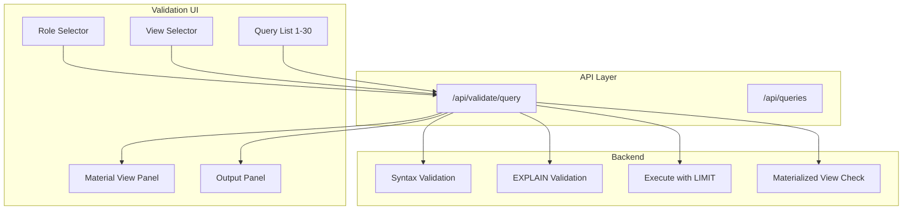

# SQL Query Validation Feature (Role × View × Query)

## Summary

Build a validation feature in `apps/ingest` that:

1. Validates SQL for each query, scoped by role and view
2. Shows a side panel with execution results (material view) and outputs
3. Validates materialized view SQL (CREATE MATERIALIZED VIEW)
4. Is fully tested (Jest, integration, E2E)
5. Is documented in [docs/ROADMAP.md](docs/ROADMAP.md)

---

## Architecture

---

## 1. Backend: Validation API

### 1.1 New API Route: `/api/validate/query`

**File**: [apps/ingest/app/api/validate/query/route.ts](apps/ingest/app/api/validate/query/route.ts) (new)

**Request**: `POST` with body `{ source, queryNumber?, role?, view?, sql? }` or `GET` with `?source=db-1&query=1&role=staff&view=/customer`

**Behavior**:

- Load query from `loadQueries(source)` (or use provided `sql`)
- Resolve role and view from privileges ([apps/ingest/lib/privileges.ts](apps/ingest/lib/privileges.ts))
- Run validation:
  - **Syntax**: Balanced parens, SQL keywords, CTE structure (port from [scripts/validate_sql_syntax_postgresql.py](scripts/validate_sql_syntax_postgresql.py))
  - **Materialized view**: Detect `CREATE MATERIALIZED VIEW`, validate structure, check for `REFRESH`
  - **Execution** (optional): When `PG_HOST`, `PG_DATABASE` etc. are set, run `EXPLAIN` and `SELECT ... LIMIT 10` via `pg` client
- Return: `{ valid, errors, warnings, materializedView: boolean, executionResult?: { rows, columns, rowCount }, executionTimeMs? }`

**Dependencies**: Add `pg` (optional) to `apps/ingest` for execution when DB is configured.

### 1.2 Batch Validation API: `/api/validate/batch`

**File**: [apps/ingest/app/api/validate/batch/route.ts](apps/ingest/app/api/validate/batch/route.ts) (new)

**Request**: `POST` with `{ source, role?, view? }`

**Response**: Array of `{ queryNumber, title, valid, errors, warnings, materializedView, hasExecutionResult }` for all 30 queries. Used for the matrix view.

---

## 2. Validation Logic (Shared)

### 2.1 Syntax Validator

**File**: [apps/ingest/lib/sql-validator.ts](apps/ingest/lib/sql-validator.ts) (new)

Port logic from [scripts/validate_sql_syntax_postgresql.py](scripts/validate_sql_syntax_postgresql.py):

- `validateSqlSyntax(sql: string): { valid, errors, warnings }`
- `detectMaterializedView(sql: string): boolean`
- `validateMaterializedView(sql: string): { valid, errors }` — check `CREATE MATERIALIZED VIEW`, `REFRESH`, dependencies

### 2.2 Execution Helper (Optional)

**File**: [apps/ingest/lib/sql-executor.ts](apps/ingest/lib/sql-executor.ts) (new)

- `explainQuery(sql: string, pgConfig): Promise<{ valid, plan? }>`
- `executeQuery(sql: string, limit: number, pgConfig): Promise<{ rows, columns, rowCount }>`
- Use `pg` client; skip when env vars not set.

---

## 3. UI: Validation Page and Components

### 3.1 Validation Page

**File**: [apps/ingest/app/validate/page.tsx](apps/ingest/app/validate/page.tsx) (new)

- Route: `/validate` (staff/system_owner only; add to privileges)
- Layout: Role selector, View selector, Database (source) selector
- Query list (1–30) with validation status badges (pass/fail/warning)
- Click query → load validation details + material view + outputs in side panel

### 3.2 Validation Side Panel Component

**File**: [apps/ingest/components/ValidationSidePanel.tsx](apps/ingest/components/ValidationSidePanel.tsx) (new)

- **Material view**: Table/grid of execution results (rows × columns) when available
- **Outputs**: Raw JSON or formatted output; row count; execution time
- **Materialized view**: Badge/indicator if query creates MV; validation status for MV-specific checks
- **Errors/warnings**: Display validation errors and warnings

### 3.3 Integration with Existing UI

- Add "Validate" link to nav/sidebar for staff (e.g. in [apps/ingest/app/layout.tsx](apps/ingest/app/layout.tsx) or ViewSelector)
- Add `/validate` to `getViewsForRole` for staff and system_owner in [apps/ingest/lib/privileges.ts](apps/ingest/lib/privileges.ts)

---

## 4. Roadmap Update

**File**: [docs/ROADMAP.md](docs/ROADMAP.md)

Add new epic under "## 10. Epics and Features":

**Epic 9: SQL Query Validation (Role × View × Query)**

| Feature            | Description                                                                                   |
| ------------------ | --------------------------------------------------------------------------------------------- |
| 9.1 Validation API | `/api/validate/query`, `/api/validate/batch`; syntax, MV, optional execution                  |
| 9.2 Validation UI  | `/validate` page with role/view/query matrix, side panel                                      |
| 9.3 Material View  | Execution results panel; materialized view detection and validation                           |
| 9.4 User Stories   | US-9.1: Staff validates queries per role/view; US-9.2: Side panel shows results and MV status |

---

## 5. Testing

### 5.1 Unit Tests (Jest)

**File**: [apps/ingest/**tests**/lib/sql-validator.test.ts](apps/ingest/__tests__/lib/sql-validator.test.ts) (new)

- `validateSqlSyntax`: balanced parens, keywords, CTE, empty SQL
- `detectMaterializedView`: `CREATE MATERIALIZED VIEW` detection
- `validateMaterializedView`: valid MV, missing REFRESH, malformed

**File**: [apps/ingest/**tests**/api/validate-query.test.ts](apps/ingest/__tests__/api/validate-query.test.ts) (new)

- POST /api/validate/query: required params, syntax validation response, role/view resolution
- Mock `loadQueries`; no real DB required for syntax-only tests

### 5.2 Integration Tests

**File**: [apps/ingest/**tests**/integration/validate-flow.e2e.test.ts](apps/ingest/__tests__/integration/validate-flow.e2e.test.ts) (new)

- Fetch `/api/validate/query?source=db-1&query=1&role=staff&view=/customer` when app running
- Assert 200, `valid` boolean, `errors`/`warnings` arrays
- Skip gracefully when app not running (same pattern as [apps/ingest/**tests**/integration/views-and-access.e2e.test.ts](apps/ingest/__tests__/integration/views-and-access.e2e.test.ts))

### 5.3 E2E Tests (Playwright)

**File**: [apps/ingest/e2e/validate-feature.spec.ts](apps/ingest/e2e/validate-feature.spec.ts) (new)

- Login as staff
- Navigate to `/validate`
- Select role, view, database
- Assert query list visible, validation status badges
- Click a query, assert side panel shows material view / outputs (or "No execution" when DB unavailable)
- Assert materialized view indicator when query contains `CREATE MATERIALIZED VIEW`

---

## 6. Files to Create or Modify

| Action | Path                                                                          |
| ------ | ----------------------------------------------------------------------------- |
| Create | `apps/ingest/app/api/validate/query/route.ts`                                 |
| Create | `apps/ingest/app/api/validate/batch/route.ts`                                 |
| Create | `apps/ingest/lib/sql-validator.ts`                                            |
| Create | `apps/ingest/lib/sql-executor.ts` (optional, for execution)                   |
| Create | `apps/ingest/app/validate/page.tsx`                                           |
| Create | `apps/ingest/components/ValidationSidePanel.tsx`                              |
| Create | `apps/ingest/__tests__/lib/sql-validator.test.ts`                             |
| Create | `apps/ingest/__tests__/api/validate-query.test.ts`                            |
| Create | `apps/ingest/__tests__/integration/validate-flow.e2e.test.ts`                 |
| Create | `apps/ingest/e2e/validate-feature.spec.ts`                                    |
| Modify | `apps/ingest/lib/privileges.ts` — add `/validate` to staff/system_owner views |
| Modify | `apps/ingest/package.json` — add `pg` (optional dependency)                   |
| Modify | `docs/ROADMAP.md` — add Epic 9                                                |

---

## 7. Implementation Order

1. **sql-validator.ts** + unit tests — no dependencies
2. **sql-executor.ts** (optional) — pg client for execution
3. **/api/validate/query** + **/api/validate/batch** + API tests
4. **ValidationSidePanel** component
5. **/validate** page + nav/privileges
6. Integration + E2E tests
7. Roadmap update

---

## 8. Notes

- **Execution optional**: When `PG_*` env vars are not set, validation is syntax + MV only; material view panel shows "Database not configured" or similar.
- **Role/view semantics**: Validation is scoped by role and view for organizational/filtering purposes; the same SQL is validated regardless. Future: per-role query visibility (e.g. customer sees subset).
- **Materialized view**: Queries that *create* materialized views are validated for MV syntax; queries that *select from* MVs are validated as normal SELECT.

