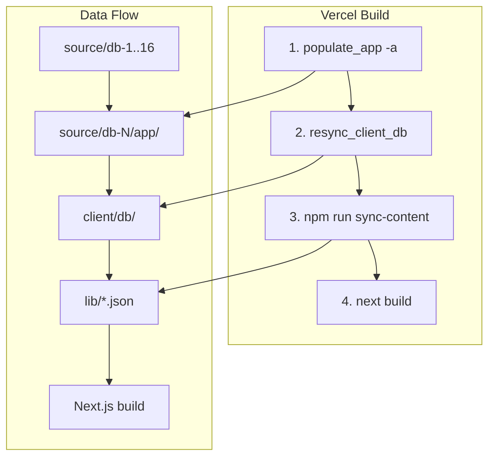

# Website Branch and Vercel Deployment Plan

## Current State

- **Website app**: [apps/web/](apps/web/) (db-documentation-portal) - Next.js 16, renders `client/db/` content
- **client/db**: Gitignored (`.gitignore:82`); generated by QA pipeline (populate_app → resync)
- **Root package.json**: Default scripts target `apps/ingest`, not `apps/web`
- **Path bug**: [extract-deliverable-content.js](apps/web/scripts/extract-deliverable-content.js) and [build-website-database.js](apps/web/scripts/build-website-database.js) use `rootDir = ../..` (apps/web) but `client/db` lives at repo root; [build-comprehensive-database.js](apps/web/scripts/build-comprehensive-database.js) correctly uses `../../..` (repo root)
- **next.config.js**: Uses `output: 'standalone'` (for Docker/Cloud Run); rules say omit for Vercel

## Architecture




## Implementation Steps

### 1. Create `website` Branch

```bash
git checkout -b website
```

### 2. Fix Build Script Paths (apps/web)

Update `rootDir` in two scripts to resolve `client/db` from repo root:

- **[apps/web/scripts/extract-deliverable-content.js](apps/web/scripts/extract-deliverable-content.js)** (line 19): Change `path.join(__dirname, '../..')` to `path.join(__dirname, '../../..')`
- **[apps/web/scripts/build-website-database.js](apps/web/scripts/build-website-database.js)** (line 11): Same change

### 3. Configure Next.js for Vercel

In [apps/web/next.config.js](apps/web/next.config.js): Remove or comment out `output: 'standalone'` so Vercel uses default serverless output.

### 4. Add Pre-Build Step for client/db

Create [apps/web/scripts/prepare-for-vercel.sh](apps/web/scripts/prepare-for-vercel.sh):

```bash
#!/bin/bash
# Run from repo root; creates client/db for website build
cd "$(dirname "$0")/../.."
python3 scripts/populate_app_trifecta.py -a
python3 scripts/resync_client_db.py
```

Update [apps/web/package.json](apps/web/package.json) build script:

```json
"build": "bash scripts/prepare-for-vercel.sh && npm run sync-content && next build"
```

This ensures `client/db` exists before `sync-content` runs.

### 5. Vercel Project Configuration

**Option A: Root Directory = repo root (recommended)**

- Root [vercel.json](vercel.json): Add `"rootDirectory": "apps/web"` so Vercel builds the Next.js app in that folder, but the build command runs from repo root (giving access to `source/`, `scripts/`, and `client/`).

Actually, Vercel's `rootDirectory` sets the project root; the build runs from that directory. So if `rootDirectory: "apps/web"`, the cwd is `apps/web` and `../..` would be repo root. The prepare script would need to run from apps/web and `cd ../..` to reach repo root. Update the prepare script to run from apps/web:

```bash
#!/bin/bash
set -e
ROOT="$(cd "$(dirname "$0")/../.." && pwd)"
cd "$ROOT"
python3 scripts/populate_app_trifecta.py -a
python3 scripts/resync_client_db.py
```

And in package.json, the build runs from apps/web, so the script will `cd` to repo root and run the Python scripts. Good.

**Option B: Root Directory = apps/web**

- In Vercel Dashboard: Project Settings → General → Root Directory = `apps/web`
- The prepare script must `cd` to repo root to run Python scripts (parent of apps/web)
- Build command: `npm run build` (which runs prepare-for-vercel.sh first)

### 6. Root vercel.json for Website Deployment

Update root [vercel.json](vercel.json) to target the web app:

```json
{
  "$schema": "https://openapi.vercel.sh/vercel.json",
  "framework": "nextjs",
  "buildCommand": "cd apps/web && npm run build",
  "outputDirectory": "apps/web/.next",
  "installCommand": "npm install",
  "regions": ["iad1"]
}
```

Or use **Root Directory** in Vercel Dashboard = `apps/web` and keep a minimal `apps/web/vercel.json`. The key is that when Root Directory = apps/web, the working directory for the build is apps/web. The prepare script will `cd ../..` to get to repo root, then run the Python scripts. The Python scripts will create `client/db` at repo root. The Node build scripts (with fixed paths) use `path.join(__dirname, '../../..')` which from `apps/web/scripts/` = repo root. So `client/db` will be found. Good.

### 7. Environment Variables (Vercel Dashboard)

- **BLOB_READ_WRITE_TOKEN** (optional): For production blob storage; dev falls back to filesystem
- **NEXT_PUBLIC_VERCEL_ANALYTICS_ID** (optional): For analytics

### 8. Ensure Python in Vercel Build

Vercel includes Python by default. If `populate_app_trifecta.py` or `resync_client_db.py` need extra packages, add a minimal `requirements.txt` at repo root or in apps/web and use `pip install -r requirements.txt` in the prepare script. Current scripts use only stdlib (argparse, shutil, pathlib), so no extra deps needed.

### 9. Optional: Add website Scripts to Root package.json

For convenience, add to root [package.json](package.json):

```json
"build:web": "npm run build --prefix apps/web",
"dev:web": "npm run dev --prefix apps/web"
```

## Files to Modify


| File                                              | Change                                              |
| ------------------------------------------------- | --------------------------------------------------- |
| `apps/web/scripts/extract-deliverable-content.js` | `rootDir`: `../..` → `../../..`                     |
| `apps/web/scripts/build-website-database.js`      | `rootDir`: `../..` → `../../..`                     |
| `apps/web/next.config.js`                         | Remove `output: 'standalone'`                       |
| `apps/web/scripts/prepare-for-vercel.sh`          | Create (new file)                                   |
| `apps/web/package.json`                           | Update build script                                 |
| `vercel.json`                                     | Add buildCommand/outputDirectory if using repo root |
| `package.json`                                    | Optional: add build:web, dev:web                    |


## Vercel Deployment Checklist

1. Push `website` branch to GitHub
2. In Vercel: New Project → Import repo → Select `website` branch
3. Set Root Directory: `apps/web` (so build runs from apps/web)
4. Build Command: `npm run build` (uses prepare-for-vercel.sh)
5. Add env vars if using Blob storage
6. Deploy

## Verification

- `npm run build` from `apps/web` succeeds locally (with `client/` un-ignored or after running prepare script)
- Vercel build completes without errors
- Deployed site loads `/databases` and individual db pages

