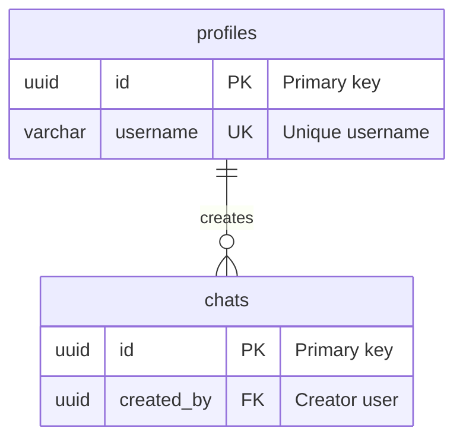
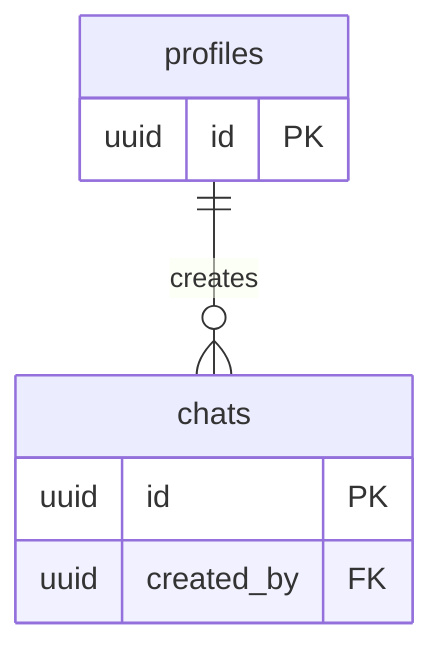
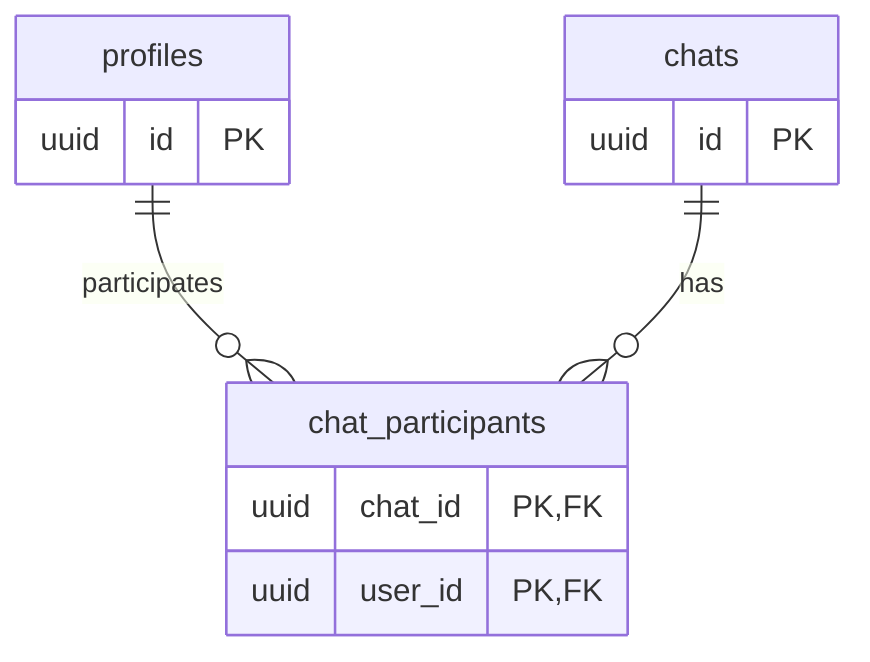
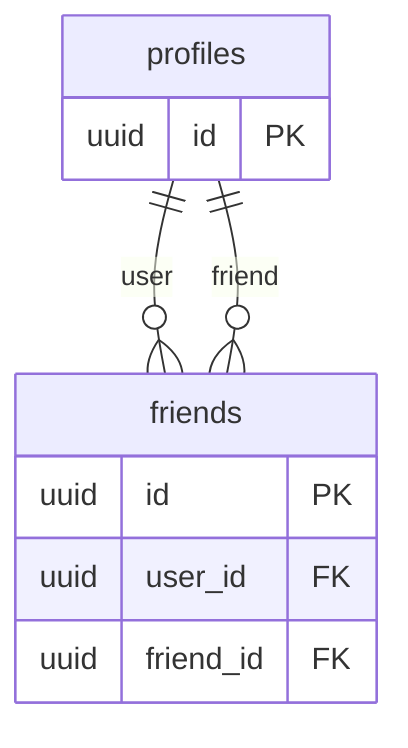

# ER Diagrams Guide - Mermaid.js Database Schema Visualization

## Overview

This guide explains how to create and maintain Entity-Relationship (ER) diagrams using Mermaid.js syntax for database schema visualization.

## Quick Start

### Basic ER Diagram



## Mermaid.js ER Diagram Syntax

### Entity Definition

```mermaid
erDiagram
    TABLE_NAME {
        column_type column_name PK "Description"
        column_type column_name FK "Description"
        column_type column_name UK "Unique constraint"
        column_type column_name SPATIAL "Spatial column"
        column_type column_name "Regular column"
    }
```

### Relationship Cardinality

| Syntax | Meaning | Example |
|--------|---------|---------|
| `||--||` | One-to-One (1:1) | User to Profile |
| `||--o{` | One-to-Many (1:N) | User to Messages |
| `}o--o{` | Many-to-Many (N:M) | Users to Chats (via junction) |
| `||--o\|` | One-to-Zero-or-One (1:0..1) | User to Optional Profile |
| `}o--||` | Many-to-One (N:1) | Messages to User |

### Column Markers

- `PK` : Primary Key
- `FK` : Foreign Key
- `UK` : Unique Key
- `SPATIAL` : Spatial/Geography column

## Complete Examples

### Example 1: Chat/Messaging System (db-1)

See `db-1/DELIVERABLE.md` for the complete ER diagram showing:
- User profiles and authentication
- Chat rooms and participants
- Messages and attachments
- Friend relationships
- Notifications
- Anonymous chats

### Example 2: Weather Data Pipeline (db-6)

See `db-6/DELIVERABLE.md` for the complete ER diagram showing:
- GRIB2 forecast data
- Shapefile boundaries
- Weather observations and stations
- Spatial join operations
- Transformation logs
- Data quality metrics

## Best Practices

### 1. Group Related Tables

Group tables by logical domain:
- User Management
- Chat System
- Spatial Data
- Logging/Metrics

### 2. Show Key Relationships

- Always show primary key relationships
- Show foreign key relationships with correct cardinality
- Indicate self-referential relationships

### 3. Include Important Attributes

- Primary keys (PK)
- Foreign keys (FK)
- Unique constraints (UK)
- Spatial columns (SPATIAL)
- Important business columns

### 4. Use Clear Naming

- Descriptive relationship names
- Table names matching actual database tables
- Column names matching actual column names

### 5. Handle Complex Relationships

- Many-to-many via junction tables
- Self-referential relationships
- Optional relationships (nullable foreign keys)

## Common Patterns

### Pattern 1: One-to-Many



### Pattern 2: Many-to-Many via Junction



### Pattern 3: Self-Referential



### Pattern 4: Spatial Relationships

```mermaid
erDiagram
    grib2_forecasts {
        varchar forecast_id PK
        geography grid_cell_geom SPATIAL
    }

    shapefile_boundaries {
        varchar boundary_id PK
        geography boundary_geom SPATIAL
    }

    spatial_join_results {
        varchar join_id PK
        varchar forecast_id FK
        varchar boundary_id FK
    }

    grib2_forecasts ||--o{ spatial_join_results : "forecast"
    shapefile_boundaries ||--o{ spatial_join_results : "boundary"
```

## Viewing ER Diagrams

### GitHub/GitLab

Mermaid diagrams render automatically in markdown files on GitHub and GitLab.

### Mermaid Live Editor

1. Go to https://mermaid.live/
2. Paste your Mermaid ER diagram code
3. View rendered diagram
4. Export as PNG or SVG

### VS Code

1. Install "Markdown Preview Mermaid Support" extension
2. Open markdown file with ER diagram
3. Use preview pane to view rendered diagram

### Documentation Sites

- **MkDocs**: Use `mkdocs-mermaid2-plugin`
- **Docusaurus**: Built-in Mermaid support
- **GitBook**: Built-in Mermaid support

## Validation

ER diagrams must:

1. **Match Schema**: All tables and relationships match actual database schema
2. **Show All Foreign Keys**: Every foreign key relationship is shown
3. **Correct Cardinality**: Cardinality matches actual relationships
4. **Valid Mermaid Syntax**: Valid Mermaid.js syntax
5. **Render Correctly**: Renders correctly in Mermaid-compatible viewers

## Troubleshooting

### Diagram Not Rendering

- Check Mermaid syntax is correct
- Verify all braces are closed
- Ensure relationship syntax is correct
- Check for special characters in names

### Relationship Not Showing

- Verify foreign key column exists in both tables
- Check cardinality syntax is correct
- Ensure relationship name is provided

### Column Not Displaying

- Check column definition syntax
- Verify column type and name are separated by space
- Ensure description is in quotes

## Related Documentation

- **Cursor Rules**: `.cursor/rules/database-er-diagrams.mdc`
- **Deliverable Formatting**: `.cursor/rules/deliverable-formatting.mdc`
- **Database Examples**: `db-1/DELIVERABLE.md`, `db-6/DELIVERABLE.md`

## Resources

- **Mermaid.js Documentation**: https://mermaid.js.org/
- **Mermaid ER Diagrams**: https://mermaid.js.org/syntax/entityRelationshipDiagram.html
- **Mermaid Live Editor**: https://mermaid.live/

---

**Last Updated**: 2026-02-03
**Version**: 1.0
