```mermaid
erDiagram
    profiles {
        uuid id PK "Primary key"
        varchar username UK "Unique username"
        varchar email "Email address"
        varchar display_name "Display name"
        timestamp created_at "Account creation"
    }

    chats {
        uuid id PK "Primary key"
        uuid created_by FK "Creator user"
        varchar title "Chat title"
        timestamp created_at "Creation time"
    }

    messages {
        uuid id PK "Primary key"
        uuid chat_id FK "Chat room"
        uuid sender_id FK "Sender user"
        boolean is_ai "AI message flag"
        text content "Message content"
        timestamp created_at "Message time"
    }

    chat_participants {
        uuid chat_id PK,FK "Chat room"
        uuid user_id PK,FK "Participant user"
        timestamp joined_at "Join time"
    }

    friends {
        uuid id PK "Primary key"
        uuid user_id FK "Requester user"
        uuid friend_id FK "Friend user"
        varchar status "pending/accepted/declined"
        timestamp created_at "Request time"
    }

    notifications {
        uuid id PK "Primary key"
        uuid user_id FK "User"
        varchar type "Notification type"
        boolean read "Read status"
        timestamp seen_at "Seen time"
        timestamp created_at "Creation time"
    }

    file_attachments {
        uuid id PK "Primary key"
        uuid chat_id FK "Chat room"
        uuid user_id FK "Uploader user"
        varchar file_name "Filename"
        varchar file_type "MIME type"
        bigint file_size "File size bytes"
        timestamp created_at "Upload time"
    }

    anonymous_chats {
        uuid id PK "Primary key"
        varchar join_code "Join code"
        timestamp created_at "Creation time"
        timestamp expires_at "Expiration"
    }

    anonymous_chat_users {
        uuid guest_id PK "Guest identifier"
        uuid chat_id PK,FK "Anonymous chat"
    }

    anonymous_messages {
        uuid id PK "Primary key"
        uuid chat_id FK "Anonymous chat"
        uuid guest_id "Guest sender"
        text content "Message content"
        timestamp created_at "Message time"
    }

    chat_invitations {
        uuid id PK "Primary key"
        uuid inviting_user_id FK "Inviter"
        uuid invited_user_id FK "Invitee"
        uuid chat_id FK "Chat room"
        varchar status "pending/accepted/declined"
        timestamp created_at "Invitation time"
    }

    aircraft_position_history {
        serial id PK "Primary key"
        varchar hex "Aircraft hex code"
        numeric speed "Speed"
        numeric altitude "Altitude"
        timestamp timestamp "Position time"
    }

    profiles ||--o{ chats : "creates"
    profiles ||--o{ messages : "sends"
    profiles ||--o{ chat_participants : "participates"
    profiles ||--o{ friends : "user"
    profiles ||--o{ friends : "friend"
    profiles ||--o{ notifications : "receives"
    profiles ||--o{ file_attachments : "uploads"
    profiles ||--o{ chat_invitations : "inviting"
    profiles ||--o{ chat_invitations : "invited"
    chats ||--o{ messages : "contains"
    chats ||--o{ chat_participants : "has"
    chats ||--o{ file_attachments : "contains"
    chats ||--o{ chat_invitations : "invited_to"
    anonymous_chats ||--o{ anonymous_chat_users : "has"
    anonymous_chats ||--o{ anonymous_messages : "contains"
```

# ID: db-1 - Name: Chat/Messaging System

This document provides comprehensive documentation for database db-1, including complete schema documentation, all SQL queries with business context, and usage instructions. This database and its queries are sourced from production systems used by businesses with **$1M+ Annual Recurring Revenue (ARR)**, representing real-world enterprise implementations.

---

## Table of Contents

### Database Documentation

1. [Database Overview](#database-overview)
   - Description and key features
   - Business context and use cases
   - Platform compatibility
   - Data sources

2. [Database Schema Documentation](#database-schema-documentation)
   - Complete schema overview
   - All tables with detailed column definitions
   - Indexes and constraints
   - Entity-Relationship diagrams
   - Table relationships

3. [Data Dictionary](#data-dictionary)
   - Comprehensive column-level documentation
   - Data types and constraints
   - Column descriptions and business context

### SQL Queries (30 Production Queries)

1. [Query 1: How has aircraft altitude varied over the past year? I'd like to see rolling averages and outlier counts broken down by day and aircraft.](#query-1)
    - **Use Case:** How has aircraft altitude varied over the past year? I'd like to see rolling averages and outlier counts broken down by day and aircraft.
    - *What it does:* Fleet operators monitor ADS-B telemetry to track how aircraft altitude varies over time, helping them spot anomalies and identify maintenance needs be...
    - *Business Value:* Aggregated metrics grouped by day and hex

2. [Query 2: Can you show me weekly altitude statistics grouped by speed range? I need quartiles, outlier counts, and how many readings show an upward trend.](#query-2)
    - **Use Case:** Can you show me weekly altitude statistics grouped by speed range? I need quartiles, outlier counts, and how many readings show an upward trend.
    - *What it does:* Flight analysts want to understand how altitude behavior differs across groundspeed ranges (measured in knots) to identify whether fast-flying aircraf...
    - *Business Value:* Aggregated metrics grouped by week and speed

3. [Query 3: Give me monthly altitude summaries for each aircraft—quartiles, median, outlier count, and rolling average.](#query-3)
    - **Use Case:** Give me monthly altitude summaries for each aircraft—quartiles, median, outlier count, and rolling average.
    - *What it does:* Fleet managers produce monthly reports to track long-term altitude trends for each aircraft and identify seasonal or cyclical patterns that might affe...
    - *Business Value:* Aggregated metrics grouped by month and hex

4. [Query 4: I need a daily altitude breakdown by speed—how many outliers are there, how many readings are increasing, and what's the maximum cumulative sum?](#query-4)
    - **Use Case:** I need a daily altitude breakdown by speed—how many outliers are there, how many readings are increasing, and what's the maximum cumulative sum?
    - *What it does:* Operations teams want to understand whether certain flight speed regimes—such as cruise versus climb or descent—exhibit more altitude anomalies or dif...
    - *Business Value:* Aggregated metrics grouped by day and speed

5. [Query 5: Show me weekly altitude metrics for each aircraft—record count, quartiles, standard deviation, and how many readings are trending upward.](#query-5)
    - **Use Case:** Show me weekly altitude metrics for each aircraft—record count, quartiles, standard deviation, and how many readings are trending upward.
    - *What it does:* Fleet analysts compare altitude variability and trend direction across aircraft on a weekly basis to identify which units are behaving normally and wh...
    - *Business Value:* Aggregated metrics grouped by week and hex

6. [Query 6: I need daily altitude statistics broken down by speed bucket, including quartiles, a rolling average, and a count of outlier readings.](#query-6)
    - **Use Case:** I need daily altitude statistics broken down by speed bucket, including quartiles, a rolling average, and a count of outlier readings.
    - *What it does:* Flight operations analysts monitor daily altitude patterns across different speed regimes to identify anomalies that may indicate instrumentation issu...
    - *Business Value:* Aggregated metrics grouped by day and speed

7. [Query 7: I want a monthly altitude analysis for each aircraft hex code, including quartiles, minimum and maximum values, outlier count, and the maximum cumulative sum.](#query-7)
    - **Use Case:** I want a monthly altitude analysis for each aircraft hex code, including quartiles, minimum and maximum values, outlier count, and the maximum cumulative sum.
    - *What it does:* Fleet managers need monthly summaries of altitude performance for each aircraft to compare operational profiles, assess consistency across the fleet,...
    - *Business Value:* Aggregated metrics grouped by month and hex

8. [Query 8: I need daily altitude statistics by aircraft hex code showing gaps between consecutive readings, sequential altitude differences, and quartiles.](#query-8)
    - **Use Case:** I need daily altitude statistics by aircraft hex code showing gaps between consecutive readings, sequential altitude differences, and quartiles.
    - *What it does:* Safety analysts need to detect rapid altitude changes between consecutive readings for each aircraft, as sudden climbs or descents may indicate turbul...
    - *Business Value:* Aggregated metrics grouped by day and speed

9. [Query 9: I need daily altitude statistics by speed bucket with z-score-based anomaly detection, quartiles, and counts of different trend directions.](#query-9)
    - **Use Case:** I need daily altitude statistics by speed bucket with z-score-based anomaly detection, quartiles, and counts of different trend directions.
    - *What it does:* Quality assurance teams monitor altitude behavior within specific speed regimes to detect anomalies such as unexpected altitude holds during high-spee...
    - *Business Value:* Aggregated metrics grouped by week and hex

10. [Query 10: I want weekly altitude statistics by aircraft hex code with recency and frequency scoring, quartiles, and a rolling average.](#query-10)
    - **Use Case:** I want weekly altitude statistics by aircraft hex code with recency and frequency scoring, quartiles, and a rolling average.
    - *What it does:* Maintenance planners prioritize aircraft inspections based on activity patterns, using recency (how recently an aircraft was active) and frequency (ho...
    - *Business Value:* Aggregated metrics grouped by month and speed

11. [Query 11: What are the monthly altitude patterns across different speed ranges, analyzed like cohort retention with quartile distributions?](#query-11)
    - **Use Case:** What are the monthly altitude patterns across different speed ranges, analyzed like cohort retention with quartile distributions?
    - *What it does:* Aviation analysts need to understand how aircraft altitude behavior varies across different speed regimes over time, similar to how product teams trac...
    - *Business Value:* Aggregated metrics grouped by day and hex

12. [Query 12: What are the daily altitude change patterns for each aircraft, including acceleration-like metrics, quartiles, and outlier detection?](#query-12)
    - **Use Case:** What are the daily altitude change patterns for each aircraft, including acceleration-like metrics, quartiles, and outlier detection?
    - *What it does:* Flight safety analysts need to detect sudden altitude changes that might indicate emergency maneuvers, equipment issues, or unusual flight patterns. T...
    - *Business Value:* Aggregated metrics grouped by week and speed

13. [Query 13: How do weekly altitude distributions compare across speed categories, with percentile rankings and quartile breakdowns?](#query-13)
    - **Use Case:** How do weekly altitude distributions compare across speed categories, with percentile rankings and quartile breakdowns?
    - *What it does:* Aviation operations teams need to benchmark altitude patterns across different speed regimes to understand whether aircraft at cruise speed, climbing...
    - *Business Value:* Aggregated metrics grouped by month and hex

14. [Query 14: What are the monthly altitude trends for each aircraft using smoothed moving averages, with quartiles and trend pattern counts?](#query-14)
    - **Use Case:** What are the monthly altitude trends for each aircraft using smoothed moving averages, with quartiles and trend pattern counts?
    - *What it does:* Aircraft maintenance teams and flight operations analysts need to identify underlying altitude trends for individual aircraft by filtering out short-t...
    - *Business Value:* Aggregated metrics grouped by day and speed

15. [Query 15: What are the daily peak altitude periods for each speed category, including efficiency metrics and quartile distributions?](#query-15)
    - **Use Case:** What are the daily peak altitude periods for each speed category, including efficiency metrics and quartile distributions?
    - *What it does:* Air traffic management and capacity planning teams need to identify when aircraft in different speed categories reach peak altitudes each day. Underst...
    - *Business Value:* Aggregated metrics grouped by week and hex

16. [Query 16: What are the weekly altitude statistics for each aircraft with lifetime value metrics, quartiles, and cumulative totals?](#query-16)
    - **Use Case:** What are the weekly altitude statistics for each aircraft with lifetime value metrics, quartiles, and cumulative totals?
    - *What it does:* The maintenance planning team needs to prioritize aircraft for scheduled inspections based on their total flight activity over time. Lifetime value (L...
    - *Business Value:* Aggregated metrics grouped by month and speed

17. [Query 17: How do monthly altitude patterns vary by speed range with year-over-year growth analysis and quartiles?](#query-17)
    - **Use Case:** How do monthly altitude patterns vary by speed range with year-over-year growth analysis and quartiles?
    - *What it does:* Flight operations analysts need to understand how altitude behavior changes across different speed regimes year-over-year to identify trends in aircra...
    - *Business Value:* Aggregated metrics grouped by day and hex

18. [Query 18: What are the daily altitude statistics by aircraft for creating heatmap visualizations with quartiles and outliers?](#query-18)
    - **Use Case:** What are the daily altitude statistics by aircraft for creating heatmap visualizations with quartiles and outliers?
    - *What it does:* The fleet operations dashboard requires heatmap visualizations that allow managers to quickly spot altitude anomalies and patterns across the entire f...
    - *Business Value:* Aggregated metrics grouped by week and speed

19. [Query 19: What are the weekly altitude statistics by speed range showing running percentile distributions, quartiles, and trend patterns?](#query-19)
    - **Use Case:** What are the weekly altitude statistics by speed range showing running percentile distributions, quartiles, and trend patterns?
    - *What it does:* Performance analysts need to understand how altitude readings are distributed within each speed bucket over time to identify whether certain speed ran...
    - *Business Value:* Aggregated metrics grouped by month and hex

20. [Query 20: What are the monthly altitude statistics by aircraft showing correlation patterns with prior readings, quartiles, and rolling averages?](#query-20)
    - **Use Case:** What are the monthly altitude statistics by aircraft showing correlation patterns with prior readings, quartiles, and rolling averages?
    - *What it does:* The predictive maintenance team wants to identify whether altitude patterns for individual aircraft show correlation with their own historical reading...
    - *Business Value:* Aggregated metrics grouped by day and speed

21. [Query 21: What are the daily altitude statistics by speed category, including status transitions, quartile distributions, and outlier counts?](#query-21)
    - **Use Case:** What are the daily altitude statistics by speed category, including status transitions, quartile distributions, and outlier counts?
    - *What it does:* The aviation safety team needs to perform forensic analysis on how aircraft altitude states transition throughout the day. Understanding how altitude...
    - *Business Value:* Aggregated metrics grouped by week and hex

22. [Query 22: What are the weekly altitude statistics by aircraft hex code with complete dashboard metrics including quartiles?](#query-22)
    - **Use Case:** What are the weekly altitude statistics by aircraft hex code with complete dashboard metrics including quartiles?
    - *What it does:* The fleet operations dashboard requires a comprehensive single-query data source that provides all essential monitoring metrics for the entire aircraf...
    - *Business Value:* Aggregated metrics grouped by month and speed

23. [Query 23: What are the monthly altitude statistics by speed category showing sequential patterns and quartiles?](#query-23)
    - **Use Case:** What are the monthly altitude statistics by speed category showing sequential patterns and quartiles?
    - *What it does:* The analytics team needs to understand how altitude values evolve over time within different speed ranges to identify flight pattern trends and anomal...
    - *Business Value:* Aggregated metrics grouped by day and hex

24. [Query 24: What are the daily altitude statistics by aircraft hex code including concentration indices, quartiles, and outlier counts?](#query-24)
    - **Use Case:** What are the daily altitude statistics by aircraft hex code including concentration indices, quartiles, and outlier counts?
    - *What it does:* Fleet managers need to understand activity concentration patterns to identify which aircraft account for the majority of operational activity. Concent...
    - *Business Value:* Aggregated metrics grouped by week and speed

25. [Query 25: What are the weekly altitude statistics by speed category with anomaly scores, quartiles, and trend counts?](#query-25)
    - **Use Case:** What are the weekly altitude statistics by speed category with anomaly scores, quartiles, and trend counts?
    - *What it does:* Operations analysts need to prioritize which speed categories require investigation due to unusual altitude behavior. Anomaly scoring provides a quant...
    - *Business Value:* Aggregated metrics grouped by month and hex

26. [Query 26: What are the monthly altitude statistics by aircraft with quartile breakdowns for fiscal period comparative reporting?](#query-26)
    - **Use Case:** What are the monthly altitude statistics by aircraft with quartile breakdowns for fiscal period comparative reporting?
    - *What it does:* The finance and operations teams need to compare aircraft altitude performance across fiscal periods (month-over-month and quarter-over-quarter) to su...
    - *Business Value:* Aggregated metrics grouped by day and speed

27. [Query 27: What are the daily altitude statistics grouped by speed range, including throughput indicators, quartiles, and rolling averages for optimization?](#query-27)
    - **Use Case:** What are the daily altitude statistics grouped by speed range, including throughput indicators, quartiles, and rolling averages for optimization?
    - *What it does:* The capacity planning and network optimization teams need to understand how altitude activity is distributed across different speed ranges on a daily...
    - *Business Value:* Aggregated metrics grouped by week and hex

28. [Query 28: What are the weekly cumulative altitude trends by aircraft with quartile analysis for pattern recognition?](#query-28)
    - **Use Case:** What are the weekly cumulative altitude trends by aircraft with quartile analysis for pattern recognition?
    - *What it does:* Flight operations analysts need to monitor how total altitude activity accumulates over time for each aircraft to identify usage patterns, detect anom...
    - *Business Value:* Aggregated metrics grouped by month and speed

29. [Query 29: What are the monthly altitude statistics segmented by speed range with multi-dimensional aggregation and quartiles for pivot analysis?](#query-29)
    - **Use Case:** What are the monthly altitude statistics segmented by speed range with multi-dimensional aggregation and quartiles for pivot analysis?
    - *What it does:* Business intelligence and analytics teams require flexible, multi-dimensional altitude data that can be pivoted, sliced, and diced by both time period...
    - *Business Value:* Aggregated metrics grouped by day and hex

30. [Query 30: What are the weekly altitude statistics by speed range with IQR-based outlier detection and quartile analysis?](#query-30)
    - **Use Case:** What are the weekly altitude statistics by speed range with IQR-based outlier detection and quartile analysis?
    - *What it does:* Data quality and safety analysts need robust outlier detection in weekly altitude data segmented by speed to identify unusual flight patterns, potenti...
    - *Business Value:* Aggregated metrics grouped by week and speed

### Additional Information

- [Usage Instructions](#usage-instructions)
- [Platform Compatibility](#platform-compatibility)
- [Business Context](#business-context)

---

## Business Context

**Enterprise-Grade Database System**

This database and all associated queries are sourced from production systems used by businesses with **$1M+ Annual Recurring Revenue (ARR)**. These are not academic examples or toy databases—they represent real-world implementations that power critical business operations, serve paying customers, and generate significant revenue.

**What This Means:**

- **Production-Ready**: All queries have been tested and optimized in production environments
- **Business-Critical**: These queries solve real business problems for revenue-generating companies
- **Scalable**: Designed to handle enterprise-scale data volumes and query loads
- **Proven**: Each query addresses a specific business need that has been validated through actual customer use

**Business Value:**

Every query in this database was created to solve a specific business problem for a company generating $1M+ ARR. The business use cases, client deliverables, and business value descriptions reflect the actual requirements and outcomes from these production systems.

---

## Database Overview

This database implements a comprehensive chat/messaging system supporting user profiles, chat rooms, messages, friend networks, notifications, file attachments, anonymous chats, and chat invitations. The system is designed to work across PostgreSQL database platforms.

- **User Management**: User profiles with authentication, roles, and AI character associations
- **Chat System**: Multi-user chat rooms with participants and message threads
- **Social Network**: Friend connections with status tracking (accepted, pending, declined)
- **Notifications**: Real-time notification system for user events
- **File Attachments**: File sharing capabilities within chats
- **Anonymous Chats**: Temporary anonymous chat rooms with join codes
- **Chat Invitations**: Invitation system for chat room access

- **PostgreSQL**: Full support with UUID types, arrays, and JSONB
- **, **: Compatible with Delta Lake format
- **, **: Full support with VARIANT types

---

---

### Data Dictionary

This section provides a comprehensive data dictionary for all tables in the database, including column names, data types, constraints, and descriptions. Tables are organized by functional category for easier navigation.

The database consists of **12 tables** organized into logical groups:

1. **User Management**: `profiles`
2. **Chat System**: `chats`, `chat_participants`, `messages`
3. **Social Network**: `friends`
4. **Notifications**: `notifications`
5. **File Management**: `file_attachments`
6. **Anonymous Features**: `anonymous_chats`, `anonymous_chat_users`, `anonymous_messages`
7. **Invitations**: `chat_invitations`
8. **Analytics**: `aircraft_position_history` (time-series)

```
profiles (id)
    ├── chats (created_by)
    ├── chat_participants (user_id)
    ├── messages (sender_id)
    ├── friends (user_id, friend_id)
    ├── notifications (user_id)
    ├── file_attachments (user_id)
    └── chat_invitations (inviting_user_id, invited_user_id)

chats (id)
    ├── chat_participants (chat_id)
    ├── messages (chat_id)
    ├── file_attachments (chat_id)
    ├── anonymous_chat_users (chat_id) [via anonymous_chats]
    ├── anonymous_messages (chat_id) [via anonymous_chats]
    └── chat_invitations (chat_id)
```



---

Stores user profile information including authentication details, preferences, and AI character associations.

| Column | Type | Nullable | Default | Description |
|--------|------|----------|---------|-------------|
| `id` | `UUID` | No | `gen_random_uuid()` | Primary key - unique user identifier |
| `username` | `VARCHAR(255)` | No | — | Unique username for login |
| `display_name` | `VARCHAR(255)` | No | — | Display name shown in UI |
| `avatar_url` | `VARCHAR(16777216)` | No | — | URL to user avatar image |
| `created_at` | `TIMESTAMP_NTZ` | No | `CURRENT_TIMESTAMP()` | Account creation timestamp |
| `updated_at` | `TIMESTAMP_NTZ` | No | `CURRENT_TIMESTAMP()` | Last profile update timestamp |
| `ai_character_id` | `VARCHAR(255)` | Yes | `NULL` | Associated AI character identifier |
| `user_role` | `VARCHAR(50)` | No | `'user'` | User role (user, admin, moderator) |
| `email` | `VARCHAR(255)` | No | — | User email address |
| `bio` | `VARCHAR(16777216)` | Yes | `NULL` | User biography text |
| `last_username_changed_at` | `TIMESTAMP_NTZ` | Yes | `NULL` | Timestamp of last username change |
| `prompt_username_setup` | `BOOLEAN` | No | `FALSE` | Flag indicating if username setup was prompted |

**Indexes:**
- Primary Key: `id`
- Unique Index: `username`
- Index: `email`
- Index: `created_at`

**Constraints:**
- `username` must be unique
- `email` must be unique

---

Stores chat room information including metadata and AI character associations.

| Column | Type | Nullable | Default | Description |
|--------|------|----------|---------|-------------|
| `id` | `UUID` | No | `gen_random_uuid()` | Primary key - unique chat identifier |
| `title` | `VARCHAR(255)` | No | — | Chat room title |
| `created_at` | `TIMESTAMP_NTZ` | No | `CURRENT_TIMESTAMP()` | Chat creation timestamp |
| `updated_at` | `TIMESTAMP_NTZ` | No | `CURRENT_TIMESTAMP()` | Last update timestamp |
| `current_ai_character_id` | `VARCHAR(255)` | Yes | `NULL` | Currently active AI character |
| `created_by` | `UUID` | No | — | Foreign key to `profiles.id` - creator |

**Indexes:**
- Primary Key: `id`
- Foreign Key: `created_by` → `profiles.id`
- Index: `created_at`
- Index: `updated_at`

---

Junction table linking users to chat rooms they participate in.

| Column | Type | Nullable | Default | Description |
|--------|------|----------|---------|-------------|
| `chat_id` | `UUID` | No | — | Foreign key to `chats.id` |
| `user_id` | `UUID` | No | — | Foreign key to `profiles.id` |
| `joined_at` | `TIMESTAMP_NTZ` | No | `CURRENT_TIMESTAMP()` | Timestamp when user joined |

**Indexes:**
- Composite Primary Key: `(chat_id, user_id)`
- Foreign Key: `chat_id` → `chats.id`
- Foreign Key: `user_id` → `profiles.id`
- Index: `joined_at`

**Constraints:**
- Unique combination of `chat_id` and `user_id`

---

Stores individual messages within chat rooms, supporting both user and AI-generated messages.

| Column | Type | Nullable | Default | Description |
|--------|------|----------|---------|-------------|
| `id` | `UUID` | No | `gen_random_uuid()` | Primary key - unique message identifier |
| `chat_id` | `UUID` | No | — | Foreign key to `chats.id` |
| `sender_id` | `UUID` | Yes | `NULL` | Foreign key to `profiles.id` (NULL for system messages) |
| `content` | `VARCHAR(16777216)` | No | — | Message text content |
| `is_ai` | `BOOLEAN` | No | `FALSE` | Flag indicating AI-generated message |
| `ai_character_id` | `VARCHAR(255)` | Yes | `NULL` | AI character identifier if AI message |
| `created_at` | `TIMESTAMP_NTZ` | No | `CURRENT_TIMESTAMP()` | Message creation timestamp |
| `updated_at` | `TIMESTAMP_NTZ` | No | `CURRENT_TIMESTAMP()` | Last update timestamp |
| `deleted_at` | `TIMESTAMP_NTZ` | Yes | `NULL` | Soft delete timestamp |
| `mentioned_users` | `ARRAY(VARCHAR)` | Yes | `NULL` | Array of mentioned user IDs |
| `is_system_message` | `BOOLEAN` | No | `FALSE` | Flag indicating system-generated message |
| `mentions_data` | `VARIANT` | Yes | `NULL` | JSON data for mentions  |

**Indexes:**
- Primary Key: `id`
- Foreign Key: `chat_id` → `chats.id`
- Foreign Key: `sender_id` → `profiles.id`
- Index: `created_at`
- Index: `(chat_id, created_at)`
- Index: `deleted_at` WHERE `deleted_at IS NULL`

**Constraints:**
- `sender_id` must be NULL if `is_system_message` is TRUE
- `content` cannot be empty

---

Stores friend relationships between users with status tracking.

| Column | Type | Nullable | Default | Description |
|--------|------|----------|---------|-------------|
| `id` | `UUID` | No | `gen_random_uuid()` | Primary key |
| `user_id` | `UUID` | No | — | Foreign key to `profiles.id` - requester |
| `friend_id` | `UUID` | No | — | Foreign key to `profiles.id` - friend |
| `status` | `VARCHAR(20)` | No | `'pending'` | Relationship status (pending, accepted, declined) |
| `created_at` | `TIMESTAMP_NTZ` | No | `CURRENT_TIMESTAMP()` | Request creation timestamp |
| `updated_at` | `TIMESTAMP_NTZ` | No | `CURRENT_TIMESTAMP()` | Last status update timestamp |

**Indexes:**
- Primary Key: `id`
- Foreign Key: `user_id` → `profiles.id`
- Foreign Key: `friend_id` → `profiles.id`
- Unique Index: `(user_id, friend_id)`
- Index: `status`
- Index: `updated_at`

**Constraints:**
- `user_id` cannot equal `friend_id`
- Unique combination of `user_id` and `friend_id`

---

Stores user notifications for various events.

| Column | Type | Nullable | Default | Description |
|--------|------|----------|---------|-------------|
| `id` | `UUID` | No | `gen_random_uuid()` | Primary key |
| `user_id` | `UUID` | No | — | Foreign key to `profiles.id` |
| `type` | `VARCHAR(50)` | No | — | Notification type (message, friend_request, etc.) |
| `title` | `VARCHAR(255)` | No | — | Notification title |
| `message` | `VARCHAR(16777216)` | No | — | Notification message content |
| `data` | `VARIANT` | Yes | `NULL` | Additional JSON data  |
| `created_at` | `TIMESTAMP_NTZ` | No | `CURRENT_TIMESTAMP()` | Creation timestamp |
| `read` | `BOOLEAN` | No | `FALSE` | Read status flag |
| `updated_at` | `TIMESTAMP_NTZ` | No | `CURRENT_TIMESTAMP()` | Last update timestamp |
| `seen_at` | `TIMESTAMP_NTZ` | Yes | `NULL` | Timestamp when notification was seen |

**Indexes:**
- Primary Key: `id`
- Foreign Key: `user_id` → `profiles.id`
- Index: `(user_id, read)`
- Index: `created_at`
- Index: `type`

---

Stores file attachment metadata for messages.

| Column | Type | Nullable | Default | Description |
|--------|------|----------|---------|-------------|
| `id` | `UUID` | No | `gen_random_uuid()` | Primary key |
| `message_id` | `UUID` | Yes | `NULL` | Foreign key to `messages.id` |
| `chat_id` | `UUID` | Yes | `NULL` | Foreign key to `chats.id` |
| `user_id` | `UUID` | Yes | `NULL` | Foreign key to `profiles.id` - uploader |
| `file_name` | `VARCHAR(255)` | No | — | Original filename |
| `file_size` | `INTEGER` | No | — | File size in bytes |
| `file_type` | `VARCHAR(100)` | No | — | MIME type |
| `file_path` | `VARCHAR(16777216)` | No | — | Storage path/URL |
| `created_at` | `TIMESTAMP_NTZ` | No | `CURRENT_TIMESTAMP()` | Upload timestamp |

**Indexes:**
- Primary Key: `id`
- Foreign Key: `message_id` → `messages.id`
- Foreign Key: `chat_id` → `chats.id`
- Foreign Key: `user_id` → `profiles.id`
- Index: `created_at`

---

Stores temporary anonymous chat rooms with join codes.

| Column | Type | Nullable | Default | Description |
|--------|------|----------|---------|-------------|
| `id` | `UUID` | No | `gen_random_uuid()` | Primary key |
| `join_code` | `VARCHAR(50)` | Yes | `NULL` | Unique join code for anonymous access |
| `created_at` | `TIMESTAMP_NTZ` | No | `CURRENT_TIMESTAMP()` | Creation timestamp |
| `expires_at` | `TIMESTAMP_NTZ` | Yes | `NULL` | Expiration timestamp |

**Indexes:**
- Primary Key: `id`
- Unique Index: `join_code`
- Index: `expires_at`

---

Stores anonymous users participating in anonymous chats.

| Column | Type | Nullable | Default | Description |
|--------|------|----------|---------|-------------|
| `id` | `UUID` | No | `gen_random_uuid()` | Primary key |
| `chat_id` | `UUID` | No | — | Foreign key to `anonymous_chats.id` |
| `guest_id` | `VARCHAR(100)` | Yes | `NULL` | Temporary guest identifier |
| `created_at` | `TIMESTAMP_NTZ` | No | `CURRENT_TIMESTAMP()` | Join timestamp |

**Indexes:**
- Primary Key: `id`
- Foreign Key: `chat_id` → `anonymous_chats.id`
- Index: `guest_id`

---

Stores messages in anonymous chat rooms.

| Column | Type | Nullable | Default | Description |
|--------|------|----------|---------|-------------|
| `id` | `UUID` | No | `gen_random_uuid()` | Primary key |
| `chat_id` | `UUID` | No | — | Foreign key to `anonymous_chats.id` |
| `guest_id` | `VARCHAR(100)` | Yes | `NULL` | Guest identifier of sender |
| `content` | `VARCHAR(16777216)` | No | — | Message content |
| `created_at` | `TIMESTAMP_NTZ` | No | `CURRENT_TIMESTAMP()` | Message timestamp |

**Indexes:**
- Primary Key: `id`
- Foreign Key: `chat_id` → `anonymous_chats.id`
- Index: `created_at`
- Index: `(chat_id, created_at)`

---

Stores chat room invitations sent between users.

| Column | Type | Nullable | Default | Description |
|--------|------|----------|---------|-------------|
| `id` | `UUID` | No | `gen_random_uuid()` | Primary key |
| `chat_id` | `UUID` | No | — | Foreign key to `chats.id` |
| `inviting_user_id` | `UUID` | No | — | Foreign key to `profiles.id` - inviter |
| `invited_user_id` | `UUID` | No | — | Foreign key to `profiles.id` - invitee |
| `status` | `VARCHAR(20)` | No | `'pending'` | Invitation status (pending, accepted, declined) |
| `created_at` | `TIMESTAMP_NTZ` | No | `CURRENT_TIMESTAMP()` | Invitation timestamp |

**Indexes:**
- Primary Key: `id`
- Foreign Key: `chat_id` → `chats.id`
- Foreign Key: `inviting_user_id` → `profiles.id`
- Foreign Key: `invited_user_id` → `profiles.id`
- Unique Index: `(chat_id, invited_user_id)`
- Index: `status`
- Index: `created_at`

---

---

---

## SQL Queries

This database includes **30 production SQL queries**, each designed to solve specific business problems for companies with $1M+ ARR. Each query includes:

- **Business Use Case**: The specific business problem this query solves
- **Description**: Technical explanation of what the query does
- **Client Deliverable**: What output or report this query generates
- **Business Value**: The business impact and value delivered
- **Complexity**: Technical complexity indicators
- **SQL Code**: Complete, production-ready SQL query

---

## Query 1: How has aircraft altitude varied over the past year? I'd like to see rolling averages and outlier counts broken down by day and aircraft. {#query-1}

**Use Case:** **How has aircraft altitude varied over the past year? I'd like to see rolling averages and outlier counts broken down by day and aircraft.**

**Description:** Fleet operators monitor ADS-B telemetry to track how aircraft altitude varies over time, helping them spot anomalies and identify maintenance needs before they become critical. Each aircraft transmits a unique ICAO 24-bit transponder hex code, and altitude is recorded in feet. Operators need daily summaries to detect unusual patterns that might indicate sensor drift, flight envelope excursions, or operational issues. Produce daily aggregated altitude statistics for each aircraft, including rolling averages to smooth short-term fluctuations and outlier counts to flag abnormal readings. The query constructs four common table expressions (CTEs). First, it retains the 60 most recent telemetry points per aircraft to limit memory usage. Second, it computes a 5-row rolling average of altitude for each aircraft to identify trends. Third, it flags statistical outliers by calculating z-scores and marking any reading that exceeds 2 standard deviations from the mean; when

**Business Value:** Aggregated metrics grouped by day and hex

**Complexity:** moderate

```sql
WITH cte_level_1 AS (
    SELECT
        *,
        ROW_NUMBER() OVER (PARTITION BY hex ORDER BY timestamp DESC) AS rn,
        DATE_TRUNC('day', timestamp) AS day_bucket,
        DATE_TRUNC('week', timestamp) AS week_bucket,
        EXTRACT(HOUR FROM timestamp) AS hour_val,
        EXTRACT(DOW FROM timestamp) AS dow_val
    FROM aircraft_position_history
    WHERE timestamp >= CURRENT_TIMESTAMP - INTERVAL '365 days'
),
cte_level_2 AS (
    SELECT
        c1.*,
        COUNT(*) OVER (PARTITION BY c1.day_bucket, c1.hex) AS daily_partition_count,
        AVG(c1.altitude) OVER (PARTITION BY c1.hex ORDER BY c1.timestamp ROWS BETWEEN 4 PRECEDING AND CURRENT ROW) AS rolling_avg,
        SUM(c1.altitude) OVER (PARTITION BY c1.hex ORDER BY c1.timestamp ROWS BETWEEN UNBOUNDED PRECEDING AND CURRENT ROW) AS cumulative_sum,
        FIRST_VALUE(c1.altitude) OVER (PARTITION BY c1.hex ORDER BY c1.timestamp) AS first_val,
        LAST_VALUE(c1.altitude) OVER (PARTITION BY c1.hex ORDER BY c1.timestamp ROWS BETWEEN UNBOUNDED PRECEDING AND UNBOUNDED FOLLOWING) AS last_val
    FROM cte_level_1 c1
    WHERE c1.rn <= 60
),
cte_level_3 AS (
    SELECT
        c2.*,
        LAG(c2.altitude, 1) OVER (PARTITION BY c2.hex ORDER BY c2.timestamp) AS prev_value,
        LEAD(c2.altitude, 1) OVER (PARTITION BY c2.hex ORDER BY c2.timestamp) AS next_value,
        c2.altitude - LAG(c2.altitude, 1) OVER (PARTITION BY c2.hex ORDER BY c2.timestamp) AS delta_value,
        AVG(c2.altitude) OVER (PARTITION BY c2.hex) AS partition_avg,
        STDDEV(c2.altitude) OVER (PARTITION BY c2.hex) AS partition_stddev,
        NTILE(5) OVER (PARTITION BY c2.hex ORDER BY c2.altitude) AS ntile_bucket,
        RANK() OVER (PARTITION BY c2.day_bucket ORDER BY c2.altitude DESC) AS daily_rank
    FROM cte_level_2 c2
),
cte_level_4 AS (
    SELECT
        c3.*,
        CASE
            WHEN c3.partition_stddev > 0 THEN (c3.altitude - c3.partition_avg) / c3.partition_stddev
            ELSE 0
        END AS z_score,
        DENSE_RANK() OVER (ORDER BY c3.cumulative_sum DESC) AS overall_rank,
        PERCENT_RANK() OVER (PARTITION BY c3.hex ORDER BY c3.altitude) AS pct_rank,
        CASE
            WHEN c3.delta_value > 0 THEN 'Increasing'
            WHEN c3.delta_value < 0 THEN 'Decreasing'
            ELSE 'Stable'
        END AS trend_direction
    FROM cte_level_3 c3
)
SELECT
    DATE_TRUNC('day', c4.timestamp) AS period,
    c4.hex,
    COUNT(*) AS record_count,
    AVG(c4.altitude) AS avg_value,
    PERCENTILE_CONT(0.25) WITHIN GROUP (ORDER BY c4.altitude) AS q1_value,
    PERCENTILE_CONT(0.5) WITHIN GROUP (ORDER BY c4.altitude) AS median_value,
    PERCENTILE_CONT(0.75) WITHIN GROUP (ORDER BY c4.altitude) AS q3_value,
    STDDEV(c4.altitude) AS stddev_value,
    MIN(c4.altitude) AS min_value,
    MAX(c4.altitude) AS max_value,
    SUM(CASE WHEN c4.z_score > 2 THEN 1 ELSE 0 END) AS outlier_count,
    SUM(CASE WHEN c4.trend_direction = 'Increasing' THEN 1 ELSE 0 END) AS increasing_count,
    AVG(c4.rolling_avg) AS avg_rolling,
    MAX(c4.cumulative_sum) AS max_cumulative
FROM cte_level_4 c4
GROUP BY DATE_TRUNC('day', c4.timestamp), c4.hex
HAVING COUNT(*) >= 2
ORDER BY period DESC, avg_value DESC
LIMIT 100
```

---

## Query 2: Can you show me weekly altitude statistics grouped by speed range? I need quartiles, outlier counts, and how many readings show an upward trend. {#query-2}

**Use Case:** **Can you show me weekly altitude statistics grouped by speed range? I need quartiles, outlier counts, and how many readings show an upward trend.**

**Description:** Flight analysts want to understand how altitude behavior differs across groundspeed ranges (measured in knots) to identify whether fast-flying aircraft exhibit different operational patterns than slower ones. For example, cruise-speed flight may show tighter altitude clustering, while climb or descent phases at different speeds may show more variability. This comparison helps optimize flight profiles and detect speed-related anomalies. Produce weekly altitude statistics segmented by speed bucket, including quartiles to show distribution, counts of statistical outliers, and counts of readings that are trending upward. The query groups telemetry by week and speed bucket. Within each speed bucket, it divides altitude readings into sextiles (six equal-frequency bins) to capture distribution shape. It calculates z-scores for each reading and flags those exceeding 2 standard deviations as outliers. Using the LAG and LEAD window functions, it compares each altitude re

**Business Value:** Aggregated metrics grouped by week and speed

**Complexity:** moderate

```sql
WITH cte_level_1 AS (
    SELECT
        *,
        ROW_NUMBER() OVER (PARTITION BY speed ORDER BY timestamp DESC) AS rn,
        DATE_TRUNC('day', timestamp) AS day_bucket,
        DATE_TRUNC('week', timestamp) AS week_bucket,
        EXTRACT(HOUR FROM timestamp) AS hour_val,
        EXTRACT(DOW FROM timestamp) AS dow_val
    FROM aircraft_position_history
    WHERE timestamp >= CURRENT_TIMESTAMP - INTERVAL '365 days'
),
cte_level_2 AS (
    SELECT
        c1.*,
        COUNT(*) OVER (PARTITION BY c1.day_bucket, c1.speed) AS daily_partition_count,
        AVG(c1.altitude) OVER (PARTITION BY c1.speed ORDER BY c1.timestamp ROWS BETWEEN 5 PRECEDING AND CURRENT ROW) AS rolling_avg,
        SUM(c1.altitude) OVER (PARTITION BY c1.speed ORDER BY c1.timestamp ROWS BETWEEN UNBOUNDED PRECEDING AND CURRENT ROW) AS cumulative_sum,
        FIRST_VALUE(c1.altitude) OVER (PARTITION BY c1.speed ORDER BY c1.timestamp) AS first_val,
        LAST_VALUE(c1.altitude) OVER (PARTITION BY c1.speed ORDER BY c1.timestamp ROWS BETWEEN UNBOUNDED PRECEDING AND UNBOUNDED FOLLOWING) AS last_val
    FROM cte_level_1 c1
    WHERE c1.rn <= 70
),
cte_level_3 AS (
    SELECT
        c2.*,
        LAG(c2.altitude, 1) OVER (PARTITION BY c2.speed ORDER BY c2.timestamp) AS prev_value,
        LEAD(c2.altitude, 1) OVER (PARTITION BY c2.speed ORDER BY c2.timestamp) AS next_value,
        c2.altitude - LAG(c2.altitude, 1) OVER (PARTITION BY c2.speed ORDER BY c2.timestamp) AS delta_value,
        AVG(c2.altitude) OVER (PARTITION BY c2.speed) AS partition_avg,
        STDDEV(c2.altitude) OVER (PARTITION BY c2.speed) AS partition_stddev,
        NTILE(6) OVER (PARTITION BY c2.speed ORDER BY c2.altitude) AS ntile_bucket,
        RANK() OVER (PARTITION BY c2.day_bucket ORDER BY c2.altitude DESC) AS daily_rank
    FROM cte_level_2 c2
),
cte_level_4 AS (
    SELECT
        c3.*,
        CASE
            WHEN c3.partition_stddev > 0 THEN (c3.altitude - c3.partition_avg) / c3.partition_stddev
            ELSE 0
        END AS z_score,
        DENSE_RANK() OVER (ORDER BY c3.cumulative_sum DESC) AS overall_rank,
        PERCENT_RANK() OVER (PARTITION BY c3.speed ORDER BY c3.altitude) AS pct_rank,
        CASE
            WHEN c3.delta_value > 0 THEN 'Increasing'
            WHEN c3.delta_value < 0 THEN 'Decreasing'
            ELSE 'Stable'
        END AS trend_direction
    FROM cte_level_3 c3
)
SELECT
    DATE_TRUNC('week', c4.timestamp) AS period,
    c4.speed,
    COUNT(*) AS record_count,
    AVG(c4.altitude) AS avg_value,
    PERCENTILE_CONT(0.25) WITHIN GROUP (ORDER BY c4.altitude) AS q1_value,
    PERCENTILE_CONT(0.5) WITHIN GROUP (ORDER BY c4.altitude) AS median_value,
    PERCENTILE_CONT(0.75) WITHIN GROUP (ORDER BY c4.altitude) AS q3_value,
    STDDEV(c4.altitude) AS stddev_value,
    MIN(c4.altitude) AS min_value,
    MAX(c4.altitude) AS max_value,
    SUM(CASE WHEN c4.z_score > 2 THEN 1 ELSE 0 END) AS outlier_count,
    SUM(CASE WHEN c4.trend_direction = 'Increasing' THEN 1 ELSE 0 END) AS increasing_count,
    AVG(c4.rolling_avg) AS avg_rolling,
    MAX(c4.cumulative_sum) AS max_cumulative
FROM cte_level_4 c4
GROUP BY DATE_TRUNC('week', c4.timestamp), c4.speed
HAVING COUNT(*) >= 3
ORDER BY period DESC, avg_value DESC
LIMIT 100
```

---

## Query 3: Give me monthly altitude summaries for each aircraft—quartiles, median, outlier count, and rolling average. {#query-3}

**Use Case:** **Give me monthly altitude summaries for each aircraft—quartiles, median, outlier count, and rolling average.**

**Description:** Fleet managers produce monthly reports to track long-term altitude trends for each aircraft and identify seasonal or cyclical patterns that might affect operations. Monthly aggregation smooths out daily noise and reveals gradual shifts in flight behavior, such as changes in typical cruise altitude or increased variability that could indicate equipment degradation. These reports support strategic decisions about fleet deployment, maintenance scheduling, and route optimization. Produce monthly altitude summaries for each aircraft, including quartiles to show distribution spread, median to identify the central tendency, outlier count to flag anomalies, and rolling average to reveal trends across months. The query groups telemetry by month and aircraft hex code. For each group, it uses the PERCENTILE_CONT function to calculate the first quartile (Q1), median (Q2), and third quartile (Q3), providing a robust view of altitude distribution. It computes a 6-row rolling

**Business Value:** Aggregated metrics grouped by month and hex

**Complexity:** moderate

```sql
WITH cte_level_1 AS (
    SELECT
        *,
        ROW_NUMBER() OVER (PARTITION BY hex ORDER BY timestamp DESC) AS rn,
        DATE_TRUNC('day', timestamp) AS day_bucket,
        DATE_TRUNC('week', timestamp) AS week_bucket,
        EXTRACT(HOUR FROM timestamp) AS hour_val,
        EXTRACT(DOW FROM timestamp) AS dow_val
    FROM aircraft_position_history
    WHERE timestamp >= CURRENT_TIMESTAMP - INTERVAL '365 days'
),
cte_level_2 AS (
    SELECT
        c1.*,
        COUNT(*) OVER (PARTITION BY c1.day_bucket, c1.hex) AS daily_partition_count,
        AVG(c1.altitude) OVER (PARTITION BY c1.hex ORDER BY c1.timestamp ROWS BETWEEN 6 PRECEDING AND CURRENT ROW) AS rolling_avg,
        SUM(c1.altitude) OVER (PARTITION BY c1.hex ORDER BY c1.timestamp ROWS BETWEEN UNBOUNDED PRECEDING AND CURRENT ROW) AS cumulative_sum,
        FIRST_VALUE(c1.altitude) OVER (PARTITION BY c1.hex ORDER BY c1.timestamp) AS first_val,
        LAST_VALUE(c1.altitude) OVER (PARTITION BY c1.hex ORDER BY c1.timestamp ROWS BETWEEN UNBOUNDED PRECEDING AND UNBOUNDED FOLLOWING) AS last_val
    FROM cte_level_1 c1
    WHERE c1.rn <= 80
),
cte_level_3 AS (
    SELECT
        c2.*,
        LAG(c2.altitude, 1) OVER (PARTITION BY c2.hex ORDER BY c2.timestamp) AS prev_value,
        LEAD(c2.altitude, 1) OVER (PARTITION BY c2.hex ORDER BY c2.timestamp) AS next_value,
        c2.altitude - LAG(c2.altitude, 1) OVER (PARTITION BY c2.hex ORDER BY c2.timestamp) AS delta_value,
        AVG(c2.altitude) OVER (PARTITION BY c2.hex) AS partition_avg,
        STDDEV(c2.altitude) OVER (PARTITION BY c2.hex) AS partition_stddev,
        NTILE(7) OVER (PARTITION BY c2.hex ORDER BY c2.altitude) AS ntile_bucket,
        RANK() OVER (PARTITION BY c2.day_bucket ORDER BY c2.altitude DESC) AS daily_rank
    FROM cte_level_2 c2
),
cte_level_4 AS (
    SELECT
        c3.*,
        CASE
            WHEN c3.partition_stddev > 0 THEN (c3.altitude - c3.partition_avg) / c3.partition_stddev
            ELSE 0
        END AS z_score,
        DENSE_RANK() OVER (ORDER BY c3.cumulative_sum DESC) AS overall_rank,
        PERCENT_RANK() OVER (PARTITION BY c3.hex ORDER BY c3.altitude) AS pct_rank,
        CASE
            WHEN c3.delta_value > 0 THEN 'Increasing'
            WHEN c3.delta_value < 0 THEN 'Decreasing'
            ELSE 'Stable'
        END AS trend_direction
    FROM cte_level_3 c3
)
SELECT
    DATE_TRUNC('month', c4.timestamp) AS period,
    c4.hex,
    COUNT(*) AS record_count,
    AVG(c4.altitude) AS avg_value,
    PERCENTILE_CONT(0.25) WITHIN GROUP (ORDER BY c4.altitude) AS q1_value,
    PERCENTILE_CONT(0.5) WITHIN GROUP (ORDER BY c4.altitude) AS median_value,
    PERCENTILE_CONT(0.75) WITHIN GROUP (ORDER BY c4.altitude) AS q3_value,
    STDDEV(c4.altitude) AS stddev_value,
    MIN(c4.altitude) AS min_value,
    MAX(c4.altitude) AS max_value,
    SUM(CASE WHEN c4.z_score > 2 THEN 1 ELSE 0 END) AS outlier_count,
    SUM(CASE WHEN c4.trend_direction = 'Increasing' THEN 1 ELSE 0 END) AS increasing_count,
    AVG(c4.rolling_avg) AS avg_rolling,
    MAX(c4.cumulative_sum) AS max_cumulative
FROM cte_level_4 c4
GROUP BY DATE_TRUNC('month', c4.timestamp), c4.hex
HAVING COUNT(*) >= 1
ORDER BY period DESC, avg_value DESC
LIMIT 100
```

---

## Query 4: I need a daily altitude breakdown by speed—how many outliers are there, how many readings are increasing, and what's the maximum cumulative sum? {#query-4}

**Use Case:** **I need a daily altitude breakdown by speed—how many outliers are there, how many readings are increasing, and what's the maximum cumulative sum?**

**Description:** Operations teams want to understand whether certain flight speed regimes—such as cruise versus climb or descent—exhibit more altitude anomalies or different trend behaviors. Daily breakdowns by speed help pinpoint whether specific phases of flight are associated with sensor issues, pilot technique variations, or airspace constraints. The cumulative sum metric helps identify which speed ranges accumulate the most altitude change, which can indicate workload or operational complexity. Produce daily altitude statistics segmented by speed, including the count of outlier readings, the count of readings showing an increasing trend, and the peak cumulative sum of altitude changes within each speed bucket. The query groups telemetry by date and speed. For each group, it calculates a running cumulative sum of altitude changes to track total vertical movement within that speed bucket. It applies a 7-row rolling window to compute moving statistics and divides altitude int

**Business Value:** Aggregated metrics grouped by day and speed

**Complexity:** moderate

```sql
WITH cte_level_1 AS (
    SELECT
        *,
        ROW_NUMBER() OVER (PARTITION BY speed ORDER BY timestamp DESC) AS rn,
        DATE_TRUNC('day', timestamp) AS day_bucket,
        DATE_TRUNC('week', timestamp) AS week_bucket,
        EXTRACT(HOUR FROM timestamp) AS hour_val,
        EXTRACT(DOW FROM timestamp) AS dow_val
    FROM aircraft_position_history
    WHERE timestamp >= CURRENT_TIMESTAMP - INTERVAL '365 days'
),
cte_level_2 AS (
    SELECT
        c1.*,
        COUNT(*) OVER (PARTITION BY c1.day_bucket, c1.speed) AS daily_partition_count,
        AVG(c1.altitude) OVER (PARTITION BY c1.speed ORDER BY c1.timestamp ROWS BETWEEN 7 PRECEDING AND CURRENT ROW) AS rolling_avg,
        SUM(c1.altitude) OVER (PARTITION BY c1.speed ORDER BY c1.timestamp ROWS BETWEEN UNBOUNDED PRECEDING AND CURRENT ROW) AS cumulative_sum,
        FIRST_VALUE(c1.altitude) OVER (PARTITION BY c1.speed ORDER BY c1.timestamp) AS first_val,
        LAST_VALUE(c1.altitude) OVER (PARTITION BY c1.speed ORDER BY c1.timestamp ROWS BETWEEN UNBOUNDED PRECEDING AND UNBOUNDED FOLLOWING) AS last_val
    FROM cte_level_1 c1
    WHERE c1.rn <= 90
),
cte_level_3 AS (
    SELECT
        c2.*,
        LAG(c2.altitude, 1) OVER (PARTITION BY c2.speed ORDER BY c2.timestamp) AS prev_value,
        LEAD(c2.altitude, 1) OVER (PARTITION BY c2.speed ORDER BY c2.timestamp) AS next_value,
        c2.altitude - LAG(c2.altitude, 1) OVER (PARTITION BY c2.speed ORDER BY c2.timestamp) AS delta_value,
        AVG(c2.altitude) OVER (PARTITION BY c2.speed) AS partition_avg,
        STDDEV(c2.altitude) OVER (PARTITION BY c2.speed) AS partition_stddev,
        NTILE(8) OVER (PARTITION BY c2.speed ORDER BY c2.altitude) AS ntile_bucket,
        RANK() OVER (PARTITION BY c2.day_bucket ORDER BY c2.altitude DESC) AS daily_rank
    FROM cte_level_2 c2
),
cte_level_4 AS (
    SELECT
        c3.*,
        CASE
            WHEN c3.partition_stddev > 0 THEN (c3.altitude - c3.partition_avg) / c3.partition_stddev
            ELSE 0
        END AS z_score,
        DENSE_RANK() OVER (ORDER BY c3.cumulative_sum DESC) AS overall_rank,
        PERCENT_RANK() OVER (PARTITION BY c3.speed ORDER BY c3.altitude) AS pct_rank,
        CASE
            WHEN c3.delta_value > 0 THEN 'Increasing'
            WHEN c3.delta_value < 0 THEN 'Decreasing'
            ELSE 'Stable'
        END AS trend_direction
    FROM cte_level_3 c3
)
SELECT
    DATE_TRUNC('day', c4.timestamp) AS period,
    c4.speed,
    COUNT(*) AS record_count,
    AVG(c4.altitude) AS avg_value,
    PERCENTILE_CONT(0.25) WITHIN GROUP (ORDER BY c4.altitude) AS q1_value,
    PERCENTILE_CONT(0.5) WITHIN GROUP (ORDER BY c4.altitude) AS median_value,
    PERCENTILE_CONT(0.75) WITHIN GROUP (ORDER BY c4.altitude) AS q3_value,
    STDDEV(c4.altitude) AS stddev_value,
    MIN(c4.altitude) AS min_value,
    MAX(c4.altitude) AS max_value,
    SUM(CASE WHEN c4.z_score > 2 THEN 1 ELSE 0 END) AS outlier_count,
    SUM(CASE WHEN c4.trend_direction = 'Increasing' THEN 1 ELSE 0 END) AS increasing_count,
    AVG(c4.rolling_avg) AS avg_rolling,
    MAX(c4.cumulative_sum) AS max_cumulative
FROM cte_level_4 c4
GROUP BY DATE_TRUNC('day', c4.timestamp), c4.speed
HAVING COUNT(*) >= 2
ORDER BY period DESC, avg_value DESC
LIMIT 100
```

---

## Query 5: Show me weekly altitude metrics for each aircraft—record count, quartiles, standard deviation, and how many readings are trending upward. {#query-5}

**Use Case:** **Show me weekly altitude metrics for each aircraft—record count, quartiles, standard deviation, and how many readings are trending upward.**

**Description:** Fleet analysts compare altitude variability and trend direction across aircraft on a weekly basis to identify which units are behaving normally and which may require attention. Standard deviation is a key indicator of altitude stability—low standard deviation suggests consistent flight behavior, while high standard deviation may indicate erratic altitude changes due to turbulence, equipment issues, or unusual flight profiles. Combining variability measures with trend counts helps prioritize follow-up investigations. Produce weekly altitude metrics for each aircraft, including the number of telemetry records, altitude quartiles to show distribution, standard deviation to quantify variability, and a count of readings where altitude is increasing to assess climb behavior. The query groups telemetry by week and aircraft hex code. For each group, it calculates the standard deviation of altitude to measure dispersion around the mean, and computes quartiles (Q1, Q3) t

**Business Value:** Aggregated metrics grouped by week and hex

**Complexity:** moderate

```sql
WITH cte_level_1 AS (
    SELECT
        *,
        ROW_NUMBER() OVER (PARTITION BY hex ORDER BY timestamp DESC) AS rn,
        DATE_TRUNC('day', timestamp) AS day_bucket,
        DATE_TRUNC('week', timestamp) AS week_bucket,
        EXTRACT(HOUR FROM timestamp) AS hour_val,
        EXTRACT(DOW FROM timestamp) AS dow_val
    FROM aircraft_position_history
    WHERE timestamp >= CURRENT_TIMESTAMP - INTERVAL '365 days'
),
cte_level_2 AS (
    SELECT
        c1.*,
        COUNT(*) OVER (PARTITION BY c1.day_bucket, c1.hex) AS daily_partition_count,
        AVG(c1.altitude) OVER (PARTITION BY c1.hex ORDER BY c1.timestamp ROWS BETWEEN 8 PRECEDING AND CURRENT ROW) AS rolling_avg,
        SUM(c1.altitude) OVER (PARTITION BY c1.hex ORDER BY c1.timestamp ROWS BETWEEN UNBOUNDED PRECEDING AND CURRENT ROW) AS cumulative_sum,
        FIRST_VALUE(c1.altitude) OVER (PARTITION BY c1.hex ORDER BY c1.timestamp) AS first_val,
        LAST_VALUE(c1.altitude) OVER (PARTITION BY c1.hex ORDER BY c1.timestamp ROWS BETWEEN UNBOUNDED PRECEDING AND UNBOUNDED FOLLOWING) AS last_val
    FROM cte_level_1 c1
    WHERE c1.rn <= 100
),
cte_level_3 AS (
    SELECT
        c2.*,
        LAG(c2.altitude, 1) OVER (PARTITION BY c2.hex ORDER BY c2.timestamp) AS prev_value,
        LEAD(c2.altitude, 1) OVER (PARTITION BY c2.hex ORDER BY c2.timestamp) AS next_value,
        c2.altitude - LAG(c2.altitude, 1) OVER (PARTITION BY c2.hex ORDER BY c2.timestamp) AS delta_value,
        AVG(c2.altitude) OVER (PARTITION BY c2.hex) AS partition_avg,
        STDDEV(c2.altitude) OVER (PARTITION BY c2.hex) AS partition_stddev,
        NTILE(9) OVER (PARTITION BY c2.hex ORDER BY c2.altitude) AS ntile_bucket,
        RANK() OVER (PARTITION BY c2.day_bucket ORDER BY c2.altitude DESC) AS daily_rank
    FROM cte_level_2 c2
),
cte_level_4 AS (
    SELECT
        c3.*,
        CASE
            WHEN c3.partition_stddev > 0 THEN (c3.altitude - c3.partition_avg) / c3.partition_stddev
            ELSE 0
        END AS z_score,
        DENSE_RANK() OVER (ORDER BY c3.cumulative_sum DESC) AS overall_rank,
        PERCENT_RANK() OVER (PARTITION BY c3.hex ORDER BY c3.altitude) AS pct_rank,
        CASE
            WHEN c3.delta_value > 0 THEN 'Increasing'
            WHEN c3.delta_value < 0 THEN 'Decreasing'
            ELSE 'Stable'
        END AS trend_direction
    FROM cte_level_3 c3
)
SELECT
    DATE_TRUNC('week', c4.timestamp) AS period,
    c4.hex,
    COUNT(*) AS record_count,
    AVG(c4.altitude) AS avg_value,
    PERCENTILE_CONT(0.25) WITHIN GROUP (ORDER BY c4.altitude) AS q1_value,
    PERCENTILE_CONT(0.5) WITHIN GROUP (ORDER BY c4.altitude) AS median_value,
    PERCENTILE_CONT(0.75) WITHIN GROUP (ORDER BY c4.altitude) AS q3_value,
    STDDEV(c4.altitude) AS stddev_value,
    MIN(c4.altitude) AS min_value,
    MAX(c4.altitude) AS max_value,
    SUM(CASE WHEN c4.z_score > 2 THEN 1 ELSE 0 END) AS outlier_count,
    SUM(CASE WHEN c4.trend_direction = 'Increasing' THEN 1 ELSE 0 END) AS increasing_count,
    AVG(c4.rolling_avg) AS avg_rolling,
    MAX(c4.cumulative_sum) AS max_cumulative
FROM cte_level_4 c4
GROUP BY DATE_TRUNC('week', c4.timestamp), c4.hex
HAVING COUNT(*) >= 3
ORDER BY period DESC, avg_value DESC
LIMIT 100
```

---

## Query 6: I need daily altitude statistics broken down by speed bucket, including quartiles, a rolling average, and a count of outlier readings. {#query-6}

**Use Case:** **I need daily altitude statistics broken down by speed bucket, including quartiles, a rolling average, and a count of outlier readings.**

**Description:** Flight operations analysts monitor daily altitude patterns across different speed regimes to identify anomalies that may indicate instrumentation issues, unusual weather encounters, or non-standard flight profiles. Speed buckets help isolate behavior in climb, cruise, and descent phases. Produce daily altitude statistics segmented by speed bucket, including quartile distributions, a rolling average for trend smoothing, and a count of statistical outliers. The query groups records by calendar day and speed bucket, extracts hour and day-of-week for temporal context, computes z-scores for each altitude reading using the mean and standard deviation of the group (defaulting to zero when standard deviation is zero to prevent division errors), flags outliers as readings with absolute z-score above a threshold, calculates a 5-row rolling average of altitude to smooth short-term fluctuations, and filters to groups with at least 2 records to ensure statistical validity.

**Business Value:** Aggregated metrics grouped by day and speed

**Complexity:** moderate

```sql
WITH cte_level_1 AS (
    SELECT
        *,
        ROW_NUMBER() OVER (PARTITION BY speed ORDER BY timestamp DESC) AS rn,
        DATE_TRUNC('day', timestamp) AS day_bucket,
        DATE_TRUNC('week', timestamp) AS week_bucket,
        EXTRACT(HOUR FROM timestamp) AS hour_val,
        EXTRACT(DOW FROM timestamp) AS dow_val
    FROM aircraft_position_history
    WHERE timestamp >= CURRENT_TIMESTAMP - INTERVAL '365 days'
),
cte_level_2 AS (
    SELECT
        c1.*,
        COUNT(*) OVER (PARTITION BY c1.day_bucket, c1.speed) AS daily_partition_count,
        AVG(c1.altitude) OVER (PARTITION BY c1.speed ORDER BY c1.timestamp ROWS BETWEEN 9 PRECEDING AND CURRENT ROW) AS rolling_avg,
        SUM(c1.altitude) OVER (PARTITION BY c1.speed ORDER BY c1.timestamp ROWS BETWEEN UNBOUNDED PRECEDING AND CURRENT ROW) AS cumulative_sum,
        FIRST_VALUE(c1.altitude) OVER (PARTITION BY c1.speed ORDER BY c1.timestamp) AS first_val,
        LAST_VALUE(c1.altitude) OVER (PARTITION BY c1.speed ORDER BY c1.timestamp ROWS BETWEEN UNBOUNDED PRECEDING AND UNBOUNDED FOLLOWING) AS last_val
    FROM cte_level_1 c1
    WHERE c1.rn <= 110
),
cte_level_3 AS (
    SELECT
        c2.*,
        LAG(c2.altitude, 1) OVER (PARTITION BY c2.speed ORDER BY c2.timestamp) AS prev_value,
        LEAD(c2.altitude, 1) OVER (PARTITION BY c2.speed ORDER BY c2.timestamp) AS next_value,
        c2.altitude - LAG(c2.altitude, 1) OVER (PARTITION BY c2.speed ORDER BY c2.timestamp) AS delta_value,
        AVG(c2.altitude) OVER (PARTITION BY c2.speed) AS partition_avg,
        STDDEV(c2.altitude) OVER (PARTITION BY c2.speed) AS partition_stddev,
        NTILE(4) OVER (PARTITION BY c2.speed ORDER BY c2.altitude) AS ntile_bucket,
        RANK() OVER (PARTITION BY c2.day_bucket ORDER BY c2.altitude DESC) AS daily_rank
    FROM cte_level_2 c2
),
cte_level_4 AS (
    SELECT
        c3.*,
        CASE
            WHEN c3.partition_stddev > 0 THEN (c3.altitude - c3.partition_avg) / c3.partition_stddev
            ELSE 0
        END AS z_score,
        DENSE_RANK() OVER (ORDER BY c3.cumulative_sum DESC) AS overall_rank,
        PERCENT_RANK() OVER (PARTITION BY c3.speed ORDER BY c3.altitude) AS pct_rank,
        CASE
            WHEN c3.delta_value > 0 THEN 'Increasing'
            WHEN c3.delta_value < 0 THEN 'Decreasing'
            ELSE 'Stable'
        END AS trend_direction
    FROM cte_level_3 c3
)
SELECT
    DATE_TRUNC('day', c4.timestamp) AS period,
    c4.speed,
    COUNT(*) AS record_count,
    AVG(c4.altitude) AS avg_value,
    PERCENTILE_CONT(0.25) WITHIN GROUP (ORDER BY c4.altitude) AS q1_value,
    PERCENTILE_CONT(0.5) WITHIN GROUP (ORDER BY c4.altitude) AS median_value,
    PERCENTILE_CONT(0.75) WITHIN GROUP (ORDER BY c4.altitude) AS q3_value,
    STDDEV(c4.altitude) AS stddev_value,
    MIN(c4.altitude) AS min_value,
    MAX(c4.altitude) AS max_value,
    SUM(CASE WHEN c4.z_score > 2 THEN 1 ELSE 0 END) AS outlier_count,
    SUM(CASE WHEN c4.trend_direction = 'Increasing' THEN 1 ELSE 0 END) AS increasing_count,
    AVG(c4.rolling_avg) AS avg_rolling,
    MAX(c4.cumulative_sum) AS max_cumulative
FROM cte_level_4 c4
GROUP BY DATE_TRUNC('day', c4.timestamp), c4.speed
HAVING COUNT(*) >= 1
ORDER BY period DESC, avg_value DESC
LIMIT 100
```

---

## Query 7: I want a monthly altitude analysis for each aircraft hex code, including quartiles, minimum and maximum values, outlier count, and the maximum cumulative sum. {#query-7}

**Use Case:** **I want a monthly altitude analysis for each aircraft hex code, including quartiles, minimum and maximum values, outlier count, and the maximum cumulative sum.**

**Description:** Fleet managers need monthly summaries of altitude performance for each aircraft to compare operational profiles, assess consistency across the fleet, and identify aircraft with unusual altitude distributions or high cumulative activity that may require maintenance review. Produce monthly altitude statistics for each aircraft hex code, including quartile distributions, minimum and maximum altitudes, a count of statistical outliers, and the maximum value of a cumulative altitude sum. The query groups records by month and aircraft hex code, captures the minimum and maximum altitude values to show the operational range, flags outliers as readings with z-score above 2 standard deviations from the group mean, limits analysis to the most recent 80 data points per aircraft to focus on recent behavior, computes PERCENT_RANK to understand each reading's relative position within the month, calculates a cumulative sum of altitude over time-ordered readings using a window f

**Business Value:** Aggregated metrics grouped by month and hex

**Complexity:** moderate

```sql
WITH cte_level_1 AS (
    SELECT
        *,
        ROW_NUMBER() OVER (PARTITION BY hex ORDER BY timestamp DESC) AS rn,
        DATE_TRUNC('day', timestamp) AS day_bucket,
        DATE_TRUNC('week', timestamp) AS week_bucket,
        EXTRACT(HOUR FROM timestamp) AS hour_val,
        EXTRACT(DOW FROM timestamp) AS dow_val
    FROM aircraft_position_history
    WHERE timestamp >= CURRENT_TIMESTAMP - INTERVAL '365 days'
),
cte_level_2 AS (
    SELECT
        c1.*,
        COUNT(*) OVER (PARTITION BY c1.day_bucket, c1.hex) AS daily_partition_count,
        AVG(c1.altitude) OVER (PARTITION BY c1.hex ORDER BY c1.timestamp ROWS BETWEEN 3 PRECEDING AND CURRENT ROW) AS rolling_avg,
        SUM(c1.altitude) OVER (PARTITION BY c1.hex ORDER BY c1.timestamp ROWS BETWEEN UNBOUNDED PRECEDING AND CURRENT ROW) AS cumulative_sum,
        FIRST_VALUE(c1.altitude) OVER (PARTITION BY c1.hex ORDER BY c1.timestamp) AS first_val,
        LAST_VALUE(c1.altitude) OVER (PARTITION BY c1.hex ORDER BY c1.timestamp ROWS BETWEEN UNBOUNDED PRECEDING AND UNBOUNDED FOLLOWING) AS last_val
    FROM cte_level_1 c1
    WHERE c1.rn <= 120
),
cte_level_3 AS (
    SELECT
        c2.*,
        LAG(c2.altitude, 1) OVER (PARTITION BY c2.hex ORDER BY c2.timestamp) AS prev_value,
        LEAD(c2.altitude, 1) OVER (PARTITION BY c2.hex ORDER BY c2.timestamp) AS next_value,
        c2.altitude - LAG(c2.altitude, 1) OVER (PARTITION BY c2.hex ORDER BY c2.timestamp) AS delta_value,
        AVG(c2.altitude) OVER (PARTITION BY c2.hex) AS partition_avg,
        STDDEV(c2.altitude) OVER (PARTITION BY c2.hex) AS partition_stddev,
        NTILE(5) OVER (PARTITION BY c2.hex ORDER BY c2.altitude) AS ntile_bucket,
        RANK() OVER (PARTITION BY c2.day_bucket ORDER BY c2.altitude DESC) AS daily_rank
    FROM cte_level_2 c2
),
cte_level_4 AS (
    SELECT
        c3.*,
        CASE
            WHEN c3.partition_stddev > 0 THEN (c3.altitude - c3.partition_avg) / c3.partition_stddev
            ELSE 0
        END AS z_score,
        DENSE_RANK() OVER (ORDER BY c3.cumulative_sum DESC) AS overall_rank,
        PERCENT_RANK() OVER (PARTITION BY c3.hex ORDER BY c3.altitude) AS pct_rank,
        CASE
            WHEN c3.delta_value > 0 THEN 'Increasing'
            WHEN c3.delta_value < 0 THEN 'Decreasing'
            ELSE 'Stable'
        END AS trend_direction
    FROM cte_level_3 c3
)
SELECT
    DATE_TRUNC('month', c4.timestamp) AS period,
    c4.hex,
    COUNT(*) AS record_count,
    AVG(c4.altitude) AS avg_value,
    PERCENTILE_CONT(0.25) WITHIN GROUP (ORDER BY c4.altitude) AS q1_value,
    PERCENTILE_CONT(0.5) WITHIN GROUP (ORDER BY c4.altitude) AS median_value,
    PERCENTILE_CONT(0.75) WITHIN GROUP (ORDER BY c4.altitude) AS q3_value,
    STDDEV(c4.altitude) AS stddev_value,
    MIN(c4.altitude) AS min_value,
    MAX(c4.altitude) AS max_value,
    SUM(CASE WHEN c4.z_score > 2 THEN 1 ELSE 0 END) AS outlier_count,
    SUM(CASE WHEN c4.trend_direction = 'Increasing' THEN 1 ELSE 0 END) AS increasing_count,
    AVG(c4.rolling_avg) AS avg_rolling,
    MAX(c4.cumulative_sum) AS max_cumulative
FROM cte_level_4 c4
GROUP BY DATE_TRUNC('month', c4.timestamp), c4.hex
HAVING COUNT(*) >= 2
ORDER BY period DESC, avg_value DESC
LIMIT 100
```

---

## Query 8: I need daily altitude statistics by aircraft hex code showing gaps between consecutive readings, sequential altitude differences, and quartiles. {#query-8}

**Use Case:** **I need daily altitude statistics by aircraft hex code showing gaps between consecutive readings, sequential altitude differences, and quartiles.**

**Description:** Safety analysts need to detect rapid altitude changes between consecutive readings for each aircraft, as sudden climbs or descents may indicate turbulence, emergency maneuvers, or data quality issues. Understanding the time gaps between readings also helps assess data continuity. Produce daily altitude statistics for each aircraft hex code, including sequential differences between consecutive altitude readings and quartile distributions. The query groups records by calendar day and aircraft hex code, orders readings chronologically by timestamp, uses the LAG window function to retrieve the previous altitude reading for each row (with the first reading per aircraft having no prior value and thus NULL), computes the altitude difference from the prior reading (current minus previous), derives a trend direction indicator from the sign of that difference (climbing, descending, or level), uses LAG to capture the previous altitude value and LEAD to capture the next al

**Business Value:** Aggregated metrics grouped by day and speed

**Complexity:** moderate

```sql
WITH cte_level_1 AS (
    SELECT
        *,
        ROW_NUMBER() OVER (PARTITION BY speed ORDER BY timestamp DESC) AS rn,
        DATE_TRUNC('day', timestamp) AS day_bucket,
        DATE_TRUNC('week', timestamp) AS week_bucket,
        EXTRACT(HOUR FROM timestamp) AS hour_val,
        EXTRACT(DOW FROM timestamp) AS dow_val
    FROM aircraft_position_history
    WHERE timestamp >= CURRENT_TIMESTAMP - INTERVAL '365 days'
),
cte_level_2 AS (
    SELECT
        c1.*,
        COUNT(*) OVER (PARTITION BY c1.day_bucket, c1.speed) AS daily_partition_count,
        AVG(c1.altitude) OVER (PARTITION BY c1.speed ORDER BY c1.timestamp ROWS BETWEEN 4 PRECEDING AND CURRENT ROW) AS rolling_avg,
        SUM(c1.altitude) OVER (PARTITION BY c1.speed ORDER BY c1.timestamp ROWS BETWEEN UNBOUNDED PRECEDING AND CURRENT ROW) AS cumulative_sum,
        FIRST_VALUE(c1.altitude) OVER (PARTITION BY c1.speed ORDER BY c1.timestamp) AS first_val,
        LAST_VALUE(c1.altitude) OVER (PARTITION BY c1.speed ORDER BY c1.timestamp ROWS BETWEEN UNBOUNDED PRECEDING AND UNBOUNDED FOLLOWING) AS last_val
    FROM cte_level_1 c1
    WHERE c1.rn <= 130
),
cte_level_3 AS (
    SELECT
        c2.*,
        LAG(c2.altitude, 1) OVER (PARTITION BY c2.speed ORDER BY c2.timestamp) AS prev_value,
        LEAD(c2.altitude, 1) OVER (PARTITION BY c2.speed ORDER BY c2.timestamp) AS next_value,
        c2.altitude - LAG(c2.altitude, 1) OVER (PARTITION BY c2.speed ORDER BY c2.timestamp) AS delta_value,
        AVG(c2.altitude) OVER (PARTITION BY c2.speed) AS partition_avg,
        STDDEV(c2.altitude) OVER (PARTITION BY c2.speed) AS partition_stddev,
        NTILE(6) OVER (PARTITION BY c2.speed ORDER BY c2.altitude) AS ntile_bucket,
        RANK() OVER (PARTITION BY c2.day_bucket ORDER BY c2.altitude DESC) AS daily_rank
    FROM cte_level_2 c2
),
cte_level_4 AS (
    SELECT
        c3.*,
        CASE
            WHEN c3.partition_stddev > 0 THEN (c3.altitude - c3.partition_avg) / c3.partition_stddev
            ELSE 0
        END AS z_score,
        DENSE_RANK() OVER (ORDER BY c3.cumulative_sum DESC) AS overall_rank,
        PERCENT_RANK() OVER (PARTITION BY c3.speed ORDER BY c3.altitude) AS pct_rank,
        CASE
            WHEN c3.delta_value > 0 THEN 'Increasing'
            WHEN c3.delta_value < 0 THEN 'Decreasing'
            ELSE 'Stable'
        END AS trend_direction
    FROM cte_level_3 c3
)
SELECT
    DATE_TRUNC('day', c4.timestamp) AS period,
    c4.speed,
    COUNT(*) AS record_count,
    AVG(c4.altitude) AS avg_value,
    PERCENTILE_CONT(0.25) WITHIN GROUP (ORDER BY c4.altitude) AS q1_value,
    PERCENTILE_CONT(0.5) WITHIN GROUP (ORDER BY c4.altitude) AS median_value,
    PERCENTILE_CONT(0.75) WITHIN GROUP (ORDER BY c4.altitude) AS q3_value,
    STDDEV(c4.altitude) AS stddev_value,
    MIN(c4.altitude) AS min_value,
    MAX(c4.altitude) AS max_value,
    SUM(CASE WHEN c4.z_score > 2 THEN 1 ELSE 0 END) AS outlier_count,
    SUM(CASE WHEN c4.trend_direction = 'Increasing' THEN 1 ELSE 0 END) AS increasing_count,
    AVG(c4.rolling_avg) AS avg_rolling,
    MAX(c4.cumulative_sum) AS max_cumulative
FROM cte_level_4 c4
GROUP BY DATE_TRUNC('day', c4.timestamp), c4.speed
HAVING COUNT(*) >= 3
ORDER BY period DESC, avg_value DESC
LIMIT 100
```

---

## Query 9: I need daily altitude statistics by speed bucket with z-score-based anomaly detection, quartiles, and counts of different trend directions. {#query-9}

**Use Case:** **I need daily altitude statistics by speed bucket with z-score-based anomaly detection, quartiles, and counts of different trend directions.**

**Description:** Quality assurance teams monitor altitude behavior within specific speed regimes to detect anomalies such as unexpected altitude holds during high-speed segments or erratic altitude changes during approach speeds. Identifying statistical outliers helps flag data for manual review or operational investigation. Produce daily altitude statistics segmented by speed bucket, including z-score-based anomaly detection, quartile distributions, and counts of increasing versus decreasing altitude trends. The query groups records by calendar day and speed bucket, computes the mean and standard deviation of altitude for each group, flags anomalies as readings where altitude deviates by more than 2 standard deviations from the partition mean, safely handles cases where standard deviation is zero (preventing division errors by using a conditional check), segments the altitude distribution into octiles (8 equal-frequency bins) to understand the shape of the distribution, calcul

**Business Value:** Aggregated metrics grouped by week and hex

**Complexity:** moderate

```sql
WITH cte_level_1 AS (
    SELECT
        *,
        ROW_NUMBER() OVER (PARTITION BY hex ORDER BY timestamp DESC) AS rn,
        DATE_TRUNC('day', timestamp) AS day_bucket,
        DATE_TRUNC('week', timestamp) AS week_bucket,
        EXTRACT(HOUR FROM timestamp) AS hour_val,
        EXTRACT(DOW FROM timestamp) AS dow_val
    FROM aircraft_position_history
    WHERE timestamp >= CURRENT_TIMESTAMP - INTERVAL '365 days'
),
cte_level_2 AS (
    SELECT
        c1.*,
        COUNT(*) OVER (PARTITION BY c1.day_bucket, c1.hex) AS daily_partition_count,
        AVG(c1.altitude) OVER (PARTITION BY c1.hex ORDER BY c1.timestamp ROWS BETWEEN 5 PRECEDING AND CURRENT ROW) AS rolling_avg,
        SUM(c1.altitude) OVER (PARTITION BY c1.hex ORDER BY c1.timestamp ROWS BETWEEN UNBOUNDED PRECEDING AND CURRENT ROW) AS cumulative_sum,
        FIRST_VALUE(c1.altitude) OVER (PARTITION BY c1.hex ORDER BY c1.timestamp) AS first_val,
        LAST_VALUE(c1.altitude) OVER (PARTITION BY c1.hex ORDER BY c1.timestamp ROWS BETWEEN UNBOUNDED PRECEDING AND UNBOUNDED FOLLOWING) AS last_val
    FROM cte_level_1 c1
    WHERE c1.rn <= 140
),
cte_level_3 AS (
    SELECT
        c2.*,
        LAG(c2.altitude, 1) OVER (PARTITION BY c2.hex ORDER BY c2.timestamp) AS prev_value,
        LEAD(c2.altitude, 1) OVER (PARTITION BY c2.hex ORDER BY c2.timestamp) AS next_value,
        c2.altitude - LAG(c2.altitude, 1) OVER (PARTITION BY c2.hex ORDER BY c2.timestamp) AS delta_value,
        AVG(c2.altitude) OVER (PARTITION BY c2.hex) AS partition_avg,
        STDDEV(c2.altitude) OVER (PARTITION BY c2.hex) AS partition_stddev,
        NTILE(7) OVER (PARTITION BY c2.hex ORDER BY c2.altitude) AS ntile_bucket,
        RANK() OVER (PARTITION BY c2.day_bucket ORDER BY c2.altitude DESC) AS daily_rank
    FROM cte_level_2 c2
),
cte_level_4 AS (
    SELECT
        c3.*,
        CASE
            WHEN c3.partition_stddev > 0 THEN (c3.altitude - c3.partition_avg) / c3.partition_stddev
            ELSE 0
        END AS z_score,
        DENSE_RANK() OVER (ORDER BY c3.cumulative_sum DESC) AS overall_rank,
        PERCENT_RANK() OVER (PARTITION BY c3.hex ORDER BY c3.altitude) AS pct_rank,
        CASE
            WHEN c3.delta_value > 0 THEN 'Increasing'
            WHEN c3.delta_value < 0 THEN 'Decreasing'
            ELSE 'Stable'
        END AS trend_direction
    FROM cte_level_3 c3
)
SELECT
    DATE_TRUNC('week', c4.timestamp) AS period,
    c4.hex,
    COUNT(*) AS record_count,
    AVG(c4.altitude) AS avg_value,
    PERCENTILE_CONT(0.25) WITHIN GROUP (ORDER BY c4.altitude) AS q1_value,
    PERCENTILE_CONT(0.5) WITHIN GROUP (ORDER BY c4.altitude) AS median_value,
    PERCENTILE_CONT(0.75) WITHIN GROUP (ORDER BY c4.altitude) AS q3_value,
    STDDEV(c4.altitude) AS stddev_value,
    MIN(c4.altitude) AS min_value,
    MAX(c4.altitude) AS max_value,
    SUM(CASE WHEN c4.z_score > 2 THEN 1 ELSE 0 END) AS outlier_count,
    SUM(CASE WHEN c4.trend_direction = 'Increasing' THEN 1 ELSE 0 END) AS increasing_count,
    AVG(c4.rolling_avg) AS avg_rolling,
    MAX(c4.cumulative_sum) AS max_cumulative
FROM cte_level_4 c4
GROUP BY DATE_TRUNC('week', c4.timestamp), c4.hex
HAVING COUNT(*) >= 1
ORDER BY period DESC, avg_value DESC
LIMIT 100
```

---

## Query 10: I want weekly altitude statistics by aircraft hex code with recency and frequency scoring, quartiles, and a rolling average. {#query-10}

**Use Case:** **I want weekly altitude statistics by aircraft hex code with recency and frequency scoring, quartiles, and a rolling average.**

**Description:** Maintenance planners prioritize aircraft inspections based on activity patterns, using recency (how recently an aircraft was active) and frequency (how often it appears in the data) as key indicators. Aircraft that are both frequently active and recently observed may require earlier inspection scheduling. Produce weekly altitude statistics for each aircraft hex code, incorporating recency-frequency style metrics along with quartile distributions and rolling averages. The query groups records by calendar week and aircraft hex code, assigns a ROW_NUMBER to each reading ordered by timestamp descending to score recency (with 1 being the most recent reading), uses the total record count per aircraft per week as a frequency proxy to measure activity level, ranks aircraft by their cumulative sum of altitude to identify those with the highest total activity, computes a 6-row rolling average of altitude to smooth week-to-week variation, filters to groups with at least 3

**Business Value:** Aggregated metrics grouped by month and speed

**Complexity:** moderate

```sql
WITH cte_level_1 AS (
    SELECT
        *,
        ROW_NUMBER() OVER (PARTITION BY speed ORDER BY timestamp DESC) AS rn,
        DATE_TRUNC('day', timestamp) AS day_bucket,
        DATE_TRUNC('week', timestamp) AS week_bucket,
        EXTRACT(HOUR FROM timestamp) AS hour_val,
        EXTRACT(DOW FROM timestamp) AS dow_val
    FROM aircraft_position_history
    WHERE timestamp >= CURRENT_TIMESTAMP - INTERVAL '365 days'
),
cte_level_2 AS (
    SELECT
        c1.*,
        COUNT(*) OVER (PARTITION BY c1.day_bucket, c1.speed) AS daily_partition_count,
        AVG(c1.altitude) OVER (PARTITION BY c1.speed ORDER BY c1.timestamp ROWS BETWEEN 6 PRECEDING AND CURRENT ROW) AS rolling_avg,
        SUM(c1.altitude) OVER (PARTITION BY c1.speed ORDER BY c1.timestamp ROWS BETWEEN UNBOUNDED PRECEDING AND CURRENT ROW) AS cumulative_sum,
        FIRST_VALUE(c1.altitude) OVER (PARTITION BY c1.speed ORDER BY c1.timestamp) AS first_val,
        LAST_VALUE(c1.altitude) OVER (PARTITION BY c1.speed ORDER BY c1.timestamp ROWS BETWEEN UNBOUNDED PRECEDING AND UNBOUNDED FOLLOWING) AS last_val
    FROM cte_level_1 c1
    WHERE c1.rn <= 150
),
cte_level_3 AS (
    SELECT
        c2.*,
        LAG(c2.altitude, 1) OVER (PARTITION BY c2.speed ORDER BY c2.timestamp) AS prev_value,
        LEAD(c2.altitude, 1) OVER (PARTITION BY c2.speed ORDER BY c2.timestamp) AS next_value,
        c2.altitude - LAG(c2.altitude, 1) OVER (PARTITION BY c2.speed ORDER BY c2.timestamp) AS delta_value,
        AVG(c2.altitude) OVER (PARTITION BY c2.speed) AS partition_avg,
        STDDEV(c2.altitude) OVER (PARTITION BY c2.speed) AS partition_stddev,
        NTILE(8) OVER (PARTITION BY c2.speed ORDER BY c2.altitude) AS ntile_bucket,
        RANK() OVER (PARTITION BY c2.day_bucket ORDER BY c2.altitude DESC) AS daily_rank
    FROM cte_level_2 c2
),
cte_level_4 AS (
    SELECT
        c3.*,
        CASE
            WHEN c3.partition_stddev > 0 THEN (c3.altitude - c3.partition_avg) / c3.partition_stddev
            ELSE 0
        END AS z_score,
        DENSE_RANK() OVER (ORDER BY c3.cumulative_sum DESC) AS overall_rank,
        PERCENT_RANK() OVER (PARTITION BY c3.speed ORDER BY c3.altitude) AS pct_rank,
        CASE
            WHEN c3.delta_value > 0 THEN 'Increasing'
            WHEN c3.delta_value < 0 THEN 'Decreasing'
            ELSE 'Stable'
        END AS trend_direction
    FROM cte_level_3 c3
)
SELECT
    DATE_TRUNC('month', c4.timestamp) AS period,
    c4.speed,
    COUNT(*) AS record_count,
    AVG(c4.altitude) AS avg_value,
    PERCENTILE_CONT(0.25) WITHIN GROUP (ORDER BY c4.altitude) AS q1_value,
    PERCENTILE_CONT(0.5) WITHIN GROUP (ORDER BY c4.altitude) AS median_value,
    PERCENTILE_CONT(0.75) WITHIN GROUP (ORDER BY c4.altitude) AS q3_value,
    STDDEV(c4.altitude) AS stddev_value,
    MIN(c4.altitude) AS min_value,
    MAX(c4.altitude) AS max_value,
    SUM(CASE WHEN c4.z_score > 2 THEN 1 ELSE 0 END) AS outlier_count,
    SUM(CASE WHEN c4.trend_direction = 'Increasing' THEN 1 ELSE 0 END) AS increasing_count,
    AVG(c4.rolling_avg) AS avg_rolling,
    MAX(c4.cumulative_sum) AS max_cumulative
FROM cte_level_4 c4
GROUP BY DATE_TRUNC('month', c4.timestamp), c4.speed
HAVING COUNT(*) >= 2
ORDER BY period DESC, avg_value DESC
LIMIT 100
```

---

## Query 11: What are the monthly altitude patterns across different speed ranges, analyzed like cohort retention with quartile distributions? {#query-11}

**Use Case:** **What are the monthly altitude patterns across different speed ranges, analyzed like cohort retention with quartile distributions?**

**Description:** Aviation analysts need to understand how aircraft altitude behavior varies across different speed regimes over time, similar to how product teams track user cohorts, to identify performance patterns and anomalies in flight operations. Generate monthly altitude statistics segmented by speed bucket with cohort-style progression metrics and quartile distributions. The SQL query treats each speed range as a distinct cohort and tracks altitude as the primary metric. It limits the dataset to 90 data points per speed bucket for performance. Window functions calculate increasing_count to measure how many periods show growth (analogous to retention) and trend_direction to classify the movement pattern. Results are ordered by time period and average value to prioritize recent data and prominent patterns. A dataset showing monthly altitude metrics for each speed cohort, including retention-style progression indicators, quartile boundaries (25th, 50th, 75th percent

**Business Value:** Aggregated metrics grouped by day and hex

**Complexity:** moderate

```sql
WITH cte_level_1 AS (
    SELECT
        *,
        ROW_NUMBER() OVER (PARTITION BY hex ORDER BY timestamp DESC) AS rn,
        DATE_TRUNC('day', timestamp) AS day_bucket,
        DATE_TRUNC('week', timestamp) AS week_bucket,
        EXTRACT(HOUR FROM timestamp) AS hour_val,
        EXTRACT(DOW FROM timestamp) AS dow_val
    FROM aircraft_position_history
    WHERE timestamp >= CURRENT_TIMESTAMP - INTERVAL '365 days'
),
cte_level_2 AS (
    SELECT
        c1.*,
        COUNT(*) OVER (PARTITION BY c1.day_bucket, c1.hex) AS daily_partition_count,
        AVG(c1.altitude) OVER (PARTITION BY c1.hex ORDER BY c1.timestamp ROWS BETWEEN 7 PRECEDING AND CURRENT ROW) AS rolling_avg,
        SUM(c1.altitude) OVER (PARTITION BY c1.hex ORDER BY c1.timestamp ROWS BETWEEN UNBOUNDED PRECEDING AND CURRENT ROW) AS cumulative_sum,
        FIRST_VALUE(c1.altitude) OVER (PARTITION BY c1.hex ORDER BY c1.timestamp) AS first_val,
        LAST_VALUE(c1.altitude) OVER (PARTITION BY c1.hex ORDER BY c1.timestamp ROWS BETWEEN UNBOUNDED PRECEDING AND UNBOUNDED FOLLOWING) AS last_val
    FROM cte_level_1 c1
    WHERE c1.rn <= 160
),
cte_level_3 AS (
    SELECT
        c2.*,
        LAG(c2.altitude, 1) OVER (PARTITION BY c2.hex ORDER BY c2.timestamp) AS prev_value,
        LEAD(c2.altitude, 1) OVER (PARTITION BY c2.hex ORDER BY c2.timestamp) AS next_value,
        c2.altitude - LAG(c2.altitude, 1) OVER (PARTITION BY c2.hex ORDER BY c2.timestamp) AS delta_value,
        AVG(c2.altitude) OVER (PARTITION BY c2.hex) AS partition_avg,
        STDDEV(c2.altitude) OVER (PARTITION BY c2.hex) AS partition_stddev,
        NTILE(9) OVER (PARTITION BY c2.hex ORDER BY c2.altitude) AS ntile_bucket,
        RANK() OVER (PARTITION BY c2.day_bucket ORDER BY c2.altitude DESC) AS daily_rank
    FROM cte_level_2 c2
),
cte_level_4 AS (
    SELECT
        c3.*,
        CASE
            WHEN c3.partition_stddev > 0 THEN (c3.altitude - c3.partition_avg) / c3.partition_stddev
            ELSE 0
        END AS z_score,
        DENSE_RANK() OVER (ORDER BY c3.cumulative_sum DESC) AS overall_rank,
        PERCENT_RANK() OVER (PARTITION BY c3.hex ORDER BY c3.altitude) AS pct_rank,
        CASE
            WHEN c3.delta_value > 0 THEN 'Increasing'
            WHEN c3.delta_value < 0 THEN 'Decreasing'
            ELSE 'Stable'
        END AS trend_direction
    FROM cte_level_3 c3
)
SELECT
    DATE_TRUNC('day', c4.timestamp) AS period,
    c4.hex,
    COUNT(*) AS record_count,
    AVG(c4.altitude) AS avg_value,
    PERCENTILE_CONT(0.25) WITHIN GROUP (ORDER BY c4.altitude) AS q1_value,
    PERCENTILE_CONT(0.5) WITHIN GROUP (ORDER BY c4.altitude) AS median_value,
    PERCENTILE_CONT(0.75) WITHIN GROUP (ORDER BY c4.altitude) AS q3_value,
    STDDEV(c4.altitude) AS stddev_value,
    MIN(c4.altitude) AS min_value,
    MAX(c4.altitude) AS max_value,
    SUM(CASE WHEN c4.z_score > 2 THEN 1 ELSE 0 END) AS outlier_count,
    SUM(CASE WHEN c4.trend_direction = 'Increasing' THEN 1 ELSE 0 END) AS increasing_count,
    AVG(c4.rolling_avg) AS avg_rolling,
    MAX(c4.cumulative_sum) AS max_cumulative
FROM cte_level_4 c4
GROUP BY DATE_TRUNC('day', c4.timestamp), c4.hex
HAVING COUNT(*) >= 3
ORDER BY period DESC, avg_value DESC
LIMIT 100
```

---

## Query 12: What are the daily altitude change patterns for each aircraft, including acceleration-like metrics, quartiles, and outlier detection? {#query-12}

**Use Case:** **What are the daily altitude change patterns for each aircraft, including acceleration-like metrics, quartiles, and outlier detection?**

**Description:** Flight safety analysts need to detect sudden altitude changes that might indicate emergency maneuvers, equipment issues, or unusual flight patterns. Tracking not just altitude changes (first derivative) but the acceleration of those changes (second derivative) helps identify critical events early. Produce daily altitude statistics for each aircraft including change rate metrics, quartile distributions, and statistical outlier counts. The SQL query computes altitude change from the previous reading using LAG to create a first derivative. The trend_direction field (Increasing/Decreasing) captures the sign of change. By combining LAG and LEAD window functions, the query enables calculation of previous and next values, which implicitly provides second-order derivative information (how the rate of change itself is changing). Statistical outliers are flagged using z-score thresholds, and results are limited to 60 data points per aircraft for manageability. A

**Business Value:** Aggregated metrics grouped by week and speed

**Complexity:** moderate

```sql
WITH cte_level_1 AS (
    SELECT
        *,
        ROW_NUMBER() OVER (PARTITION BY speed ORDER BY timestamp DESC) AS rn,
        DATE_TRUNC('day', timestamp) AS day_bucket,
        DATE_TRUNC('week', timestamp) AS week_bucket,
        EXTRACT(HOUR FROM timestamp) AS hour_val,
        EXTRACT(DOW FROM timestamp) AS dow_val
    FROM aircraft_position_history
    WHERE timestamp >= CURRENT_TIMESTAMP - INTERVAL '365 days'
),
cte_level_2 AS (
    SELECT
        c1.*,
        COUNT(*) OVER (PARTITION BY c1.day_bucket, c1.speed) AS daily_partition_count,
        AVG(c1.altitude) OVER (PARTITION BY c1.speed ORDER BY c1.timestamp ROWS BETWEEN 8 PRECEDING AND CURRENT ROW) AS rolling_avg,
        SUM(c1.altitude) OVER (PARTITION BY c1.speed ORDER BY c1.timestamp ROWS BETWEEN UNBOUNDED PRECEDING AND CURRENT ROW) AS cumulative_sum,
        FIRST_VALUE(c1.altitude) OVER (PARTITION BY c1.speed ORDER BY c1.timestamp) AS first_val,
        LAST_VALUE(c1.altitude) OVER (PARTITION BY c1.speed ORDER BY c1.timestamp ROWS BETWEEN UNBOUNDED PRECEDING AND UNBOUNDED FOLLOWING) AS last_val
    FROM cte_level_1 c1
    WHERE c1.rn <= 170
),
cte_level_3 AS (
    SELECT
        c2.*,
        LAG(c2.altitude, 1) OVER (PARTITION BY c2.speed ORDER BY c2.timestamp) AS prev_value,
        LEAD(c2.altitude, 1) OVER (PARTITION BY c2.speed ORDER BY c2.timestamp) AS next_value,
        c2.altitude - LAG(c2.altitude, 1) OVER (PARTITION BY c2.speed ORDER BY c2.timestamp) AS delta_value,
        AVG(c2.altitude) OVER (PARTITION BY c2.speed) AS partition_avg,
        STDDEV(c2.altitude) OVER (PARTITION BY c2.speed) AS partition_stddev,
        NTILE(4) OVER (PARTITION BY c2.speed ORDER BY c2.altitude) AS ntile_bucket,
        RANK() OVER (PARTITION BY c2.day_bucket ORDER BY c2.altitude DESC) AS daily_rank
    FROM cte_level_2 c2
),
cte_level_4 AS (
    SELECT
        c3.*,
        CASE
            WHEN c3.partition_stddev > 0 THEN (c3.altitude - c3.partition_avg) / c3.partition_stddev
            ELSE 0
        END AS z_score,
        DENSE_RANK() OVER (ORDER BY c3.cumulative_sum DESC) AS overall_rank,
        PERCENT_RANK() OVER (PARTITION BY c3.speed ORDER BY c3.altitude) AS pct_rank,
        CASE
            WHEN c3.delta_value > 0 THEN 'Increasing'
            WHEN c3.delta_value < 0 THEN 'Decreasing'
            ELSE 'Stable'
        END AS trend_direction
    FROM cte_level_3 c3
)
SELECT
    DATE_TRUNC('week', c4.timestamp) AS period,
    c4.speed,
    COUNT(*) AS record_count,
    AVG(c4.altitude) AS avg_value,
    PERCENTILE_CONT(0.25) WITHIN GROUP (ORDER BY c4.altitude) AS q1_value,
    PERCENTILE_CONT(0.5) WITHIN GROUP (ORDER BY c4.altitude) AS median_value,
    PERCENTILE_CONT(0.75) WITHIN GROUP (ORDER BY c4.altitude) AS q3_value,
    STDDEV(c4.altitude) AS stddev_value,
    MIN(c4.altitude) AS min_value,
    MAX(c4.altitude) AS max_value,
    SUM(CASE WHEN c4.z_score > 2 THEN 1 ELSE 0 END) AS outlier_count,
    SUM(CASE WHEN c4.trend_direction = 'Increasing' THEN 1 ELSE 0 END) AS increasing_count,
    AVG(c4.rolling_avg) AS avg_rolling,
    MAX(c4.cumulative_sum) AS max_cumulative
FROM cte_level_4 c4
GROUP BY DATE_TRUNC('week', c4.timestamp), c4.speed
HAVING COUNT(*) >= 1
ORDER BY period DESC, avg_value DESC
LIMIT 100
```

---

## Query 13: How do weekly altitude distributions compare across speed categories, with percentile rankings and quartile breakdowns? {#query-13}

**Use Case:** **How do weekly altitude distributions compare across speed categories, with percentile rankings and quartile breakdowns?**

**Description:** Aviation operations teams need to benchmark altitude patterns across different speed regimes to understand whether aircraft at cruise speed, climbing speed, or descending speed maintain appropriate altitude profiles relative to each other. This cross-category comparison helps identify operational inefficiencies or safety concerns. Generate weekly altitude statistics segmented by speed with percentile-based benchmarking across categories and quartile distributions. The SQL query employs PERCENT_RANK to calculate where each speed category falls relative to all others in altitude distribution, and PERCENTILE_CONT to compute precise percentile values for benchmarking. Data is segmented into sextiles (six equal groups) for granular distribution analysis. Speed categories are ranked by cumulative altitude sum to identify which regimes accumulate the most altitude exposure. Partition-level averages and standard deviations enable z-score calculations for cross-category

**Business Value:** Aggregated metrics grouped by month and hex

**Complexity:** moderate

```sql
WITH cte_level_1 AS (
    SELECT
        *,
        ROW_NUMBER() OVER (PARTITION BY hex ORDER BY timestamp DESC) AS rn,
        DATE_TRUNC('day', timestamp) AS day_bucket,
        DATE_TRUNC('week', timestamp) AS week_bucket,
        EXTRACT(HOUR FROM timestamp) AS hour_val,
        EXTRACT(DOW FROM timestamp) AS dow_val
    FROM aircraft_position_history
    WHERE timestamp >= CURRENT_TIMESTAMP - INTERVAL '365 days'
),
cte_level_2 AS (
    SELECT
        c1.*,
        COUNT(*) OVER (PARTITION BY c1.day_bucket, c1.hex) AS daily_partition_count,
        AVG(c1.altitude) OVER (PARTITION BY c1.hex ORDER BY c1.timestamp ROWS BETWEEN 9 PRECEDING AND CURRENT ROW) AS rolling_avg,
        SUM(c1.altitude) OVER (PARTITION BY c1.hex ORDER BY c1.timestamp ROWS BETWEEN UNBOUNDED PRECEDING AND CURRENT ROW) AS cumulative_sum,
        FIRST_VALUE(c1.altitude) OVER (PARTITION BY c1.hex ORDER BY c1.timestamp) AS first_val,
        LAST_VALUE(c1.altitude) OVER (PARTITION BY c1.hex ORDER BY c1.timestamp ROWS BETWEEN UNBOUNDED PRECEDING AND UNBOUNDED FOLLOWING) AS last_val
    FROM cte_level_1 c1
    WHERE c1.rn <= 180
),
cte_level_3 AS (
    SELECT
        c2.*,
        LAG(c2.altitude, 1) OVER (PARTITION BY c2.hex ORDER BY c2.timestamp) AS prev_value,
        LEAD(c2.altitude, 1) OVER (PARTITION BY c2.hex ORDER BY c2.timestamp) AS next_value,
        c2.altitude - LAG(c2.altitude, 1) OVER (PARTITION BY c2.hex ORDER BY c2.timestamp) AS delta_value,
        AVG(c2.altitude) OVER (PARTITION BY c2.hex) AS partition_avg,
        STDDEV(c2.altitude) OVER (PARTITION BY c2.hex) AS partition_stddev,
        NTILE(5) OVER (PARTITION BY c2.hex ORDER BY c2.altitude) AS ntile_bucket,
        RANK() OVER (PARTITION BY c2.day_bucket ORDER BY c2.altitude DESC) AS daily_rank
    FROM cte_level_2 c2
),
cte_level_4 AS (
    SELECT
        c3.*,
        CASE
            WHEN c3.partition_stddev > 0 THEN (c3.altitude - c3.partition_avg) / c3.partition_stddev
            ELSE 0
        END AS z_score,
        DENSE_RANK() OVER (ORDER BY c3.cumulative_sum DESC) AS overall_rank,
        PERCENT_RANK() OVER (PARTITION BY c3.hex ORDER BY c3.altitude) AS pct_rank,
        CASE
            WHEN c3.delta_value > 0 THEN 'Increasing'
            WHEN c3.delta_value < 0 THEN 'Decreasing'
            ELSE 'Stable'
        END AS trend_direction
    FROM cte_level_3 c3
)
SELECT
    DATE_TRUNC('month', c4.timestamp) AS period,
    c4.hex,
    COUNT(*) AS record_count,
    AVG(c4.altitude) AS avg_value,
    PERCENTILE_CONT(0.25) WITHIN GROUP (ORDER BY c4.altitude) AS q1_value,
    PERCENTILE_CONT(0.5) WITHIN GROUP (ORDER BY c4.altitude) AS median_value,
    PERCENTILE_CONT(0.75) WITHIN GROUP (ORDER BY c4.altitude) AS q3_value,
    STDDEV(c4.altitude) AS stddev_value,
    MIN(c4.altitude) AS min_value,
    MAX(c4.altitude) AS max_value,
    SUM(CASE WHEN c4.z_score > 2 THEN 1 ELSE 0 END) AS outlier_count,
    SUM(CASE WHEN c4.trend_direction = 'Increasing' THEN 1 ELSE 0 END) AS increasing_count,
    AVG(c4.rolling_avg) AS avg_rolling,
    MAX(c4.cumulative_sum) AS max_cumulative
FROM cte_level_4 c4
GROUP BY DATE_TRUNC('month', c4.timestamp), c4.hex
HAVING COUNT(*) >= 2
ORDER BY period DESC, avg_value DESC
LIMIT 100
```

---

## Query 14: What are the monthly altitude trends for each aircraft using smoothed moving averages, with quartiles and trend pattern counts? {#query-14}

**Use Case:** **What are the monthly altitude trends for each aircraft using smoothed moving averages, with quartiles and trend pattern counts?**

**Description:** Aircraft maintenance teams and flight operations analysts need to identify underlying altitude trends for individual aircraft by filtering out short-term noise and volatility. Raw altitude readings can be erratic due to weather, air traffic control instructions, and normal flight operations, making trend detection difficult without smoothing techniques. Produce monthly altitude statistics for each aircraft incorporating moving average smoothing, quartile distributions, and counts of trending periods. The SQL query implements a 6-row rolling window to calculate a simple moving average of altitude readings, producing an avg_rolling metric that smooths out short-term fluctuations. The query counts periods where altitude is increasing to quantify upward trend frequency, and counts statistical outlier readings that fall outside normal ranges. Results are limited to 80 data points per aircraft for performance, with a minimum threshold of 1 record per aircraft group t

**Business Value:** Aggregated metrics grouped by day and speed

**Complexity:** moderate

```sql
WITH cte_level_1 AS (
    SELECT
        *,
        ROW_NUMBER() OVER (PARTITION BY speed ORDER BY timestamp DESC) AS rn,
        DATE_TRUNC('day', timestamp) AS day_bucket,
        DATE_TRUNC('week', timestamp) AS week_bucket,
        EXTRACT(HOUR FROM timestamp) AS hour_val,
        EXTRACT(DOW FROM timestamp) AS dow_val
    FROM aircraft_position_history
    WHERE timestamp >= CURRENT_TIMESTAMP - INTERVAL '365 days'
),
cte_level_2 AS (
    SELECT
        c1.*,
        COUNT(*) OVER (PARTITION BY c1.day_bucket, c1.speed) AS daily_partition_count,
        AVG(c1.altitude) OVER (PARTITION BY c1.speed ORDER BY c1.timestamp ROWS BETWEEN 3 PRECEDING AND CURRENT ROW) AS rolling_avg,
        SUM(c1.altitude) OVER (PARTITION BY c1.speed ORDER BY c1.timestamp ROWS BETWEEN UNBOUNDED PRECEDING AND CURRENT ROW) AS cumulative_sum,
        FIRST_VALUE(c1.altitude) OVER (PARTITION BY c1.speed ORDER BY c1.timestamp) AS first_val,
        LAST_VALUE(c1.altitude) OVER (PARTITION BY c1.speed ORDER BY c1.timestamp ROWS BETWEEN UNBOUNDED PRECEDING AND UNBOUNDED FOLLOWING) AS last_val
    FROM cte_level_1 c1
    WHERE c1.rn <= 190
),
cte_level_3 AS (
    SELECT
        c2.*,
        LAG(c2.altitude, 1) OVER (PARTITION BY c2.speed ORDER BY c2.timestamp) AS prev_value,
        LEAD(c2.altitude, 1) OVER (PARTITION BY c2.speed ORDER BY c2.timestamp) AS next_value,
        c2.altitude - LAG(c2.altitude, 1) OVER (PARTITION BY c2.speed ORDER BY c2.timestamp) AS delta_value,
        AVG(c2.altitude) OVER (PARTITION BY c2.speed) AS partition_avg,
        STDDEV(c2.altitude) OVER (PARTITION BY c2.speed) AS partition_stddev,
        NTILE(6) OVER (PARTITION BY c2.speed ORDER BY c2.altitude) AS ntile_bucket,
        RANK() OVER (PARTITION BY c2.day_bucket ORDER BY c2.altitude DESC) AS daily_rank
    FROM cte_level_2 c2
),
cte_level_4 AS (
    SELECT
        c3.*,
        CASE
            WHEN c3.partition_stddev > 0 THEN (c3.altitude - c3.partition_avg) / c3.partition_stddev
            ELSE 0
        END AS z_score,
        DENSE_RANK() OVER (ORDER BY c3.cumulative_sum DESC) AS overall_rank,
        PERCENT_RANK() OVER (PARTITION BY c3.speed ORDER BY c3.altitude) AS pct_rank,
        CASE
            WHEN c3.delta_value > 0 THEN 'Increasing'
            WHEN c3.delta_value < 0 THEN 'Decreasing'
            ELSE 'Stable'
        END AS trend_direction
    FROM cte_level_3 c3
)
SELECT
    DATE_TRUNC('day', c4.timestamp) AS period,
    c4.speed,
    COUNT(*) AS record_count,
    AVG(c4.altitude) AS avg_value,
    PERCENTILE_CONT(0.25) WITHIN GROUP (ORDER BY c4.altitude) AS q1_value,
    PERCENTILE_CONT(0.5) WITHIN GROUP (ORDER BY c4.altitude) AS median_value,
    PERCENTILE_CONT(0.75) WITHIN GROUP (ORDER BY c4.altitude) AS q3_value,
    STDDEV(c4.altitude) AS stddev_value,
    MIN(c4.altitude) AS min_value,
    MAX(c4.altitude) AS max_value,
    SUM(CASE WHEN c4.z_score > 2 THEN 1 ELSE 0 END) AS outlier_count,
    SUM(CASE WHEN c4.trend_direction = 'Increasing' THEN 1 ELSE 0 END) AS increasing_count,
    AVG(c4.rolling_avg) AS avg_rolling,
    MAX(c4.cumulative_sum) AS max_cumulative
FROM cte_level_4 c4
GROUP BY DATE_TRUNC('day', c4.timestamp), c4.speed
HAVING COUNT(*) >= 3
ORDER BY period DESC, avg_value DESC
LIMIT 100
```

---

## Query 15: What are the daily peak altitude periods for each speed category, including efficiency metrics and quartile distributions? {#query-15}

**Use Case:** **What are the daily peak altitude periods for each speed category, including efficiency metrics and quartile distributions?**

**Description:** Air traffic management and capacity planning teams need to identify when aircraft in different speed categories reach peak altitudes each day. Understanding these peak periods helps optimize airspace utilization, predict congestion, and allocate resources effectively. Efficiency metrics tied to these peaks provide insights into operational performance. Generate daily altitude statistics segmented by speed category with peak period identification and efficiency proxy metrics. The SQL query ranks altitude readings within each day using window functions to identify peak values for each speed category. Temporal features are extracted including hour of day and day of week to enable pattern analysis across time dimensions. The query calculates max_cumulative (running maximum altitude) and avg_rolling (moving average) as proxy metrics for operational efficiency—higher cumulative maximums and stable rolling averages suggest consistent, efficient altitude management. A

**Business Value:** Aggregated metrics grouped by week and hex

**Complexity:** moderate

```sql
WITH cte_level_1 AS (
    SELECT
        *,
        ROW_NUMBER() OVER (PARTITION BY hex ORDER BY timestamp DESC) AS rn,
        DATE_TRUNC('day', timestamp) AS day_bucket,
        DATE_TRUNC('week', timestamp) AS week_bucket,
        EXTRACT(HOUR FROM timestamp) AS hour_val,
        EXTRACT(DOW FROM timestamp) AS dow_val
    FROM aircraft_position_history
    WHERE timestamp >= CURRENT_TIMESTAMP - INTERVAL '365 days'
),
cte_level_2 AS (
    SELECT
        c1.*,
        COUNT(*) OVER (PARTITION BY c1.day_bucket, c1.hex) AS daily_partition_count,
        AVG(c1.altitude) OVER (PARTITION BY c1.hex ORDER BY c1.timestamp ROWS BETWEEN 4 PRECEDING AND CURRENT ROW) AS rolling_avg,
        SUM(c1.altitude) OVER (PARTITION BY c1.hex ORDER BY c1.timestamp ROWS BETWEEN UNBOUNDED PRECEDING AND CURRENT ROW) AS cumulative_sum,
        FIRST_VALUE(c1.altitude) OVER (PARTITION BY c1.hex ORDER BY c1.timestamp) AS first_val,
        LAST_VALUE(c1.altitude) OVER (PARTITION BY c1.hex ORDER BY c1.timestamp ROWS BETWEEN UNBOUNDED PRECEDING AND UNBOUNDED FOLLOWING) AS last_val
    FROM cte_level_1 c1
    WHERE c1.rn <= 200
),
cte_level_3 AS (
    SELECT
        c2.*,
        LAG(c2.altitude, 1) OVER (PARTITION BY c2.hex ORDER BY c2.timestamp) AS prev_value,
        LEAD(c2.altitude, 1) OVER (PARTITION BY c2.hex ORDER BY c2.timestamp) AS next_value,
        c2.altitude - LAG(c2.altitude, 1) OVER (PARTITION BY c2.hex ORDER BY c2.timestamp) AS delta_value,
        AVG(c2.altitude) OVER (PARTITION BY c2.hex) AS partition_avg,
        STDDEV(c2.altitude) OVER (PARTITION BY c2.hex) AS partition_stddev,
        NTILE(7) OVER (PARTITION BY c2.hex ORDER BY c2.altitude) AS ntile_bucket,
        RANK() OVER (PARTITION BY c2.day_bucket ORDER BY c2.altitude DESC) AS daily_rank
    FROM cte_level_2 c2
),
cte_level_4 AS (
    SELECT
        c3.*,
        CASE
            WHEN c3.partition_stddev > 0 THEN (c3.altitude - c3.partition_avg) / c3.partition_stddev
            ELSE 0
        END AS z_score,
        DENSE_RANK() OVER (ORDER BY c3.cumulative_sum DESC) AS overall_rank,
        PERCENT_RANK() OVER (PARTITION BY c3.hex ORDER BY c3.altitude) AS pct_rank,
        CASE
            WHEN c3.delta_value > 0 THEN 'Increasing'
            WHEN c3.delta_value < 0 THEN 'Decreasing'
            ELSE 'Stable'
        END AS trend_direction
    FROM cte_level_3 c3
)
SELECT
    DATE_TRUNC('week', c4.timestamp) AS period,
    c4.hex,
    COUNT(*) AS record_count,
    AVG(c4.altitude) AS avg_value,
    PERCENTILE_CONT(0.25) WITHIN GROUP (ORDER BY c4.altitude) AS q1_value,
    PERCENTILE_CONT(0.5) WITHIN GROUP (ORDER BY c4.altitude) AS median_value,
    PERCENTILE_CONT(0.75) WITHIN GROUP (ORDER BY c4.altitude) AS q3_value,
    STDDEV(c4.altitude) AS stddev_value,
    MIN(c4.altitude) AS min_value,
    MAX(c4.altitude) AS max_value,
    SUM(CASE WHEN c4.z_score > 2 THEN 1 ELSE 0 END) AS outlier_count,
    SUM(CASE WHEN c4.trend_direction = 'Increasing' THEN 1 ELSE 0 END) AS increasing_count,
    AVG(c4.rolling_avg) AS avg_rolling,
    MAX(c4.cumulative_sum) AS max_cumulative
FROM cte_level_4 c4
GROUP BY DATE_TRUNC('week', c4.timestamp), c4.hex
HAVING COUNT(*) >= 1
ORDER BY period DESC, avg_value DESC
LIMIT 100
```

---

## Query 16: What are the weekly altitude statistics for each aircraft with lifetime value metrics, quartiles, and cumulative totals? {#query-16}

**Use Case:** **What are the weekly altitude statistics for each aircraft with lifetime value metrics, quartiles, and cumulative totals?**

**Description:** The maintenance planning team needs to prioritize aircraft for scheduled inspections based on their total flight activity over time. Lifetime value (LTV) style metrics provide a clear ranking of aircraft by cumulative altitude exposure, helping allocate maintenance resources to the most heavily used aircraft first. Generate weekly altitude statistics for each aircraft that include LTV-style activity metrics, quartile rankings, and cumulative measures. The query computes cumulative_sum of altitude readings as a proxy for total exposure, tracks max_cumulative values to represent lifetime activity, ranks aircraft using cumulative sum ordering, applies PERCENT_RANK to determine which quartile each aircraft falls into for distribution analysis, limits output to 60 data points per aircraft to keep results manageable, and filters to include only aircraft groups with at least 3 records to ensure statistical validity. Returns a dataset with one row per aircraft

**Business Value:** Aggregated metrics grouped by month and speed

**Complexity:** moderate

```sql
WITH cte_level_1 AS (
    SELECT
        *,
        ROW_NUMBER() OVER (PARTITION BY speed ORDER BY timestamp DESC) AS rn,
        DATE_TRUNC('day', timestamp) AS day_bucket,
        DATE_TRUNC('week', timestamp) AS week_bucket,
        EXTRACT(HOUR FROM timestamp) AS hour_val,
        EXTRACT(DOW FROM timestamp) AS dow_val
    FROM aircraft_position_history
    WHERE timestamp >= CURRENT_TIMESTAMP - INTERVAL '365 days'
),
cte_level_2 AS (
    SELECT
        c1.*,
        COUNT(*) OVER (PARTITION BY c1.day_bucket, c1.speed) AS daily_partition_count,
        AVG(c1.altitude) OVER (PARTITION BY c1.speed ORDER BY c1.timestamp ROWS BETWEEN 5 PRECEDING AND CURRENT ROW) AS rolling_avg,
        SUM(c1.altitude) OVER (PARTITION BY c1.speed ORDER BY c1.timestamp ROWS BETWEEN UNBOUNDED PRECEDING AND CURRENT ROW) AS cumulative_sum,
        FIRST_VALUE(c1.altitude) OVER (PARTITION BY c1.speed ORDER BY c1.timestamp) AS first_val,
        LAST_VALUE(c1.altitude) OVER (PARTITION BY c1.speed ORDER BY c1.timestamp ROWS BETWEEN UNBOUNDED PRECEDING AND UNBOUNDED FOLLOWING) AS last_val
    FROM cte_level_1 c1
    WHERE c1.rn <= 210
),
cte_level_3 AS (
    SELECT
        c2.*,
        LAG(c2.altitude, 1) OVER (PARTITION BY c2.speed ORDER BY c2.timestamp) AS prev_value,
        LEAD(c2.altitude, 1) OVER (PARTITION BY c2.speed ORDER BY c2.timestamp) AS next_value,
        c2.altitude - LAG(c2.altitude, 1) OVER (PARTITION BY c2.speed ORDER BY c2.timestamp) AS delta_value,
        AVG(c2.altitude) OVER (PARTITION BY c2.speed) AS partition_avg,
        STDDEV(c2.altitude) OVER (PARTITION BY c2.speed) AS partition_stddev,
        NTILE(8) OVER (PARTITION BY c2.speed ORDER BY c2.altitude) AS ntile_bucket,
        RANK() OVER (PARTITION BY c2.day_bucket ORDER BY c2.altitude DESC) AS daily_rank
    FROM cte_level_2 c2
),
cte_level_4 AS (
    SELECT
        c3.*,
        CASE
            WHEN c3.partition_stddev > 0 THEN (c3.altitude - c3.partition_avg) / c3.partition_stddev
            ELSE 0
        END AS z_score,
        DENSE_RANK() OVER (ORDER BY c3.cumulative_sum DESC) AS overall_rank,
        PERCENT_RANK() OVER (PARTITION BY c3.speed ORDER BY c3.altitude) AS pct_rank,
        CASE
            WHEN c3.delta_value > 0 THEN 'Increasing'
            WHEN c3.delta_value < 0 THEN 'Decreasing'
            ELSE 'Stable'
        END AS trend_direction
    FROM cte_level_3 c3
)
SELECT
    DATE_TRUNC('month', c4.timestamp) AS period,
    c4.speed,
    COUNT(*) AS record_count,
    AVG(c4.altitude) AS avg_value,
    PERCENTILE_CONT(0.25) WITHIN GROUP (ORDER BY c4.altitude) AS q1_value,
    PERCENTILE_CONT(0.5) WITHIN GROUP (ORDER BY c4.altitude) AS median_value,
    PERCENTILE_CONT(0.75) WITHIN GROUP (ORDER BY c4.altitude) AS q3_value,
    STDDEV(c4.altitude) AS stddev_value,
    MIN(c4.altitude) AS min_value,
    MAX(c4.altitude) AS max_value,
    SUM(CASE WHEN c4.z_score > 2 THEN 1 ELSE 0 END) AS outlier_count,
    SUM(CASE WHEN c4.trend_direction = 'Increasing' THEN 1 ELSE 0 END) AS increasing_count,
    AVG(c4.rolling_avg) AS avg_rolling,
    MAX(c4.cumulative_sum) AS max_cumulative
FROM cte_level_4 c4
GROUP BY DATE_TRUNC('month', c4.timestamp), c4.speed
HAVING COUNT(*) >= 2
ORDER BY period DESC, avg_value DESC
LIMIT 100
```

---

## Query 17: How do monthly altitude patterns vary by speed range with year-over-year growth analysis and quartiles? {#query-17}

**Use Case:** **How do monthly altitude patterns vary by speed range with year-over-year growth analysis and quartiles?**

**Description:** Flight operations analysts need to understand how altitude behavior changes across different speed regimes year-over-year to identify trends in aircraft performance and operational patterns. Comparing the same months across consecutive years reveals whether altitude profiles are shifting due to route changes, aircraft aging, or operational adjustments. Generate monthly altitude statistics segmented by speed range that include year-over-year style growth metrics and quartile distribution. The query uses trend_direction and delta_value fields to calculate growth indicators comparing current month to prior year, employs the LAG window function to retrieve previous period values for comparison calculations, filters the dataset to the last 365 days to ensure exactly one year of comparison data is available, limits output to 90 data points per speed range to balance detail with performance, and computes quartile boundaries for distribution analysis. Returns m

**Business Value:** Aggregated metrics grouped by day and hex

**Complexity:** moderate

```sql
WITH cte_level_1 AS (
    SELECT
        *,
        ROW_NUMBER() OVER (PARTITION BY hex ORDER BY timestamp DESC) AS rn,
        DATE_TRUNC('day', timestamp) AS day_bucket,
        DATE_TRUNC('week', timestamp) AS week_bucket,
        EXTRACT(HOUR FROM timestamp) AS hour_val,
        EXTRACT(DOW FROM timestamp) AS dow_val
    FROM aircraft_position_history
    WHERE timestamp >= CURRENT_TIMESTAMP - INTERVAL '365 days'
),
cte_level_2 AS (
    SELECT
        c1.*,
        COUNT(*) OVER (PARTITION BY c1.day_bucket, c1.hex) AS daily_partition_count,
        AVG(c1.altitude) OVER (PARTITION BY c1.hex ORDER BY c1.timestamp ROWS BETWEEN 6 PRECEDING AND CURRENT ROW) AS rolling_avg,
        SUM(c1.altitude) OVER (PARTITION BY c1.hex ORDER BY c1.timestamp ROWS BETWEEN UNBOUNDED PRECEDING AND CURRENT ROW) AS cumulative_sum,
        FIRST_VALUE(c1.altitude) OVER (PARTITION BY c1.hex ORDER BY c1.timestamp) AS first_val,
        LAST_VALUE(c1.altitude) OVER (PARTITION BY c1.hex ORDER BY c1.timestamp ROWS BETWEEN UNBOUNDED PRECEDING AND UNBOUNDED FOLLOWING) AS last_val
    FROM cte_level_1 c1
    WHERE c1.rn <= 220
),
cte_level_3 AS (
    SELECT
        c2.*,
        LAG(c2.altitude, 1) OVER (PARTITION BY c2.hex ORDER BY c2.timestamp) AS prev_value,
        LEAD(c2.altitude, 1) OVER (PARTITION BY c2.hex ORDER BY c2.timestamp) AS next_value,
        c2.altitude - LAG(c2.altitude, 1) OVER (PARTITION BY c2.hex ORDER BY c2.timestamp) AS delta_value,
        AVG(c2.altitude) OVER (PARTITION BY c2.hex) AS partition_avg,
        STDDEV(c2.altitude) OVER (PARTITION BY c2.hex) AS partition_stddev,
        NTILE(9) OVER (PARTITION BY c2.hex ORDER BY c2.altitude) AS ntile_bucket,
        RANK() OVER (PARTITION BY c2.day_bucket ORDER BY c2.altitude DESC) AS daily_rank
    FROM cte_level_2 c2
),
cte_level_4 AS (
    SELECT
        c3.*,
        CASE
            WHEN c3.partition_stddev > 0 THEN (c3.altitude - c3.partition_avg) / c3.partition_stddev
            ELSE 0
        END AS z_score,
        DENSE_RANK() OVER (ORDER BY c3.cumulative_sum DESC) AS overall_rank,
        PERCENT_RANK() OVER (PARTITION BY c3.hex ORDER BY c3.altitude) AS pct_rank,
        CASE
            WHEN c3.delta_value > 0 THEN 'Increasing'
            WHEN c3.delta_value < 0 THEN 'Decreasing'
            ELSE 'Stable'
        END AS trend_direction
    FROM cte_level_3 c3
)
SELECT
    DATE_TRUNC('day', c4.timestamp) AS period,
    c4.hex,
    COUNT(*) AS record_count,
    AVG(c4.altitude) AS avg_value,
    PERCENTILE_CONT(0.25) WITHIN GROUP (ORDER BY c4.altitude) AS q1_value,
    PERCENTILE_CONT(0.5) WITHIN GROUP (ORDER BY c4.altitude) AS median_value,
    PERCENTILE_CONT(0.75) WITHIN GROUP (ORDER BY c4.altitude) AS q3_value,
    STDDEV(c4.altitude) AS stddev_value,
    MIN(c4.altitude) AS min_value,
    MAX(c4.altitude) AS max_value,
    SUM(CASE WHEN c4.z_score > 2 THEN 1 ELSE 0 END) AS outlier_count,
    SUM(CASE WHEN c4.trend_direction = 'Increasing' THEN 1 ELSE 0 END) AS increasing_count,
    AVG(c4.rolling_avg) AS avg_rolling,
    MAX(c4.cumulative_sum) AS max_cumulative
FROM cte_level_4 c4
GROUP BY DATE_TRUNC('day', c4.timestamp), c4.hex
HAVING COUNT(*) >= 3
ORDER BY period DESC, avg_value DESC
LIMIT 100
```

---

## Query 18: What are the daily altitude statistics by aircraft for creating heatmap visualizations with quartiles and outliers? {#query-18}

**Use Case:** **What are the daily altitude statistics by aircraft for creating heatmap visualizations with quartiles and outliers?**

**Description:** The fleet operations dashboard requires heatmap visualizations that allow managers to quickly spot altitude anomalies and patterns across the entire fleet over time. Heatmaps provide an intuitive color-coded view where unusual altitude behavior stands out visually, enabling rapid identification of aircraft that may need attention. Generate daily altitude statistics for each aircraft in a format optimized for heatmap rendering with quartile bands and outlier detection. The query structures data with period (date) and aircraft hex as the two heatmap dimensions for x and y axes, calculates avg_value and record_count as the intensity metric that determines heatmap cell color, extracts hour and day-of-week components to enable alternative 2D heatmap views showing intraday and weekly patterns, flags outlier readings using z-score thresholds to highlight anomalous cells, orders results by period and avg_value for efficient rendering, and includes quartile calculations

**Business Value:** Aggregated metrics grouped by week and speed

**Complexity:** moderate

```sql
WITH cte_level_1 AS (
    SELECT
        *,
        ROW_NUMBER() OVER (PARTITION BY speed ORDER BY timestamp DESC) AS rn,
        DATE_TRUNC('day', timestamp) AS day_bucket,
        DATE_TRUNC('week', timestamp) AS week_bucket,
        EXTRACT(HOUR FROM timestamp) AS hour_val,
        EXTRACT(DOW FROM timestamp) AS dow_val
    FROM aircraft_position_history
    WHERE timestamp >= CURRENT_TIMESTAMP - INTERVAL '365 days'
),
cte_level_2 AS (
    SELECT
        c1.*,
        COUNT(*) OVER (PARTITION BY c1.day_bucket, c1.speed) AS daily_partition_count,
        AVG(c1.altitude) OVER (PARTITION BY c1.speed ORDER BY c1.timestamp ROWS BETWEEN 7 PRECEDING AND CURRENT ROW) AS rolling_avg,
        SUM(c1.altitude) OVER (PARTITION BY c1.speed ORDER BY c1.timestamp ROWS BETWEEN UNBOUNDED PRECEDING AND CURRENT ROW) AS cumulative_sum,
        FIRST_VALUE(c1.altitude) OVER (PARTITION BY c1.speed ORDER BY c1.timestamp) AS first_val,
        LAST_VALUE(c1.altitude) OVER (PARTITION BY c1.speed ORDER BY c1.timestamp ROWS BETWEEN UNBOUNDED PRECEDING AND UNBOUNDED FOLLOWING) AS last_val
    FROM cte_level_1 c1
    WHERE c1.rn <= 230
),
cte_level_3 AS (
    SELECT
        c2.*,
        LAG(c2.altitude, 1) OVER (PARTITION BY c2.speed ORDER BY c2.timestamp) AS prev_value,
        LEAD(c2.altitude, 1) OVER (PARTITION BY c2.speed ORDER BY c2.timestamp) AS next_value,
        c2.altitude - LAG(c2.altitude, 1) OVER (PARTITION BY c2.speed ORDER BY c2.timestamp) AS delta_value,
        AVG(c2.altitude) OVER (PARTITION BY c2.speed) AS partition_avg,
        STDDEV(c2.altitude) OVER (PARTITION BY c2.speed) AS partition_stddev,
        NTILE(4) OVER (PARTITION BY c2.speed ORDER BY c2.altitude) AS ntile_bucket,
        RANK() OVER (PARTITION BY c2.day_bucket ORDER BY c2.altitude DESC) AS daily_rank
    FROM cte_level_2 c2
),
cte_level_4 AS (
    SELECT
        c3.*,
        CASE
            WHEN c3.partition_stddev > 0 THEN (c3.altitude - c3.partition_avg) / c3.partition_stddev
            ELSE 0
        END AS z_score,
        DENSE_RANK() OVER (ORDER BY c3.cumulative_sum DESC) AS overall_rank,
        PERCENT_RANK() OVER (PARTITION BY c3.speed ORDER BY c3.altitude) AS pct_rank,
        CASE
            WHEN c3.delta_value > 0 THEN 'Increasing'
            WHEN c3.delta_value < 0 THEN 'Decreasing'
            ELSE 'Stable'
        END AS trend_direction
    FROM cte_level_3 c3
)
SELECT
    DATE_TRUNC('week', c4.timestamp) AS period,
    c4.speed,
    COUNT(*) AS record_count,
    AVG(c4.altitude) AS avg_value,
    PERCENTILE_CONT(0.25) WITHIN GROUP (ORDER BY c4.altitude) AS q1_value,
    PERCENTILE_CONT(0.5) WITHIN GROUP (ORDER BY c4.altitude) AS median_value,
    PERCENTILE_CONT(0.75) WITHIN GROUP (ORDER BY c4.altitude) AS q3_value,
    STDDEV(c4.altitude) AS stddev_value,
    MIN(c4.altitude) AS min_value,
    MAX(c4.altitude) AS max_value,
    SUM(CASE WHEN c4.z_score > 2 THEN 1 ELSE 0 END) AS outlier_count,
    SUM(CASE WHEN c4.trend_direction = 'Increasing' THEN 1 ELSE 0 END) AS increasing_count,
    AVG(c4.rolling_avg) AS avg_rolling,
    MAX(c4.cumulative_sum) AS max_cumulative
FROM cte_level_4 c4
GROUP BY DATE_TRUNC('week', c4.timestamp), c4.speed
HAVING COUNT(*) >= 1
ORDER BY period DESC, avg_value DESC
LIMIT 100
```

---

## Query 19: What are the weekly altitude statistics by speed range showing running percentile distributions, quartiles, and trend patterns? {#query-19}

**Use Case:** **What are the weekly altitude statistics by speed range showing running percentile distributions, quartiles, and trend patterns?**

**Description:** Performance analysts need to understand how altitude readings are distributed within each speed bucket over time to identify whether certain speed ranges consistently operate at different altitude bands. Running percentiles reveal the shape of the distribution and help detect whether altitude variability is increasing or decreasing within speed categories. Generate weekly altitude statistics segmented by speed range that show running percentile positions, quartile boundaries, and counts of trend directions. The query applies PERCENT_RANK to assign each reading a percentile position within its speed group for that week, uses PERCENTILE_CONT to calculate the actual quartile threshold values for distribution analysis, limits output to 70 data points per speed range to balance temporal resolution with query performance, counts the number of readings showing increasing trends versus stable or decreasing patterns, and flags outlier readings that fall outside normal d

**Business Value:** Aggregated metrics grouped by month and hex

**Complexity:** moderate

```sql
WITH cte_level_1 AS (
    SELECT
        *,
        ROW_NUMBER() OVER (PARTITION BY hex ORDER BY timestamp DESC) AS rn,
        DATE_TRUNC('day', timestamp) AS day_bucket,
        DATE_TRUNC('week', timestamp) AS week_bucket,
        EXTRACT(HOUR FROM timestamp) AS hour_val,
        EXTRACT(DOW FROM timestamp) AS dow_val
    FROM aircraft_position_history
    WHERE timestamp >= CURRENT_TIMESTAMP - INTERVAL '365 days'
),
cte_level_2 AS (
    SELECT
        c1.*,
        COUNT(*) OVER (PARTITION BY c1.day_bucket, c1.hex) AS daily_partition_count,
        AVG(c1.altitude) OVER (PARTITION BY c1.hex ORDER BY c1.timestamp ROWS BETWEEN 8 PRECEDING AND CURRENT ROW) AS rolling_avg,
        SUM(c1.altitude) OVER (PARTITION BY c1.hex ORDER BY c1.timestamp ROWS BETWEEN UNBOUNDED PRECEDING AND CURRENT ROW) AS cumulative_sum,
        FIRST_VALUE(c1.altitude) OVER (PARTITION BY c1.hex ORDER BY c1.timestamp) AS first_val,
        LAST_VALUE(c1.altitude) OVER (PARTITION BY c1.hex ORDER BY c1.timestamp ROWS BETWEEN UNBOUNDED PRECEDING AND UNBOUNDED FOLLOWING) AS last_val
    FROM cte_level_1 c1
    WHERE c1.rn <= 240
),
cte_level_3 AS (
    SELECT
        c2.*,
        LAG(c2.altitude, 1) OVER (PARTITION BY c2.hex ORDER BY c2.timestamp) AS prev_value,
        LEAD(c2.altitude, 1) OVER (PARTITION BY c2.hex ORDER BY c2.timestamp) AS next_value,
        c2.altitude - LAG(c2.altitude, 1) OVER (PARTITION BY c2.hex ORDER BY c2.timestamp) AS delta_value,
        AVG(c2.altitude) OVER (PARTITION BY c2.hex) AS partition_avg,
        STDDEV(c2.altitude) OVER (PARTITION BY c2.hex) AS partition_stddev,
        NTILE(5) OVER (PARTITION BY c2.hex ORDER BY c2.altitude) AS ntile_bucket,
        RANK() OVER (PARTITION BY c2.day_bucket ORDER BY c2.altitude DESC) AS daily_rank
    FROM cte_level_2 c2
),
cte_level_4 AS (
    SELECT
        c3.*,
        CASE
            WHEN c3.partition_stddev > 0 THEN (c3.altitude - c3.partition_avg) / c3.partition_stddev
            ELSE 0
        END AS z_score,
        DENSE_RANK() OVER (ORDER BY c3.cumulative_sum DESC) AS overall_rank,
        PERCENT_RANK() OVER (PARTITION BY c3.hex ORDER BY c3.altitude) AS pct_rank,
        CASE
            WHEN c3.delta_value > 0 THEN 'Increasing'
            WHEN c3.delta_value < 0 THEN 'Decreasing'
            ELSE 'Stable'
        END AS trend_direction
    FROM cte_level_3 c3
)
SELECT
    DATE_TRUNC('month', c4.timestamp) AS period,
    c4.hex,
    COUNT(*) AS record_count,
    AVG(c4.altitude) AS avg_value,
    PERCENTILE_CONT(0.25) WITHIN GROUP (ORDER BY c4.altitude) AS q1_value,
    PERCENTILE_CONT(0.5) WITHIN GROUP (ORDER BY c4.altitude) AS median_value,
    PERCENTILE_CONT(0.75) WITHIN GROUP (ORDER BY c4.altitude) AS q3_value,
    STDDEV(c4.altitude) AS stddev_value,
    MIN(c4.altitude) AS min_value,
    MAX(c4.altitude) AS max_value,
    SUM(CASE WHEN c4.z_score > 2 THEN 1 ELSE 0 END) AS outlier_count,
    SUM(CASE WHEN c4.trend_direction = 'Increasing' THEN 1 ELSE 0 END) AS increasing_count,
    AVG(c4.rolling_avg) AS avg_rolling,
    MAX(c4.cumulative_sum) AS max_cumulative
FROM cte_level_4 c4
GROUP BY DATE_TRUNC('month', c4.timestamp), c4.hex
HAVING COUNT(*) >= 2
ORDER BY period DESC, avg_value DESC
LIMIT 100
```

---

## Query 20: What are the monthly altitude statistics by aircraft showing correlation patterns with prior readings, quartiles, and rolling averages? {#query-20}

**Use Case:** **What are the monthly altitude statistics by aircraft showing correlation patterns with prior readings, quartiles, and rolling averages?**

**Description:** The predictive maintenance team wants to identify whether altitude patterns for individual aircraft show correlation with their own historical readings, which could indicate degrading performance or systematic drift over time. Cross-correlation analysis reveals whether current altitude behavior is consistent with or diverging from past patterns for that specific aircraft. Generate monthly altitude statistics for each aircraft that include correlation-style sequential metrics, quartile ranges, and rolling averages. The query uses LAG and LEAD window functions to access prior and next period altitude values for sequential comparison, computes delta_value by comparing current readings to lagged values to measure period-over-period change, captures trend_direction to indicate whether altitude is increasing, stable, or decreasing relative to history, calculates partition_avg and partition_stddev within each aircraft group to enable standardization and correlation co

**Business Value:** Aggregated metrics grouped by day and speed

**Complexity:** moderate

```sql
WITH cte_level_1 AS (
    SELECT
        *,
        ROW_NUMBER() OVER (PARTITION BY speed ORDER BY timestamp DESC) AS rn,
        DATE_TRUNC('day', timestamp) AS day_bucket,
        DATE_TRUNC('week', timestamp) AS week_bucket,
        EXTRACT(HOUR FROM timestamp) AS hour_val,
        EXTRACT(DOW FROM timestamp) AS dow_val
    FROM aircraft_position_history
    WHERE timestamp >= CURRENT_TIMESTAMP - INTERVAL '365 days'
),
cte_level_2 AS (
    SELECT
        c1.*,
        COUNT(*) OVER (PARTITION BY c1.day_bucket, c1.speed) AS daily_partition_count,
        AVG(c1.altitude) OVER (PARTITION BY c1.speed ORDER BY c1.timestamp ROWS BETWEEN 9 PRECEDING AND CURRENT ROW) AS rolling_avg,
        SUM(c1.altitude) OVER (PARTITION BY c1.speed ORDER BY c1.timestamp ROWS BETWEEN UNBOUNDED PRECEDING AND CURRENT ROW) AS cumulative_sum,
        FIRST_VALUE(c1.altitude) OVER (PARTITION BY c1.speed ORDER BY c1.timestamp) AS first_val,
        LAST_VALUE(c1.altitude) OVER (PARTITION BY c1.speed ORDER BY c1.timestamp ROWS BETWEEN UNBOUNDED PRECEDING AND UNBOUNDED FOLLOWING) AS last_val
    FROM cte_level_1 c1
    WHERE c1.rn <= 250
),
cte_level_3 AS (
    SELECT
        c2.*,
        LAG(c2.altitude, 1) OVER (PARTITION BY c2.speed ORDER BY c2.timestamp) AS prev_value,
        LEAD(c2.altitude, 1) OVER (PARTITION BY c2.speed ORDER BY c2.timestamp) AS next_value,
        c2.altitude - LAG(c2.altitude, 1) OVER (PARTITION BY c2.speed ORDER BY c2.timestamp) AS delta_value,
        AVG(c2.altitude) OVER (PARTITION BY c2.speed) AS partition_avg,
        STDDEV(c2.altitude) OVER (PARTITION BY c2.speed) AS partition_stddev,
        NTILE(6) OVER (PARTITION BY c2.speed ORDER BY c2.altitude) AS ntile_bucket,
        RANK() OVER (PARTITION BY c2.day_bucket ORDER BY c2.altitude DESC) AS daily_rank
    FROM cte_level_2 c2
),
cte_level_4 AS (
    SELECT
        c3.*,
        CASE
            WHEN c3.partition_stddev > 0 THEN (c3.altitude - c3.partition_avg) / c3.partition_stddev
            ELSE 0
        END AS z_score,
        DENSE_RANK() OVER (ORDER BY c3.cumulative_sum DESC) AS overall_rank,
        PERCENT_RANK() OVER (PARTITION BY c3.speed ORDER BY c3.altitude) AS pct_rank,
        CASE
            WHEN c3.delta_value > 0 THEN 'Increasing'
            WHEN c3.delta_value < 0 THEN 'Decreasing'
            ELSE 'Stable'
        END AS trend_direction
    FROM cte_level_3 c3
)
SELECT
    DATE_TRUNC('day', c4.timestamp) AS period,
    c4.speed,
    COUNT(*) AS record_count,
    AVG(c4.altitude) AS avg_value,
    PERCENTILE_CONT(0.25) WITHIN GROUP (ORDER BY c4.altitude) AS q1_value,
    PERCENTILE_CONT(0.5) WITHIN GROUP (ORDER BY c4.altitude) AS median_value,
    PERCENTILE_CONT(0.75) WITHIN GROUP (ORDER BY c4.altitude) AS q3_value,
    STDDEV(c4.altitude) AS stddev_value,
    MIN(c4.altitude) AS min_value,
    MAX(c4.altitude) AS max_value,
    SUM(CASE WHEN c4.z_score > 2 THEN 1 ELSE 0 END) AS outlier_count,
    SUM(CASE WHEN c4.trend_direction = 'Increasing' THEN 1 ELSE 0 END) AS increasing_count,
    AVG(c4.rolling_avg) AS avg_rolling,
    MAX(c4.cumulative_sum) AS max_cumulative
FROM cte_level_4 c4
GROUP BY DATE_TRUNC('day', c4.timestamp), c4.speed
HAVING COUNT(*) >= 3
ORDER BY period DESC, avg_value DESC
LIMIT 100
```

---

## Query 21: What are the daily altitude statistics by speed category, including status transitions, quartile distributions, and outlier counts? {#query-21}

**Use Case:** **What are the daily altitude statistics by speed category, including status transitions, quartile distributions, and outlier counts?**

**Description:** The aviation safety team needs to perform forensic analysis on how aircraft altitude states transition throughout the day. Understanding how altitude moves from Increasing to Decreasing or Stable status over time helps identify abnormal flight patterns and potential safety concerns. Generate comprehensive daily altitude statistics segmented by speed category, incorporating status transition tracking, quartile distributions, and outlier identification. The query treats trend_direction values (Increasing, Decreasing, Stable) as altitude status indicators and uses delta_value as the transition driver. It employs LAG and LEAD window functions to establish forensic sequencing of status changes, calculates z-scores to flag statistical outliers, and filters for groups with at least 2 records to ensure meaningful analysis. A dataset containing daily metrics for each speed category, showing status transition sequences, quartile breakdowns (Q1, Q2/median, Q3), an

**Business Value:** Aggregated metrics grouped by week and hex

**Complexity:** moderate

```sql
WITH cte_level_1 AS (
    SELECT
        *,
        ROW_NUMBER() OVER (PARTITION BY hex ORDER BY timestamp DESC) AS rn,
        DATE_TRUNC('day', timestamp) AS day_bucket,
        DATE_TRUNC('week', timestamp) AS week_bucket,
        EXTRACT(HOUR FROM timestamp) AS hour_val,
        EXTRACT(DOW FROM timestamp) AS dow_val
    FROM aircraft_position_history
    WHERE timestamp >= CURRENT_TIMESTAMP - INTERVAL '365 days'
),
cte_level_2 AS (
    SELECT
        c1.*,
        COUNT(*) OVER (PARTITION BY c1.day_bucket, c1.hex) AS daily_partition_count,
        AVG(c1.altitude) OVER (PARTITION BY c1.hex ORDER BY c1.timestamp ROWS BETWEEN 3 PRECEDING AND CURRENT ROW) AS rolling_avg,
        SUM(c1.altitude) OVER (PARTITION BY c1.hex ORDER BY c1.timestamp ROWS BETWEEN UNBOUNDED PRECEDING AND CURRENT ROW) AS cumulative_sum,
        FIRST_VALUE(c1.altitude) OVER (PARTITION BY c1.hex ORDER BY c1.timestamp) AS first_val,
        LAST_VALUE(c1.altitude) OVER (PARTITION BY c1.hex ORDER BY c1.timestamp ROWS BETWEEN UNBOUNDED PRECEDING AND UNBOUNDED FOLLOWING) AS last_val
    FROM cte_level_1 c1
    WHERE c1.rn <= 260
),
cte_level_3 AS (
    SELECT
        c2.*,
        LAG(c2.altitude, 1) OVER (PARTITION BY c2.hex ORDER BY c2.timestamp) AS prev_value,
        LEAD(c2.altitude, 1) OVER (PARTITION BY c2.hex ORDER BY c2.timestamp) AS next_value,
        c2.altitude - LAG(c2.altitude, 1) OVER (PARTITION BY c2.hex ORDER BY c2.timestamp) AS delta_value,
        AVG(c2.altitude) OVER (PARTITION BY c2.hex) AS partition_avg,
        STDDEV(c2.altitude) OVER (PARTITION BY c2.hex) AS partition_stddev,
        NTILE(7) OVER (PARTITION BY c2.hex ORDER BY c2.altitude) AS ntile_bucket,
        RANK() OVER (PARTITION BY c2.day_bucket ORDER BY c2.altitude DESC) AS daily_rank
    FROM cte_level_2 c2
),
cte_level_4 AS (
    SELECT
        c3.*,
        CASE
            WHEN c3.partition_stddev > 0 THEN (c3.altitude - c3.partition_avg) / c3.partition_stddev
            ELSE 0
        END AS z_score,
        DENSE_RANK() OVER (ORDER BY c3.cumulative_sum DESC) AS overall_rank,
        PERCENT_RANK() OVER (PARTITION BY c3.hex ORDER BY c3.altitude) AS pct_rank,
        CASE
            WHEN c3.delta_value > 0 THEN 'Increasing'
            WHEN c3.delta_value < 0 THEN 'Decreasing'
            ELSE 'Stable'
        END AS trend_direction
    FROM cte_level_3 c3
)
SELECT
    DATE_TRUNC('week', c4.timestamp) AS period,
    c4.hex,
    COUNT(*) AS record_count,
    AVG(c4.altitude) AS avg_value,
    PERCENTILE_CONT(0.25) WITHIN GROUP (ORDER BY c4.altitude) AS q1_value,
    PERCENTILE_CONT(0.5) WITHIN GROUP (ORDER BY c4.altitude) AS median_value,
    PERCENTILE_CONT(0.75) WITHIN GROUP (ORDER BY c4.altitude) AS q3_value,
    STDDEV(c4.altitude) AS stddev_value,
    MIN(c4.altitude) AS min_value,
    MAX(c4.altitude) AS max_value,
    SUM(CASE WHEN c4.z_score > 2 THEN 1 ELSE 0 END) AS outlier_count,
    SUM(CASE WHEN c4.trend_direction = 'Increasing' THEN 1 ELSE 0 END) AS increasing_count,
    AVG(c4.rolling_avg) AS avg_rolling,
    MAX(c4.cumulative_sum) AS max_cumulative
FROM cte_level_4 c4
GROUP BY DATE_TRUNC('week', c4.timestamp), c4.hex
HAVING COUNT(*) >= 1
ORDER BY period DESC, avg_value DESC
LIMIT 100
```

---

## Query 22: What are the weekly altitude statistics by aircraft hex code with complete dashboard metrics including quartiles? {#query-22}

**Use Case:** **What are the weekly altitude statistics by aircraft hex code with complete dashboard metrics including quartiles?**

**Description:** The fleet operations dashboard requires a comprehensive single-query data source that provides all essential monitoring metrics for the entire aircraft fleet. Operations managers need to view multiple statistical dimensions simultaneously to assess fleet health and performance trends. Produce complete weekly altitude statistics for each aircraft, delivering all required dashboard metrics in a single result set. The query performs a unified aggregation pass that calculates record_count, avg_value, all quartiles (Q1, Q2, Q3), standard deviation, minimum and maximum values, outlier_count, increasing_count (upward trend occurrences), avg_rolling (moving average), and max_cumulative (running maximum). It filters for groups containing at least 3 records to ensure statistical validity. A comprehensive weekly metrics dataset for each aircraft hex code, containing the full dashboard metric suite with quartile distributions and all key statistical indicators.

**Business Value:** Aggregated metrics grouped by month and speed

**Complexity:** moderate

```sql
WITH cte_level_1 AS (
    SELECT
        *,
        ROW_NUMBER() OVER (PARTITION BY speed ORDER BY timestamp DESC) AS rn,
        DATE_TRUNC('day', timestamp) AS day_bucket,
        DATE_TRUNC('week', timestamp) AS week_bucket,
        EXTRACT(HOUR FROM timestamp) AS hour_val,
        EXTRACT(DOW FROM timestamp) AS dow_val
    FROM aircraft_position_history
    WHERE timestamp >= CURRENT_TIMESTAMP - INTERVAL '365 days'
),
cte_level_2 AS (
    SELECT
        c1.*,
        COUNT(*) OVER (PARTITION BY c1.day_bucket, c1.speed) AS daily_partition_count,
        AVG(c1.altitude) OVER (PARTITION BY c1.speed ORDER BY c1.timestamp ROWS BETWEEN 4 PRECEDING AND CURRENT ROW) AS rolling_avg,
        SUM(c1.altitude) OVER (PARTITION BY c1.speed ORDER BY c1.timestamp ROWS BETWEEN UNBOUNDED PRECEDING AND CURRENT ROW) AS cumulative_sum,
        FIRST_VALUE(c1.altitude) OVER (PARTITION BY c1.speed ORDER BY c1.timestamp) AS first_val,
        LAST_VALUE(c1.altitude) OVER (PARTITION BY c1.speed ORDER BY c1.timestamp ROWS BETWEEN UNBOUNDED PRECEDING AND UNBOUNDED FOLLOWING) AS last_val
    FROM cte_level_1 c1
    WHERE c1.rn <= 270
),
cte_level_3 AS (
    SELECT
        c2.*,
        LAG(c2.altitude, 1) OVER (PARTITION BY c2.speed ORDER BY c2.timestamp) AS prev_value,
        LEAD(c2.altitude, 1) OVER (PARTITION BY c2.speed ORDER BY c2.timestamp) AS next_value,
        c2.altitude - LAG(c2.altitude, 1) OVER (PARTITION BY c2.speed ORDER BY c2.timestamp) AS delta_value,
        AVG(c2.altitude) OVER (PARTITION BY c2.speed) AS partition_avg,
        STDDEV(c2.altitude) OVER (PARTITION BY c2.speed) AS partition_stddev,
        NTILE(8) OVER (PARTITION BY c2.speed ORDER BY c2.altitude) AS ntile_bucket,
        RANK() OVER (PARTITION BY c2.day_bucket ORDER BY c2.altitude DESC) AS daily_rank
    FROM cte_level_2 c2
),
cte_level_4 AS (
    SELECT
        c3.*,
        CASE
            WHEN c3.partition_stddev > 0 THEN (c3.altitude - c3.partition_avg) / c3.partition_stddev
            ELSE 0
        END AS z_score,
        DENSE_RANK() OVER (ORDER BY c3.cumulative_sum DESC) AS overall_rank,
        PERCENT_RANK() OVER (PARTITION BY c3.speed ORDER BY c3.altitude) AS pct_rank,
        CASE
            WHEN c3.delta_value > 0 THEN 'Increasing'
            WHEN c3.delta_value < 0 THEN 'Decreasing'
            ELSE 'Stable'
        END AS trend_direction
    FROM cte_level_3 c3
)
SELECT
    DATE_TRUNC('month', c4.timestamp) AS period,
    c4.speed,
    COUNT(*) AS record_count,
    AVG(c4.altitude) AS avg_value,
    PERCENTILE_CONT(0.25) WITHIN GROUP (ORDER BY c4.altitude) AS q1_value,
    PERCENTILE_CONT(0.5) WITHIN GROUP (ORDER BY c4.altitude) AS median_value,
    PERCENTILE_CONT(0.75) WITHIN GROUP (ORDER BY c4.altitude) AS q3_value,
    STDDEV(c4.altitude) AS stddev_value,
    MIN(c4.altitude) AS min_value,
    MAX(c4.altitude) AS max_value,
    SUM(CASE WHEN c4.z_score > 2 THEN 1 ELSE 0 END) AS outlier_count,
    SUM(CASE WHEN c4.trend_direction = 'Increasing' THEN 1 ELSE 0 END) AS increasing_count,
    AVG(c4.rolling_avg) AS avg_rolling,
    MAX(c4.cumulative_sum) AS max_cumulative
FROM cte_level_4 c4
GROUP BY DATE_TRUNC('month', c4.timestamp), c4.speed
HAVING COUNT(*) >= 2
ORDER BY period DESC, avg_value DESC
LIMIT 100
```

---

## Query 23: What are the monthly altitude statistics by speed category showing sequential patterns and quartiles? {#query-23}

**Use Case:** **What are the monthly altitude statistics by speed category showing sequential patterns and quartiles?**

**Description:** The analytics team needs to understand how altitude values evolve over time within different speed ranges to identify flight pattern trends and anomalies. Sequential pattern mining helps reveal temporal dependencies and progression characteristics in altitude behavior across operating speeds. Generate monthly altitude statistics segmented by speed category, incorporating sequential pattern analysis and quartile distributions. The query leverages LAG and LEAD window functions to capture preceding and following values, uses delta_value and trend_direction to establish sequential relationships, applies ROWS BETWEEN frame specifications for windowed calculations, employs ROW_NUMBER for deterministic ordering, and limits each speed category to 90 data points to manage result size. A monthly metrics dataset for each speed category, revealing sequential altitude patterns, temporal trends, and quartile distributions.

**Business Value:** Aggregated metrics grouped by day and hex

**Complexity:** moderate

```sql
WITH cte_level_1 AS (
    SELECT
        *,
        ROW_NUMBER() OVER (PARTITION BY hex ORDER BY timestamp DESC) AS rn,
        DATE_TRUNC('day', timestamp) AS day_bucket,
        DATE_TRUNC('week', timestamp) AS week_bucket,
        EXTRACT(HOUR FROM timestamp) AS hour_val,
        EXTRACT(DOW FROM timestamp) AS dow_val
    FROM aircraft_position_history
    WHERE timestamp >= CURRENT_TIMESTAMP - INTERVAL '365 days'
),
cte_level_2 AS (
    SELECT
        c1.*,
        COUNT(*) OVER (PARTITION BY c1.day_bucket, c1.hex) AS daily_partition_count,
        AVG(c1.altitude) OVER (PARTITION BY c1.hex ORDER BY c1.timestamp ROWS BETWEEN 5 PRECEDING AND CURRENT ROW) AS rolling_avg,
        SUM(c1.altitude) OVER (PARTITION BY c1.hex ORDER BY c1.timestamp ROWS BETWEEN UNBOUNDED PRECEDING AND CURRENT ROW) AS cumulative_sum,
        FIRST_VALUE(c1.altitude) OVER (PARTITION BY c1.hex ORDER BY c1.timestamp) AS first_val,
        LAST_VALUE(c1.altitude) OVER (PARTITION BY c1.hex ORDER BY c1.timestamp ROWS BETWEEN UNBOUNDED PRECEDING AND UNBOUNDED FOLLOWING) AS last_val
    FROM cte_level_1 c1
    WHERE c1.rn <= 280
),
cte_level_3 AS (
    SELECT
        c2.*,
        LAG(c2.altitude, 1) OVER (PARTITION BY c2.hex ORDER BY c2.timestamp) AS prev_value,
        LEAD(c2.altitude, 1) OVER (PARTITION BY c2.hex ORDER BY c2.timestamp) AS next_value,
        c2.altitude - LAG(c2.altitude, 1) OVER (PARTITION BY c2.hex ORDER BY c2.timestamp) AS delta_value,
        AVG(c2.altitude) OVER (PARTITION BY c2.hex) AS partition_avg,
        STDDEV(c2.altitude) OVER (PARTITION BY c2.hex) AS partition_stddev,
        NTILE(9) OVER (PARTITION BY c2.hex ORDER BY c2.altitude) AS ntile_bucket,
        RANK() OVER (PARTITION BY c2.day_bucket ORDER BY c2.altitude DESC) AS daily_rank
    FROM cte_level_2 c2
),
cte_level_4 AS (
    SELECT
        c3.*,
        CASE
            WHEN c3.partition_stddev > 0 THEN (c3.altitude - c3.partition_avg) / c3.partition_stddev
            ELSE 0
        END AS z_score,
        DENSE_RANK() OVER (ORDER BY c3.cumulative_sum DESC) AS overall_rank,
        PERCENT_RANK() OVER (PARTITION BY c3.hex ORDER BY c3.altitude) AS pct_rank,
        CASE
            WHEN c3.delta_value > 0 THEN 'Increasing'
            WHEN c3.delta_value < 0 THEN 'Decreasing'
            ELSE 'Stable'
        END AS trend_direction
    FROM cte_level_3 c3
)
SELECT
    DATE_TRUNC('day', c4.timestamp) AS period,
    c4.hex,
    COUNT(*) AS record_count,
    AVG(c4.altitude) AS avg_value,
    PERCENTILE_CONT(0.25) WITHIN GROUP (ORDER BY c4.altitude) AS q1_value,
    PERCENTILE_CONT(0.5) WITHIN GROUP (ORDER BY c4.altitude) AS median_value,
    PERCENTILE_CONT(0.75) WITHIN GROUP (ORDER BY c4.altitude) AS q3_value,
    STDDEV(c4.altitude) AS stddev_value,
    MIN(c4.altitude) AS min_value,
    MAX(c4.altitude) AS max_value,
    SUM(CASE WHEN c4.z_score > 2 THEN 1 ELSE 0 END) AS outlier_count,
    SUM(CASE WHEN c4.trend_direction = 'Increasing' THEN 1 ELSE 0 END) AS increasing_count,
    AVG(c4.rolling_avg) AS avg_rolling,
    MAX(c4.cumulative_sum) AS max_cumulative
FROM cte_level_4 c4
GROUP BY DATE_TRUNC('day', c4.timestamp), c4.hex
HAVING COUNT(*) >= 3
ORDER BY period DESC, avg_value DESC
LIMIT 100
```

---

## Query 24: What are the daily altitude statistics by aircraft hex code including concentration indices, quartiles, and outlier counts? {#query-24}

**Use Case:** **What are the daily altitude statistics by aircraft hex code including concentration indices, quartiles, and outlier counts?**

**Description:** Fleet managers need to understand activity concentration patterns to identify which aircraft account for the majority of operational activity. Concentration indices reveal whether activity is evenly distributed across the fleet or concentrated in specific aircraft, helping with resource allocation and maintenance planning. Produce daily altitude statistics for each aircraft with concentration metrics, quartile distributions, and outlier identification. The query computes concentration metrics using DENSE_RANK for positional ranking, PERCENT_RANK for percentile positioning, and cumulative_sum distribution to measure activity accumulation. It segments aircraft into five quintiles using NTILE(5) for stratification analysis, flags statistical outliers via z-score calculation, and requires at least 2 records per aircraft group for meaningful results. A daily metrics dataset for each aircraft hex code, containing concentration indices that show activity distr

**Business Value:** Aggregated metrics grouped by week and speed

**Complexity:** moderate

```sql
WITH cte_level_1 AS (
    SELECT
        *,
        ROW_NUMBER() OVER (PARTITION BY speed ORDER BY timestamp DESC) AS rn,
        DATE_TRUNC('day', timestamp) AS day_bucket,
        DATE_TRUNC('week', timestamp) AS week_bucket,
        EXTRACT(HOUR FROM timestamp) AS hour_val,
        EXTRACT(DOW FROM timestamp) AS dow_val
    FROM aircraft_position_history
    WHERE timestamp >= CURRENT_TIMESTAMP - INTERVAL '365 days'
),
cte_level_2 AS (
    SELECT
        c1.*,
        COUNT(*) OVER (PARTITION BY c1.day_bucket, c1.speed) AS daily_partition_count,
        AVG(c1.altitude) OVER (PARTITION BY c1.speed ORDER BY c1.timestamp ROWS BETWEEN 6 PRECEDING AND CURRENT ROW) AS rolling_avg,
        SUM(c1.altitude) OVER (PARTITION BY c1.speed ORDER BY c1.timestamp ROWS BETWEEN UNBOUNDED PRECEDING AND CURRENT ROW) AS cumulative_sum,
        FIRST_VALUE(c1.altitude) OVER (PARTITION BY c1.speed ORDER BY c1.timestamp) AS first_val,
        LAST_VALUE(c1.altitude) OVER (PARTITION BY c1.speed ORDER BY c1.timestamp ROWS BETWEEN UNBOUNDED PRECEDING AND UNBOUNDED FOLLOWING) AS last_val
    FROM cte_level_1 c1
    WHERE c1.rn <= 290
),
cte_level_3 AS (
    SELECT
        c2.*,
        LAG(c2.altitude, 1) OVER (PARTITION BY c2.speed ORDER BY c2.timestamp) AS prev_value,
        LEAD(c2.altitude, 1) OVER (PARTITION BY c2.speed ORDER BY c2.timestamp) AS next_value,
        c2.altitude - LAG(c2.altitude, 1) OVER (PARTITION BY c2.speed ORDER BY c2.timestamp) AS delta_value,
        AVG(c2.altitude) OVER (PARTITION BY c2.speed) AS partition_avg,
        STDDEV(c2.altitude) OVER (PARTITION BY c2.speed) AS partition_stddev,
        NTILE(4) OVER (PARTITION BY c2.speed ORDER BY c2.altitude) AS ntile_bucket,
        RANK() OVER (PARTITION BY c2.day_bucket ORDER BY c2.altitude DESC) AS daily_rank
    FROM cte_level_2 c2
),
cte_level_4 AS (
    SELECT
        c3.*,
        CASE
            WHEN c3.partition_stddev > 0 THEN (c3.altitude - c3.partition_avg) / c3.partition_stddev
            ELSE 0
        END AS z_score,
        DENSE_RANK() OVER (ORDER BY c3.cumulative_sum DESC) AS overall_rank,
        PERCENT_RANK() OVER (PARTITION BY c3.speed ORDER BY c3.altitude) AS pct_rank,
        CASE
            WHEN c3.delta_value > 0 THEN 'Increasing'
            WHEN c3.delta_value < 0 THEN 'Decreasing'
            ELSE 'Stable'
        END AS trend_direction
    FROM cte_level_3 c3
)
SELECT
    DATE_TRUNC('week', c4.timestamp) AS period,
    c4.speed,
    COUNT(*) AS record_count,
    AVG(c4.altitude) AS avg_value,
    PERCENTILE_CONT(0.25) WITHIN GROUP (ORDER BY c4.altitude) AS q1_value,
    PERCENTILE_CONT(0.5) WITHIN GROUP (ORDER BY c4.altitude) AS median_value,
    PERCENTILE_CONT(0.75) WITHIN GROUP (ORDER BY c4.altitude) AS q3_value,
    STDDEV(c4.altitude) AS stddev_value,
    MIN(c4.altitude) AS min_value,
    MAX(c4.altitude) AS max_value,
    SUM(CASE WHEN c4.z_score > 2 THEN 1 ELSE 0 END) AS outlier_count,
    SUM(CASE WHEN c4.trend_direction = 'Increasing' THEN 1 ELSE 0 END) AS increasing_count,
    AVG(c4.rolling_avg) AS avg_rolling,
    MAX(c4.cumulative_sum) AS max_cumulative
FROM cte_level_4 c4
GROUP BY DATE_TRUNC('week', c4.timestamp), c4.speed
HAVING COUNT(*) >= 1
ORDER BY period DESC, avg_value DESC
LIMIT 100
```

---

## Query 25: What are the weekly altitude statistics by speed category with anomaly scores, quartiles, and trend counts? {#query-25}

**Use Case:** **What are the weekly altitude statistics by speed category with anomaly scores, quartiles, and trend counts?**

**Description:** Operations analysts need to prioritize which speed categories require investigation due to unusual altitude behavior. Anomaly scoring provides a quantitative method to rank and filter speed buckets based on how significantly their altitude patterns deviate from expected norms, enabling efficient allocation of investigation resources. Generate weekly altitude statistics for each speed category with calculated anomaly scores, quartile distributions, and trend frequency counts. The query uses z_score as the primary anomaly detection metric, aggregates the count of outlier observations, computes partition-level average and standard deviation for benchmarking, limits each speed category to 70 data points for manageability, and requires at least 3 records per group to ensure statistical reliability. A weekly metrics dataset for each speed category, containing anomaly scores for prioritization, quartile distributions for spread analysis, and counts of each tre

**Business Value:** Aggregated metrics grouped by month and hex

**Complexity:** moderate

```sql
WITH cte_level_1 AS (
    SELECT
        *,
        ROW_NUMBER() OVER (PARTITION BY hex ORDER BY timestamp DESC) AS rn,
        DATE_TRUNC('day', timestamp) AS day_bucket,
        DATE_TRUNC('week', timestamp) AS week_bucket,
        EXTRACT(HOUR FROM timestamp) AS hour_val,
        EXTRACT(DOW FROM timestamp) AS dow_val
    FROM aircraft_position_history
    WHERE timestamp >= CURRENT_TIMESTAMP - INTERVAL '365 days'
),
cte_level_2 AS (
    SELECT
        c1.*,
        COUNT(*) OVER (PARTITION BY c1.day_bucket, c1.hex) AS daily_partition_count,
        AVG(c1.altitude) OVER (PARTITION BY c1.hex ORDER BY c1.timestamp ROWS BETWEEN 7 PRECEDING AND CURRENT ROW) AS rolling_avg,
        SUM(c1.altitude) OVER (PARTITION BY c1.hex ORDER BY c1.timestamp ROWS BETWEEN UNBOUNDED PRECEDING AND CURRENT ROW) AS cumulative_sum,
        FIRST_VALUE(c1.altitude) OVER (PARTITION BY c1.hex ORDER BY c1.timestamp) AS first_val,
        LAST_VALUE(c1.altitude) OVER (PARTITION BY c1.hex ORDER BY c1.timestamp ROWS BETWEEN UNBOUNDED PRECEDING AND UNBOUNDED FOLLOWING) AS last_val
    FROM cte_level_1 c1
    WHERE c1.rn <= 300
),
cte_level_3 AS (
    SELECT
        c2.*,
        LAG(c2.altitude, 1) OVER (PARTITION BY c2.hex ORDER BY c2.timestamp) AS prev_value,
        LEAD(c2.altitude, 1) OVER (PARTITION BY c2.hex ORDER BY c2.timestamp) AS next_value,
        c2.altitude - LAG(c2.altitude, 1) OVER (PARTITION BY c2.hex ORDER BY c2.timestamp) AS delta_value,
        AVG(c2.altitude) OVER (PARTITION BY c2.hex) AS partition_avg,
        STDDEV(c2.altitude) OVER (PARTITION BY c2.hex) AS partition_stddev,
        NTILE(5) OVER (PARTITION BY c2.hex ORDER BY c2.altitude) AS ntile_bucket,
        RANK() OVER (PARTITION BY c2.day_bucket ORDER BY c2.altitude DESC) AS daily_rank
    FROM cte_level_2 c2
),
cte_level_4 AS (
    SELECT
        c3.*,
        CASE
            WHEN c3.partition_stddev > 0 THEN (c3.altitude - c3.partition_avg) / c3.partition_stddev
            ELSE 0
        END AS z_score,
        DENSE_RANK() OVER (ORDER BY c3.cumulative_sum DESC) AS overall_rank,
        PERCENT_RANK() OVER (PARTITION BY c3.hex ORDER BY c3.altitude) AS pct_rank,
        CASE
            WHEN c3.delta_value > 0 THEN 'Increasing'
            WHEN c3.delta_value < 0 THEN 'Decreasing'
            ELSE 'Stable'
        END AS trend_direction
    FROM cte_level_3 c3
)
SELECT
    DATE_TRUNC('month', c4.timestamp) AS period,
    c4.hex,
    COUNT(*) AS record_count,
    AVG(c4.altitude) AS avg_value,
    PERCENTILE_CONT(0.25) WITHIN GROUP (ORDER BY c4.altitude) AS q1_value,
    PERCENTILE_CONT(0.5) WITHIN GROUP (ORDER BY c4.altitude) AS median_value,
    PERCENTILE_CONT(0.75) WITHIN GROUP (ORDER BY c4.altitude) AS q3_value,
    STDDEV(c4.altitude) AS stddev_value,
    MIN(c4.altitude) AS min_value,
    MAX(c4.altitude) AS max_value,
    SUM(CASE WHEN c4.z_score > 2 THEN 1 ELSE 0 END) AS outlier_count,
    SUM(CASE WHEN c4.trend_direction = 'Increasing' THEN 1 ELSE 0 END) AS increasing_count,
    AVG(c4.rolling_avg) AS avg_rolling,
    MAX(c4.cumulative_sum) AS max_cumulative
FROM cte_level_4 c4
GROUP BY DATE_TRUNC('month', c4.timestamp), c4.hex
HAVING COUNT(*) >= 2
ORDER BY period DESC, avg_value DESC
LIMIT 100
```

---

## Query 26: What are the monthly altitude statistics by aircraft with quartile breakdowns for fiscal period comparative reporting? {#query-26}

**Use Case:** **What are the monthly altitude statistics by aircraft with quartile breakdowns for fiscal period comparative reporting?**

**Description:** The finance and operations teams need to compare aircraft altitude performance across fiscal periods (month-over-month and quarter-over-quarter) to support budget planning, capacity forecasting, and operational variance analysis. Generate comprehensive monthly altitude statistics for each aircraft that enable fiscal period comparative reporting with statistical depth. The query truncates timestamps to monthly periods using DATE_TRUNC('month'), computes altitude quartiles (25th, 50th, 75th percentiles), average, and standard deviation for each aircraft hex identifier, limits output to 80 data points per aircraft to manage report size, and filters to include only aircraft groups with at least 1 recorded altitude measurement to ensure data validity. A dataset containing monthly altitude metrics per aircraft including quartiles, mean, and standard deviation, formatted for fiscal period comparison dashboards and trend analysis reports.

**Business Value:** Aggregated metrics grouped by day and speed

**Complexity:** moderate

```sql
WITH cte_level_1 AS (
    SELECT
        *,
        ROW_NUMBER() OVER (PARTITION BY speed ORDER BY timestamp DESC) AS rn,
        DATE_TRUNC('day', timestamp) AS day_bucket,
        DATE_TRUNC('week', timestamp) AS week_bucket,
        EXTRACT(HOUR FROM timestamp) AS hour_val,
        EXTRACT(DOW FROM timestamp) AS dow_val
    FROM aircraft_position_history
    WHERE timestamp >= CURRENT_TIMESTAMP - INTERVAL '365 days'
),
cte_level_2 AS (
    SELECT
        c1.*,
        COUNT(*) OVER (PARTITION BY c1.day_bucket, c1.speed) AS daily_partition_count,
        AVG(c1.altitude) OVER (PARTITION BY c1.speed ORDER BY c1.timestamp ROWS BETWEEN 8 PRECEDING AND CURRENT ROW) AS rolling_avg,
        SUM(c1.altitude) OVER (PARTITION BY c1.speed ORDER BY c1.timestamp ROWS BETWEEN UNBOUNDED PRECEDING AND CURRENT ROW) AS cumulative_sum,
        FIRST_VALUE(c1.altitude) OVER (PARTITION BY c1.speed ORDER BY c1.timestamp) AS first_val,
        LAST_VALUE(c1.altitude) OVER (PARTITION BY c1.speed ORDER BY c1.timestamp ROWS BETWEEN UNBOUNDED PRECEDING AND UNBOUNDED FOLLOWING) AS last_val
    FROM cte_level_1 c1
    WHERE c1.rn <= 310
),
cte_level_3 AS (
    SELECT
        c2.*,
        LAG(c2.altitude, 1) OVER (PARTITION BY c2.speed ORDER BY c2.timestamp) AS prev_value,
        LEAD(c2.altitude, 1) OVER (PARTITION BY c2.speed ORDER BY c2.timestamp) AS next_value,
        c2.altitude - LAG(c2.altitude, 1) OVER (PARTITION BY c2.speed ORDER BY c2.timestamp) AS delta_value,
        AVG(c2.altitude) OVER (PARTITION BY c2.speed) AS partition_avg,
        STDDEV(c2.altitude) OVER (PARTITION BY c2.speed) AS partition_stddev,
        NTILE(6) OVER (PARTITION BY c2.speed ORDER BY c2.altitude) AS ntile_bucket,
        RANK() OVER (PARTITION BY c2.day_bucket ORDER BY c2.altitude DESC) AS daily_rank
    FROM cte_level_2 c2
),
cte_level_4 AS (
    SELECT
        c3.*,
        CASE
            WHEN c3.partition_stddev > 0 THEN (c3.altitude - c3.partition_avg) / c3.partition_stddev
            ELSE 0
        END AS z_score,
        DENSE_RANK() OVER (ORDER BY c3.cumulative_sum DESC) AS overall_rank,
        PERCENT_RANK() OVER (PARTITION BY c3.speed ORDER BY c3.altitude) AS pct_rank,
        CASE
            WHEN c3.delta_value > 0 THEN 'Increasing'
            WHEN c3.delta_value < 0 THEN 'Decreasing'
            ELSE 'Stable'
        END AS trend_direction
    FROM cte_level_3 c3
)
SELECT
    DATE_TRUNC('day', c4.timestamp) AS period,
    c4.speed,
    COUNT(*) AS record_count,
    AVG(c4.altitude) AS avg_value,
    PERCENTILE_CONT(0.25) WITHIN GROUP (ORDER BY c4.altitude) AS q1_value,
    PERCENTILE_CONT(0.5) WITHIN GROUP (ORDER BY c4.altitude) AS median_value,
    PERCENTILE_CONT(0.75) WITHIN GROUP (ORDER BY c4.altitude) AS q3_value,
    STDDEV(c4.altitude) AS stddev_value,
    MIN(c4.altitude) AS min_value,
    MAX(c4.altitude) AS max_value,
    SUM(CASE WHEN c4.z_score > 2 THEN 1 ELSE 0 END) AS outlier_count,
    SUM(CASE WHEN c4.trend_direction = 'Increasing' THEN 1 ELSE 0 END) AS increasing_count,
    AVG(c4.rolling_avg) AS avg_rolling,
    MAX(c4.cumulative_sum) AS max_cumulative
FROM cte_level_4 c4
GROUP BY DATE_TRUNC('day', c4.timestamp), c4.speed
HAVING COUNT(*) >= 3
ORDER BY period DESC, avg_value DESC
LIMIT 100
```

---

## Query 27: What are the daily altitude statistics grouped by speed range, including throughput indicators, quartiles, and rolling averages for optimization? {#query-27}

**Use Case:** **What are the daily altitude statistics grouped by speed range, including throughput indicators, quartiles, and rolling averages for optimization?**

**Description:** The capacity planning and network optimization teams need to understand how altitude activity is distributed across different speed ranges on a daily basis to optimize airspace throughput, identify bottlenecks, and allocate resources effectively. Produce daily altitude statistics segmented by speed ranges that include throughput proxies, statistical distributions, and smoothed trend indicators. The query groups altitude data by daily periods and speed buckets, calculates record_count as a volume throughput indicator, computes a 7-row rolling average (avg_rolling) to smooth daily volatility, tracks max_cumulative altitude to identify capacity ceilings, generates quartile statistics for distribution analysis, limits output to 90 data points per speed range for performance, and requires at least 2 records per speed group to ensure statistical reliability. A comprehensive dataset of daily altitude metrics per speed range containing throughput volume indicat

**Business Value:** Aggregated metrics grouped by week and hex

**Complexity:** moderate

```sql
WITH cte_level_1 AS (
    SELECT
        *,
        ROW_NUMBER() OVER (PARTITION BY hex ORDER BY timestamp DESC) AS rn,
        DATE_TRUNC('day', timestamp) AS day_bucket,
        DATE_TRUNC('week', timestamp) AS week_bucket,
        EXTRACT(HOUR FROM timestamp) AS hour_val,
        EXTRACT(DOW FROM timestamp) AS dow_val
    FROM aircraft_position_history
    WHERE timestamp >= CURRENT_TIMESTAMP - INTERVAL '365 days'
),
cte_level_2 AS (
    SELECT
        c1.*,
        COUNT(*) OVER (PARTITION BY c1.day_bucket, c1.hex) AS daily_partition_count,
        AVG(c1.altitude) OVER (PARTITION BY c1.hex ORDER BY c1.timestamp ROWS BETWEEN 9 PRECEDING AND CURRENT ROW) AS rolling_avg,
        SUM(c1.altitude) OVER (PARTITION BY c1.hex ORDER BY c1.timestamp ROWS BETWEEN UNBOUNDED PRECEDING AND CURRENT ROW) AS cumulative_sum,
        FIRST_VALUE(c1.altitude) OVER (PARTITION BY c1.hex ORDER BY c1.timestamp) AS first_val,
        LAST_VALUE(c1.altitude) OVER (PARTITION BY c1.hex ORDER BY c1.timestamp ROWS BETWEEN UNBOUNDED PRECEDING AND UNBOUNDED FOLLOWING) AS last_val
    FROM cte_level_1 c1
    WHERE c1.rn <= 320
),
cte_level_3 AS (
    SELECT
        c2.*,
        LAG(c2.altitude, 1) OVER (PARTITION BY c2.hex ORDER BY c2.timestamp) AS prev_value,
        LEAD(c2.altitude, 1) OVER (PARTITION BY c2.hex ORDER BY c2.timestamp) AS next_value,
        c2.altitude - LAG(c2.altitude, 1) OVER (PARTITION BY c2.hex ORDER BY c2.timestamp) AS delta_value,
        AVG(c2.altitude) OVER (PARTITION BY c2.hex) AS partition_avg,
        STDDEV(c2.altitude) OVER (PARTITION BY c2.hex) AS partition_stddev,
        NTILE(7) OVER (PARTITION BY c2.hex ORDER BY c2.altitude) AS ntile_bucket,
        RANK() OVER (PARTITION BY c2.day_bucket ORDER BY c2.altitude DESC) AS daily_rank
    FROM cte_level_2 c2
),
cte_level_4 AS (
    SELECT
        c3.*,
        CASE
            WHEN c3.partition_stddev > 0 THEN (c3.altitude - c3.partition_avg) / c3.partition_stddev
            ELSE 0
        END AS z_score,
        DENSE_RANK() OVER (ORDER BY c3.cumulative_sum DESC) AS overall_rank,
        PERCENT_RANK() OVER (PARTITION BY c3.hex ORDER BY c3.altitude) AS pct_rank,
        CASE
            WHEN c3.delta_value > 0 THEN 'Increasing'
            WHEN c3.delta_value < 0 THEN 'Decreasing'
            ELSE 'Stable'
        END AS trend_direction
    FROM cte_level_3 c3
)
SELECT
    DATE_TRUNC('week', c4.timestamp) AS period,
    c4.hex,
    COUNT(*) AS record_count,
    AVG(c4.altitude) AS avg_value,
    PERCENTILE_CONT(0.25) WITHIN GROUP (ORDER BY c4.altitude) AS q1_value,
    PERCENTILE_CONT(0.5) WITHIN GROUP (ORDER BY c4.altitude) AS median_value,
    PERCENTILE_CONT(0.75) WITHIN GROUP (ORDER BY c4.altitude) AS q3_value,
    STDDEV(c4.altitude) AS stddev_value,
    MIN(c4.altitude) AS min_value,
    MAX(c4.altitude) AS max_value,
    SUM(CASE WHEN c4.z_score > 2 THEN 1 ELSE 0 END) AS outlier_count,
    SUM(CASE WHEN c4.trend_direction = 'Increasing' THEN 1 ELSE 0 END) AS increasing_count,
    AVG(c4.rolling_avg) AS avg_rolling,
    MAX(c4.cumulative_sum) AS max_cumulative
FROM cte_level_4 c4
GROUP BY DATE_TRUNC('week', c4.timestamp), c4.hex
HAVING COUNT(*) >= 1
ORDER BY period DESC, avg_value DESC
LIMIT 100
```

---

## Query 28: What are the weekly cumulative altitude trends by aircraft with quartile analysis for pattern recognition? {#query-28}

**Use Case:** **What are the weekly cumulative altitude trends by aircraft with quartile analysis for pattern recognition?**

**Description:** Flight operations analysts need to monitor how total altitude activity accumulates over time for each aircraft to identify usage patterns, detect anomalies in flight behavior, and rank aircraft by operational intensity for maintenance scheduling and fleet management. Generate weekly altitude statistics per aircraft that reveal cumulative trends, directional patterns, and relative activity rankings. The query aggregates altitude data into weekly periods per aircraft hex identifier, calculates cumulative_sum to track total altitude accumulation over time, computes max_cumulative to identify peak activity levels, determines trend_direction (increasing/decreasing) and counts consecutive increasing periods (increasing_count) for pattern recognition, ranks aircraft by their cumulative altitude sum to identify most active units, generates quartile statistics for distribution analysis, and requires at least 3 records per aircraft group to ensure trend validity. Result:

**Business Value:** Aggregated metrics grouped by month and speed

**Complexity:** moderate

```sql
WITH cte_level_1 AS (
    SELECT
        *,
        ROW_NUMBER() OVER (PARTITION BY speed ORDER BY timestamp DESC) AS rn,
        DATE_TRUNC('day', timestamp) AS day_bucket,
        DATE_TRUNC('week', timestamp) AS week_bucket,
        EXTRACT(HOUR FROM timestamp) AS hour_val,
        EXTRACT(DOW FROM timestamp) AS dow_val
    FROM aircraft_position_history
    WHERE timestamp >= CURRENT_TIMESTAMP - INTERVAL '365 days'
),
cte_level_2 AS (
    SELECT
        c1.*,
        COUNT(*) OVER (PARTITION BY c1.day_bucket, c1.speed) AS daily_partition_count,
        AVG(c1.altitude) OVER (PARTITION BY c1.speed ORDER BY c1.timestamp ROWS BETWEEN 3 PRECEDING AND CURRENT ROW) AS rolling_avg,
        SUM(c1.altitude) OVER (PARTITION BY c1.speed ORDER BY c1.timestamp ROWS BETWEEN UNBOUNDED PRECEDING AND CURRENT ROW) AS cumulative_sum,
        FIRST_VALUE(c1.altitude) OVER (PARTITION BY c1.speed ORDER BY c1.timestamp) AS first_val,
        LAST_VALUE(c1.altitude) OVER (PARTITION BY c1.speed ORDER BY c1.timestamp ROWS BETWEEN UNBOUNDED PRECEDING AND UNBOUNDED FOLLOWING) AS last_val
    FROM cte_level_1 c1
    WHERE c1.rn <= 330
),
cte_level_3 AS (
    SELECT
        c2.*,
        LAG(c2.altitude, 1) OVER (PARTITION BY c2.speed ORDER BY c2.timestamp) AS prev_value,
        LEAD(c2.altitude, 1) OVER (PARTITION BY c2.speed ORDER BY c2.timestamp) AS next_value,
        c2.altitude - LAG(c2.altitude, 1) OVER (PARTITION BY c2.speed ORDER BY c2.timestamp) AS delta_value,
        AVG(c2.altitude) OVER (PARTITION BY c2.speed) AS partition_avg,
        STDDEV(c2.altitude) OVER (PARTITION BY c2.speed) AS partition_stddev,
        NTILE(8) OVER (PARTITION BY c2.speed ORDER BY c2.altitude) AS ntile_bucket,
        RANK() OVER (PARTITION BY c2.day_bucket ORDER BY c2.altitude DESC) AS daily_rank
    FROM cte_level_2 c2
),
cte_level_4 AS (
    SELECT
        c3.*,
        CASE
            WHEN c3.partition_stddev > 0 THEN (c3.altitude - c3.partition_avg) / c3.partition_stddev
            ELSE 0
        END AS z_score,
        DENSE_RANK() OVER (ORDER BY c3.cumulative_sum DESC) AS overall_rank,
        PERCENT_RANK() OVER (PARTITION BY c3.speed ORDER BY c3.altitude) AS pct_rank,
        CASE
            WHEN c3.delta_value > 0 THEN 'Increasing'
            WHEN c3.delta_value < 0 THEN 'Decreasing'
            ELSE 'Stable'
        END AS trend_direction
    FROM cte_level_3 c3
)
SELECT
    DATE_TRUNC('month', c4.timestamp) AS period,
    c4.speed,
    COUNT(*) AS record_count,
    AVG(c4.altitude) AS avg_value,
    PERCENTILE_CONT(0.25) WITHIN GROUP (ORDER BY c4.altitude) AS q1_value,
    PERCENTILE_CONT(0.5) WITHIN GROUP (ORDER BY c4.altitude) AS median_value,
    PERCENTILE_CONT(0.75) WITHIN GROUP (ORDER BY c4.altitude) AS q3_value,
    STDDEV(c4.altitude) AS stddev_value,
    MIN(c4.altitude) AS min_value,
    MAX(c4.altitude) AS max_value,
    SUM(CASE WHEN c4.z_score > 2 THEN 1 ELSE 0 END) AS outlier_count,
    SUM(CASE WHEN c4.trend_direction = 'Increasing' THEN 1 ELSE 0 END) AS increasing_count,
    AVG(c4.rolling_avg) AS avg_rolling,
    MAX(c4.cumulative_sum) AS max_cumulative
FROM cte_level_4 c4
GROUP BY DATE_TRUNC('month', c4.timestamp), c4.speed
HAVING COUNT(*) >= 2
ORDER BY period DESC, avg_value DESC
LIMIT 100
```

---

## Query 29: What are the monthly altitude statistics segmented by speed range with multi-dimensional aggregation and quartiles for pivot analysis? {#query-29}

**Use Case:** **What are the monthly altitude statistics segmented by speed range with multi-dimensional aggregation and quartiles for pivot analysis?**

**Description:** Business intelligence and analytics teams require flexible, multi-dimensional altitude data that can be pivoted, sliced, and diced by both time period and speed range to support ad-hoc analysis, executive dashboards, and custom reporting requirements across different operational and strategic use cases. Produce monthly altitude statistics segmented by speed ranges with comprehensive multi-dimensional aggregations suitable for pivot table analysis and cross-dimensional slicing. The query creates a two-dimensional aggregation using monthly period (DATE_TRUNC) and speed bucket as primary dimensions, calculates extensive statistics including record count, average altitude, all percentiles (quartiles: 25th, 50th, 75th), standard deviation, minimum and maximum values, outlier counts to identify anomalies, and trend counts to capture directional changes, and requires at least 1 record per dimension combination to include all possible segments. A fully-dimensio

**Business Value:** Aggregated metrics grouped by day and hex

**Complexity:** moderate

```sql
WITH cte_level_1 AS (
    SELECT
        *,
        ROW_NUMBER() OVER (PARTITION BY hex ORDER BY timestamp DESC) AS rn,
        DATE_TRUNC('day', timestamp) AS day_bucket,
        DATE_TRUNC('week', timestamp) AS week_bucket,
        EXTRACT(HOUR FROM timestamp) AS hour_val,
        EXTRACT(DOW FROM timestamp) AS dow_val
    FROM aircraft_position_history
    WHERE timestamp >= CURRENT_TIMESTAMP - INTERVAL '365 days'
),
cte_level_2 AS (
    SELECT
        c1.*,
        COUNT(*) OVER (PARTITION BY c1.day_bucket, c1.hex) AS daily_partition_count,
        AVG(c1.altitude) OVER (PARTITION BY c1.hex ORDER BY c1.timestamp ROWS BETWEEN 4 PRECEDING AND CURRENT ROW) AS rolling_avg,
        SUM(c1.altitude) OVER (PARTITION BY c1.hex ORDER BY c1.timestamp ROWS BETWEEN UNBOUNDED PRECEDING AND CURRENT ROW) AS cumulative_sum,
        FIRST_VALUE(c1.altitude) OVER (PARTITION BY c1.hex ORDER BY c1.timestamp) AS first_val,
        LAST_VALUE(c1.altitude) OVER (PARTITION BY c1.hex ORDER BY c1.timestamp ROWS BETWEEN UNBOUNDED PRECEDING AND UNBOUNDED FOLLOWING) AS last_val
    FROM cte_level_1 c1
    WHERE c1.rn <= 340
),
cte_level_3 AS (
    SELECT
        c2.*,
        LAG(c2.altitude, 1) OVER (PARTITION BY c2.hex ORDER BY c2.timestamp) AS prev_value,
        LEAD(c2.altitude, 1) OVER (PARTITION BY c2.hex ORDER BY c2.timestamp) AS next_value,
        c2.altitude - LAG(c2.altitude, 1) OVER (PARTITION BY c2.hex ORDER BY c2.timestamp) AS delta_value,
        AVG(c2.altitude) OVER (PARTITION BY c2.hex) AS partition_avg,
        STDDEV(c2.altitude) OVER (PARTITION BY c2.hex) AS partition_stddev,
        NTILE(9) OVER (PARTITION BY c2.hex ORDER BY c2.altitude) AS ntile_bucket,
        RANK() OVER (PARTITION BY c2.day_bucket ORDER BY c2.altitude DESC) AS daily_rank
    FROM cte_level_2 c2
),
cte_level_4 AS (
    SELECT
        c3.*,
        CASE
            WHEN c3.partition_stddev > 0 THEN (c3.altitude - c3.partition_avg) / c3.partition_stddev
            ELSE 0
        END AS z_score,
        DENSE_RANK() OVER (ORDER BY c3.cumulative_sum DESC) AS overall_rank,
        PERCENT_RANK() OVER (PARTITION BY c3.hex ORDER BY c3.altitude) AS pct_rank,
        CASE
            WHEN c3.delta_value > 0 THEN 'Increasing'
            WHEN c3.delta_value < 0 THEN 'Decreasing'
            ELSE 'Stable'
        END AS trend_direction
    FROM cte_level_3 c3
)
SELECT
    DATE_TRUNC('day', c4.timestamp) AS period,
    c4.hex,
    COUNT(*) AS record_count,
    AVG(c4.altitude) AS avg_value,
    PERCENTILE_CONT(0.25) WITHIN GROUP (ORDER BY c4.altitude) AS q1_value,
    PERCENTILE_CONT(0.5) WITHIN GROUP (ORDER BY c4.altitude) AS median_value,
    PERCENTILE_CONT(0.75) WITHIN GROUP (ORDER BY c4.altitude) AS q3_value,
    STDDEV(c4.altitude) AS stddev_value,
    MIN(c4.altitude) AS min_value,
    MAX(c4.altitude) AS max_value,
    SUM(CASE WHEN c4.z_score > 2 THEN 1 ELSE 0 END) AS outlier_count,
    SUM(CASE WHEN c4.trend_direction = 'Increasing' THEN 1 ELSE 0 END) AS increasing_count,
    AVG(c4.rolling_avg) AS avg_rolling,
    MAX(c4.cumulative_sum) AS max_cumulative
FROM cte_level_4 c4
GROUP BY DATE_TRUNC('day', c4.timestamp), c4.hex
HAVING COUNT(*) >= 3
ORDER BY period DESC, avg_value DESC
LIMIT 100
```

---

## Query 30: What are the weekly altitude statistics by speed range with IQR-based outlier detection and quartile analysis? {#query-30}

**Use Case:** **What are the weekly altitude statistics by speed range with IQR-based outlier detection and quartile analysis?**

**Description:** Data quality and safety analysts need robust outlier detection in weekly altitude data segmented by speed to identify unusual flight patterns, potential sensor errors, or safety concerns, using the Interquartile Range (IQR) method which is less sensitive to extreme values than z-score approaches and provides more interpretable thresholds based on data distribution. Generate weekly altitude statistics per speed range with IQR-methodology outlier detection and supporting quartile measures. The query groups altitude data into weekly periods and speed buckets, calculates precise quartiles using PERCENTILE_CONT for Q1 (25th percentile) and Q3 (75th percentile) which form the basis of IQR calculation, identifies potential outliers using z-score threshold above 2 standard deviations as an approximation of the IQR 1.5×IQR rule, computes standard deviation (stddev_value) to support alternative IQR-based outlier formulas, includes trend counts to track directional patter

**Business Value:** Aggregated metrics grouped by week and speed

**Complexity:** moderate

```sql
WITH cte_level_1 AS (
    SELECT
        *,
        ROW_NUMBER() OVER (PARTITION BY speed ORDER BY timestamp DESC) AS rn,
        DATE_TRUNC('day', timestamp) AS day_bucket,
        DATE_TRUNC('week', timestamp) AS week_bucket,
        EXTRACT(HOUR FROM timestamp) AS hour_val,
        EXTRACT(DOW FROM timestamp) AS dow_val
    FROM aircraft_position_history
    WHERE timestamp >= CURRENT_TIMESTAMP - INTERVAL '365 days'
),
cte_level_2 AS (
    SELECT
        c1.*,
        COUNT(*) OVER (PARTITION BY c1.day_bucket, c1.speed) AS daily_partition_count,
        AVG(c1.altitude) OVER (PARTITION BY c1.speed ORDER BY c1.timestamp ROWS BETWEEN 5 PRECEDING AND CURRENT ROW) AS rolling_avg,
        SUM(c1.altitude) OVER (PARTITION BY c1.speed ORDER BY c1.timestamp ROWS BETWEEN UNBOUNDED PRECEDING AND CURRENT ROW) AS cumulative_sum,
        FIRST_VALUE(c1.altitude) OVER (PARTITION BY c1.speed ORDER BY c1.timestamp) AS first_val,
        LAST_VALUE(c1.altitude) OVER (PARTITION BY c1.speed ORDER BY c1.timestamp ROWS BETWEEN UNBOUNDED PRECEDING AND UNBOUNDED FOLLOWING) AS last_val
    FROM cte_level_1 c1
    WHERE c1.rn <= 350
),
cte_level_3 AS (
    SELECT
        c2.*,
        LAG(c2.altitude, 1) OVER (PARTITION BY c2.speed ORDER BY c2.timestamp) AS prev_value,
        LEAD(c2.altitude, 1) OVER (PARTITION BY c2.speed ORDER BY c2.timestamp) AS next_value,
        c2.altitude - LAG(c2.altitude, 1) OVER (PARTITION BY c2.speed ORDER BY c2.timestamp) AS delta_value,
        AVG(c2.altitude) OVER (PARTITION BY c2.speed) AS partition_avg,
        STDDEV(c2.altitude) OVER (PARTITION BY c2.speed) AS partition_stddev,
        NTILE(4) OVER (PARTITION BY c2.speed ORDER BY c2.altitude) AS ntile_bucket,
        RANK() OVER (PARTITION BY c2.day_bucket ORDER BY c2.altitude DESC) AS daily_rank
    FROM cte_level_2 c2
),
cte_level_4 AS (
    SELECT
        c3.*,
        CASE
            WHEN c3.partition_stddev > 0 THEN (c3.altitude - c3.partition_avg) / c3.partition_stddev
            ELSE 0
        END AS z_score,
        DENSE_RANK() OVER (ORDER BY c3.cumulative_sum DESC) AS overall_rank,
        PERCENT_RANK() OVER (PARTITION BY c3.speed ORDER BY c3.altitude) AS pct_rank,
        CASE
            WHEN c3.delta_value > 0 THEN 'Increasing'
            WHEN c3.delta_value < 0 THEN 'Decreasing'
            ELSE 'Stable'
        END AS trend_direction
    FROM cte_level_3 c3
)
SELECT
    DATE_TRUNC('week', c4.timestamp) AS period,
    c4.speed,
    COUNT(*) AS record_count,
    AVG(c4.altitude) AS avg_value,
    PERCENTILE_CONT(0.25) WITHIN GROUP (ORDER BY c4.altitude) AS q1_value,
    PERCENTILE_CONT(0.5) WITHIN GROUP (ORDER BY c4.altitude) AS median_value,
    PERCENTILE_CONT(0.75) WITHIN GROUP (ORDER BY c4.altitude) AS q3_value,
    STDDEV(c4.altitude) AS stddev_value,
    MIN(c4.altitude) AS min_value,
    MAX(c4.altitude) AS max_value,
    SUM(CASE WHEN c4.z_score > 2 THEN 1 ELSE 0 END) AS outlier_count,
    SUM(CASE WHEN c4.trend_direction = 'Increasing' THEN 1 ELSE 0 END) AS increasing_count,
    AVG(c4.rolling_avg) AS avg_rolling,
    MAX(c4.cumulative_sum) AS max_cumulative
FROM cte_level_4 c4
GROUP BY DATE_TRUNC('week', c4.timestamp), c4.speed
HAVING COUNT(*) >= 1
ORDER BY period DESC, avg_value DESC
LIMIT 100
```

---

## Usage Instructions

1. **Database Access**: Ensure you have access to the database instance (PostgreSQL)
2. **Credentials**: Obtain database connection credentials
3. **Schema**: Ensure all tables are created and populated with data

1. **Open Query File**: Navigate to `queries/queries.md`
2. **Select Query**: Choose the query number you want to execute
3. **Copy SQL**: Copy the SQL code from the code block
4. **Execute**: Run the query in your database client:
   - **PostgreSQL**: Use `psql` or pgAdmin
   - **, **: Use, SQL editor or notebook
   - **, **: Use, web interface or SnowSQL

- Each query includes an "Expected Output" section describing the result set
- Review the query description to understand what metrics are being calculated
- Check the complexity notes to understand the SQL patterns used

If using, notebooks:

1. Create a new notebook
2. Set the language to SQL
3. Copy the query SQL into a cell
4. Add markdown cells above for context:
   ```markdown
   # Query 1: User Activity Analysis

   This query analyzes user engagement patterns...
   ```
5. Execute the cell to run the query
6. Review results and add visualization cells as needed

1. **Create Tables**: Execute the schema creation scripts
2. **Create Indexes**: Ensure all indexes are created for performance
3. **Load Data**: Populate tables with sample or production data
4. **Verify**: Run validation queries to ensure data integrity

- All queries are designed for distributed systems
- Indexes are critical for query performance
- Consider partitioning large tables (messages, notifications) by date
- Monitor query execution times and optimize as needed

- Queries use standard SQL syntax where possible
- Some database-specific features are abstracted:
  - PostgreSQL: Uses `ARRAY` types
  : Uses compatible array functions
  : Uses `VARIANT` for JSON data
- Test queries on your target database before production use

---

---

## Platform Compatibility

All queries in this database are designed to work across multiple database platforms:

- **PostgreSQL**: Full support with standard SQL features

Queries use standard SQL syntax and avoid platform-specific features to ensure compatibility.

---

**Document Information:**

- **Generated**: 20260216-2314
- **Database**: db-1
- **Type**: Chat/Messaging System
- **Queries**: 30 production queries
- **Status**: ✅ Complete Comprehensive Deliverable
