# DB-1 Schema Overview – Chat Messaging Platform

This document describes the **logical schema** of the db-1 Chat Messaging Platform database. It is a PostgreSQL schema for a chat/messaging system with user profiles, chat rooms, messages, friend networks, notifications, file attachments, anonymous chats, and chat invitations.

**Database:** db-1 (Chat Messaging Platform)  
**Engine:** PostgreSQL  
**ACID:** Foreign keys and primary keys for referential integrity

---

## Main Domains

### User Management
- `profiles` — User accounts (username, email, display_name)

### Chat System
- `chats` — Chat rooms (created_by FK to profiles)
- `chat_participants` — Many-to-many: users in chat rooms (composite PK)
- `messages` — Message content (chat_id, sender_id FKs)

### Social & Notifications
- `friends` — Friend connections with status (user_id, friend_id FKs)
- `notifications` — User notifications (user_id FK)
- `chat_invitations` — Chat room invitations (inviting_user_id, invited_user_id, chat_id FKs)

### File & Anonymous
- `file_attachments` — File metadata per chat (chat_id, user_id FKs)
- `anonymous_chats` — Temporary anonymous chat rooms
- `anonymous_chat_users` — Anonymous participants (composite PK)
- `anonymous_messages` — Messages in anonymous chats

### Analytics
- `aircraft_position_history` — Time-series analytics (hex, speed, altitude, timestamp)

---

## Entity-Relationship Diagram

```mermaid
erDiagram
    profiles {
        uuid id PK "Primary key"
        varchar username UK "Unique username"
        varchar email "Email address"
        varchar display_name "Display name"
        timestamp created_at "Account creation"
    }
    
    chats {
        uuid id PK "Primary key"
        uuid created_by FK "Creator user"
        varchar title "Chat title"
        timestamp created_at "Creation time"
    }
    
    messages {
        uuid id PK "Primary key"
        uuid chat_id FK "Chat room"
        uuid sender_id FK "Sender user"
        boolean is_ai "AI message flag"
        text content "Message content"
        timestamp created_at "Message time"
    }
    
    chat_participants {
        uuid chat_id PK,FK "Chat room"
        uuid user_id PK,FK "Participant user"
        timestamp joined_at "Join time"
    }
    
    friends {
        uuid id PK "Primary key"
        uuid user_id FK "Requester user"
        uuid friend_id FK "Friend user"
        varchar status "pending/accepted/declined"
        timestamp created_at "Request time"
    }
    
    notifications {
        uuid id PK "Primary key"
        uuid user_id FK "User"
        varchar type "Notification type"
        boolean read "Read status"
        timestamp seen_at "Seen time"
        timestamp created_at "Creation time"
    }
    
    file_attachments {
        uuid id PK "Primary key"
        uuid chat_id FK "Chat room"
        uuid user_id FK "Uploader user"
        varchar file_name "Filename"
        varchar file_type "MIME type"
        bigint file_size "File size bytes"
        timestamp created_at "Upload time"
    }
    
    anonymous_chats {
        uuid id PK "Primary key"
        varchar join_code "Join code"
        timestamp created_at "Creation time"
        timestamp expires_at "Expiration"
    }
    
    anonymous_chat_users {
        uuid guest_id PK "Guest identifier (no FK - anonymous)"
        uuid chat_id PK,FK "Anonymous chat"
    }
    
    anonymous_messages {
        uuid id PK "Primary key"
        uuid chat_id FK "Anonymous chat"
        uuid guest_id "Guest sender"
        text content "Message content"
        timestamp created_at "Message time"
    }
    
    chat_invitations {
        uuid id PK "Primary key"
        uuid inviting_user_id FK "Inviter"
        uuid invited_user_id FK "Invitee"
        uuid chat_id FK "Chat room"
        varchar status "pending/accepted/declined"
        timestamp created_at "Invitation time"
    }
    
    aircraft_position_history {
        serial id PK "Primary key"
        varchar hex "Aircraft hex code"
        numeric speed "Speed"
        numeric altitude "Altitude"
        timestamp timestamp "Position time"
    }
    
    profiles ||--o{ chats : "creates"
    profiles ||--o{ messages : "sends"
    profiles ||--o{ chat_participants : "participates"
    profiles ||--o{ friends : "user"
    profiles ||--o{ friends : "friend"
    profiles ||--o{ notifications : "receives"
    profiles ||--o{ file_attachments : "uploads"
    profiles ||--o{ chat_invitations : "inviting"
    profiles ||--o{ chat_invitations : "invited"
    chats ||--o{ messages : "contains"
    chats ||--o{ chat_participants : "has"
    chats ||--o{ file_attachments : "contains"
    chats ||--o{ chat_invitations : "invited_to"
    anonymous_chats ||--o{ anonymous_chat_users : "has"
    anonymous_chats ||--o{ anonymous_messages : "contains"
```

---

## ACID and Referential Integrity

### Primary Keys
- `profiles.id`
- `chats.id`
- `messages.id`
- `friends.id`
- `notifications.id`
- `file_attachments.id`
- `anonymous_chats.id`
- `anonymous_chat_users.(guest_id, chat_id)`
- `chat_participants.(chat_id, user_id)`
- `anonymous_messages.id`
- `chat_invitations.id`
- `aircraft_position_history.id`

### Foreign Keys
- `chats.created_by` → `profiles(id)`
- `messages.chat_id` → `chats(id)`, `messages.sender_id` → `profiles(id)`
- `chat_participants.chat_id` → `chats(id)`, `chat_participants.user_id` → `profiles(id)`
- `friends.user_id` → `profiles(id)`, `friends.friend_id` → `profiles(id)`
- `notifications.user_id` → `profiles(id)`
- `file_attachments.chat_id` → `chats(id)`, `file_attachments.user_id` → `profiles(id)`
- `anonymous_chat_users.chat_id` → `anonymous_chats(id)`
- `anonymous_messages.chat_id` → `anonymous_chats(id)`
- `chat_invitations.inviting_user_id` → `profiles(id)`, `chat_invitations.invited_user_id` → `profiles(id)`, `chat_invitations.chat_id` → `chats(id)`

---

## Indexes

- `idx_messages_chat_id`, `idx_messages_sender_id`, `idx_messages_created_at`
- `idx_chat_participants_user_id`
- `idx_friends_user_id`, `idx_friends_friend_id`
- `idx_notifications_user_id`
- `idx_file_attachments_chat_id`
- `idx_aircraft_position_hex`, `idx_aircraft_position_timestamp`

---

**Last Updated:** 2026-02-14
