# Database Deliverable: db-13 - AI Benchmark Marketing Database

**Database:** db-13
**Type:** AI Benchmark Marketing Database
**Created:** 2026-02-04
**Status:** Complete

---

## Table of Contents

1. [Database Overview](#database-overview)
2. [Database Schema Documentation](#database-schema-documentation)
3. [SQL Queries](#sql-queries)
4. [Usage Instructions](#usage-instructions)

---

## Database Overview

### Description

This database implements a comprehensive AI benchmark marketing system that mirrors and extends Artificial Analysis (artificialanalysis.ai) functionality for comprehensive AI model benchmark tracking, competitive analysis, and marketing insights. The database integrates data from Artificial Analysis, U.S. government sources (NIST, NSF, Data.gov, DARPA), Papers with Code, Hugging Face, GitHub, and other reputable sources, providing comprehensive benchmark evaluations, performance tracking, pricing analysis, adoption metrics, and government compliance tracking.

### Key Features

- **AI Model Catalog**: Comprehensive tracking of AI models with metadata, creator information, and technical specifications
- **Performance Metrics**: Artificial Analysis Intelligence Index scores, coding performance, agentic capabilities, and benchmark evaluations
- **Benchmark Evaluations**: Individual benchmark test results from various evaluations (GDPval-AA, Terminal-Bench, SciCode, etc.)
- **Competitive Analysis**: Model-to-model comparisons and competitive positioning analysis
- **Marketing Insights**: Aggregated marketing insights, trends, and market positioning
- **Government Compliance**: Benchmark data from NIST, NSF, DARPA, and other government sources
- **Adoption Tracking**: Usage and adoption metrics for marketing insights
- **Pricing Analysis**: Historical pricing data for trend analysis and cost optimization
- **Performance History**: Historical performance metrics for trend analysis and forecasting
- **Data Lineage**: Complete source tracking and data quality scoring for all data sources

### Database Platforms Supported

- **PostgreSQL**: Full support with standard SQL features
- **Databricks**: Compatible with Delta Lake format and distributed query execution
- **Databricks**: Full support with time-series functions and advanced analytics

### Business Context

This database powers an AI benchmark marketing platform sourced from businesses with at least $1M ARR per year. The queries demonstrate production-grade patterns used by:
- **Artificial Analysis**: AI model benchmarking and performance tracking
- **Papers with Code**: Research paper and benchmark data aggregation
- **Hugging Face**: Model Hub and community data analysis
- **GitHub**: Open source model repository tracking
- **Enterprise AI Platforms**: Model selection, performance monitoring, and competitive intelligence

### Data Sources

- **Artificial Analysis**: Primary benchmark and performance data (artificialanalysis.ai)
- **NIST**: AI Risk Management Framework and safety benchmarks
- **NSF**: National Science Foundation AI research data
- **Data.gov**: Federal open data via CKAN API (AI and ML datasets)
- **DARPA**: Defense Advanced Research Projects Agency AI programs
- **Papers with Code**: Research paper and benchmark data
- **Hugging Face**: Model Hub and community data
- **GitHub**: Open source model repositories

### Data Volume

- **Target Size**: ~2GB of comprehensive benchmark and marketing data
- **AI Models**: ~500+ models from major AI companies and research institutions
- **Performance Metrics**: Daily snapshots for 2 years (~365K records)
- **Benchmark Evaluations**: ~50,000+ individual benchmark test results
- **Model Comparisons**: ~100,000+ competitive comparisons
- **Marketing Insights**: Monthly snapshots for 2 years (~24K records)
- **Government Benchmark Data**: ~10,000+ government benchmark results
- **Adoption Metrics**: Monthly snapshots for 2 years (~12K records)
- **Pricing History**: Daily pricing snapshots for 2 years (~365K records)
- **Performance History**: Daily performance snapshots for 2 years (~365K records)

---

## Database Schema Documentation

### Schema Overview

The AI Benchmark Marketing Database consists of **11 main tables** designed to store AI models, performance metrics, benchmark evaluations, model comparisons, marketing insights, government benchmark data, adoption metrics, pricing history, performance history, data sources, and pipeline metadata.

### Table Groups

1. **Core Model Tables**: `ai_models`, `model_performance_metrics`, `model_performance_history`
2. **Benchmark & Evaluation Tables**: `benchmark_evaluations`, `government_benchmark_data`, `model_comparisons`
3. **Marketing Tables**: `marketing_intelligence`, `model_adoption_metrics`, `model_pricing_history`
4. **Metadata & Pipeline Tables**: `data_sources`, `pipeline_metadata`

### Entity-Relationship Diagram

```mermaid
erDiagram
    ai_models {
        varchar model_id PK "Primary key"
        varchar model_name "Model name"
        varchar creator_company "Creator company"
        varchar model_family "Model family"
        varchar license_type "License type"
        integer context_window "Context window"
        numeric total_parameters_billions "Total parameters"
        boolean is_reasoning_model "Reasoning model flag"
    }
    
    model_performance_metrics {
        varchar metric_id PK "Primary key"
        varchar model_id FK "AI model reference"
        date evaluation_date "Evaluation date"
        numeric intelligence_index_score "Intelligence index"
        numeric output_speed_tokens_per_sec "Output speed"
        numeric latency_seconds "Latency"
        numeric blended_price_per_million_tokens "Blended price"
    }
    
    benchmark_evaluations {
        varchar evaluation_id PK "Primary key"
        varchar model_id FK "AI model reference"
        varchar benchmark_name "Benchmark name"
        varchar benchmark_category "Benchmark category"
        date evaluation_date "Evaluation date"
        numeric score "Benchmark score"
        numeric percentile_rank "Percentile rank"
    }
    
    model_comparisons {
        varchar comparison_id PK "Primary key"
        varchar model_id_1 FK "First model"
        varchar model_id_2 FK "Second model"
        date comparison_date "Comparison date"
        varchar comparison_dimension "Comparison dimension"
        varchar winner_model_id FK "Winner model"
    }
    
    marketing_intelligence {
        varchar intelligence_id PK "Primary key"
        date analysis_date "Analysis date"
        varchar analysis_type "Analysis type"
        varchar creator_company "Creator company"
        varchar model_family "Model family"
        numeric market_share_percentage "Market share"
        varchar market_position "Market position"
    }
    
    government_benchmark_data {
        varchar gov_benchmark_id PK "Primary key"
        varchar source_agency "Source agency"
        varchar benchmark_name "Benchmark name"
        varchar model_id FK "AI model reference"
        date evaluation_date "Evaluation date"
        numeric score "Benchmark score"
        varchar compliance_level "Compliance level"
    }
    
    model_adoption_metrics {
        varchar adoption_id PK "Primary key"
        varchar model_id FK "AI model reference"
        date metric_date "Metric date"
        numeric api_calls_millions "API calls"
        integer active_users_thousands "Active users"
        numeric market_penetration_percent "Market penetration"
    }
    
    model_pricing_history {
        varchar pricing_id PK "Primary key"
        varchar model_id FK "AI model reference"
        date pricing_date "Pricing date"
        numeric blended_price_per_million_tokens "Blended price"
        numeric price_change_percent "Price change"
    }
    
    model_performance_history {
        varchar performance_history_id PK "Primary key"
        varchar model_id FK "AI model reference"
        date performance_date "Performance date"
        numeric intelligence_index_score "Intelligence index"
        numeric output_speed_tokens_per_sec "Output speed"
    }
    
    data_sources {
        varchar source_id PK "Primary key"
        varchar source_name UK "Source name"
        varchar source_type "Source type"
        varchar source_category "Source category"
        varchar api_endpoint "API endpoint"
    }
    
    pipeline_metadata {
        varchar pipeline_id PK "Primary key"
        varchar source_id FK "Data source reference"
        timestamp_ntz extraction_date "Extraction date"
        varchar pipeline_type "Pipeline type"
        integer records_processed "Records processed"
        varchar status "Pipeline status"
    }
    
    ai_models ||--o{ model_performance_metrics : "has"
    ai_models ||--o{ benchmark_evaluations : "evaluated_by"
    ai_models ||--o{ model_comparisons : "compared_as_model_1"
    ai_models ||--o{ model_comparisons : "compared_as_model_2"
    ai_models ||--o{ model_comparisons : "winner"
    ai_models ||--o{ government_benchmark_data : "evaluated_by"
    ai_models ||--o{ model_adoption_metrics : "adopted_as"
    ai_models ||--o{ model_pricing_history : "priced_as"
    ai_models ||--o{ model_performance_history : "performs_as"
    data_sources ||--o{ pipeline_metadata : "processed_by"
```



### Tables

#### ai_models
Core AI model catalog with metadata, creator information, and technical specifications.

**Key Columns:**
- `model_id` (VARCHAR, PK): Unique identifier for each AI model
- `model_name` (VARCHAR): Full name of the AI model
- `creator_company` (VARCHAR): Company that created the model (OpenAI, Anthropic, Google, Meta, etc.)
- `model_family` (VARCHAR): Model family (GPT, Claude, Gemini, Llama, etc.)
- `license_type` (VARCHAR): License type (open, proprietary, commercial_restricted)
- `context_window` (INTEGER): Maximum context window in tokens
- `total_parameters_billions` (NUMERIC): Total parameters in billions
- `is_reasoning_model` (BOOLEAN): Flag indicating if model supports reasoning

#### model_performance_metrics
Performance metrics from Artificial Analysis Intelligence Index and other benchmarks.

**Key Columns:**
- `metric_id` (VARCHAR, PK): Unique identifier for each performance metric record
- `model_id` (VARCHAR, FK): Reference to ai_models table
- `evaluation_date` (DATE): Date of performance evaluation
- `intelligence_index_score` (NUMERIC): Artificial Analysis Intelligence Index v4.0 score
- `output_speed_tokens_per_sec` (NUMERIC): Output tokens per second
- `latency_seconds` (NUMERIC): Time to first token
- `blended_price_per_million_tokens` (NUMERIC): Blended price (3:1 input:output ratio)
- `omniscience_index` (NUMERIC): AA-Omniscience Index (-100 to 100)

#### benchmark_evaluations
Individual benchmark test results from various evaluations (GDPval-AA, Terminal-Bench, SciCode, etc.).

**Key Columns:**
- `evaluation_id` (VARCHAR, PK): Unique identifier for each benchmark evaluation
- `model_id` (VARCHAR, FK): Reference to ai_models table
- `benchmark_name` (VARCHAR): Name of benchmark (GDPval-AA, Terminal-Bench Hard, SciCode, etc.)
- `benchmark_category` (VARCHAR): Category (intelligence, coding, reasoning, knowledge, agentic)
- `evaluation_date` (DATE): Date of evaluation
- `score` (NUMERIC): Raw benchmark score
- `normalized_score` (NUMERIC): Normalized score (0-100 or percentile)
- `percentile_rank` (NUMERIC): Percentile ranking
- `accuracy_percentage` (NUMERIC): Accuracy percentage

#### model_comparisons
Competitive analysis and model-to-model comparisons.

**Key Columns:**
- `comparison_id` (VARCHAR, PK): Unique identifier for each comparison
- `model_id_1` (VARCHAR, FK): First model in comparison
- `model_id_2` (VARCHAR, FK): Second model in comparison
- `comparison_date` (DATE): Date of comparison
- `comparison_dimension` (VARCHAR): Dimension of comparison (intelligence, speed, price, overall)
- `winner_model_id` (VARCHAR, FK): Model with better score
- `score_difference` (NUMERIC): Absolute score difference
- `score_difference_percent` (NUMERIC): Percentage difference

#### marketing_intelligence
Aggregated marketing insights, trends, and market positioning.

**Key Columns:**
- `intelligence_id` (VARCHAR, PK): Unique identifier for each intelligence record
- `analysis_date` (DATE): Date of analysis
- `analysis_type` (VARCHAR): Type of analysis (market_share, trend_analysis, competitive_positioning, price_analysis)
- `creator_company` (VARCHAR): Company being analyzed
- `model_family` (VARCHAR): Model family being analyzed
- `market_segment` (VARCHAR): Market segment (high_intelligence, cost_effective, fast, open_source, etc.)
- `market_share_percentage` (NUMERIC): Market share percentage
- `market_position` (VARCHAR): Market position (leader, challenger, follower, niche)
- `growth_rate_percent` (NUMERIC): Growth rate percentage
- `trend_direction` (VARCHAR): Trend direction (increasing, decreasing, stable)

#### government_benchmark_data
Benchmark data from NIST, NSF, DARPA, and other government sources.

**Key Columns:**
- `gov_benchmark_id` (VARCHAR, PK): Unique identifier for each government benchmark record
- `source_agency` (VARCHAR): Source agency (NIST, NSF, DARPA, NIST_AI_RMF, etc.)
- `benchmark_name` (VARCHAR): Name of benchmark
- `benchmark_category` (VARCHAR): Category (safety, robustness, bias, efficiency, accuracy)
- `model_id` (VARCHAR, FK): Reference to ai_models table (nullable)
- `evaluation_date` (DATE): Date of evaluation
- `score` (NUMERIC): Benchmark score
- `compliance_level` (VARCHAR): Compliance level (compliant, partially_compliant, non_compliant)
- `safety_score` (NUMERIC): Safety score (if applicable)
- `robustness_score` (NUMERIC): Robustness score (if applicable)

#### model_adoption_metrics
Usage and adoption metrics for marketing insights.

**Key Columns:**
- `adoption_id` (VARCHAR, PK): Unique identifier for each adoption record
- `model_id` (VARCHAR, FK): Reference to ai_models table
- `metric_date` (DATE): Date of metric
- `api_calls_millions` (NUMERIC): Estimated API calls in millions
- `active_users_thousands` (INTEGER): Estimated active users in thousands
- `market_penetration_percent` (NUMERIC): Market penetration percentage
- `developer_sentiment_score` (NUMERIC): Sentiment score (-100 to 100)
- `github_stars` (INTEGER): GitHub stars (for open source models)
- `adoption_trend` (VARCHAR): Adoption trend (growing, stable, declining)

#### model_pricing_history
Historical pricing data for trend analysis.

**Key Columns:**
- `pricing_id` (VARCHAR, PK): Unique identifier for each pricing record
- `model_id` (VARCHAR, FK): Reference to ai_models table
- `pricing_date` (DATE): Date of pricing
- `input_price_per_million_tokens` (NUMERIC): Input price per million tokens
- `output_price_per_million_tokens` (NUMERIC): Output price per million tokens
- `blended_price_per_million_tokens` (NUMERIC): Blended price
- `price_change_percent` (NUMERIC): Price change percentage from previous period
- `pricing_tier` (VARCHAR): Pricing tier (free, tier_1, tier_2, enterprise, etc.)

#### model_performance_history
Historical performance metrics for trend analysis.

**Key Columns:**
- `performance_history_id` (VARCHAR, PK): Unique identifier for each performance history record
- `model_id` (VARCHAR, FK): Reference to ai_models table
- `performance_date` (DATE): Date of performance measurement
- `intelligence_index_score` (NUMERIC): Intelligence index score
- `output_speed_tokens_per_sec` (NUMERIC): Output speed
- `latency_seconds` (NUMERIC): Latency
- `performance_change_percent` (NUMERIC): Performance change from previous period

#### data_sources
Source tracking for data lineage and quality monitoring.

**Key Columns:**
- `source_id` (VARCHAR, PK): Unique identifier for each data source
- `source_name` (VARCHAR, UNIQUE): Unique source name
- `source_type` (VARCHAR): Source type (api, scraper, government, research, aggregated)
- `source_category` (VARCHAR): Source category (benchmark, pricing, adoption, government, research)
- `api_endpoint` (VARCHAR): API endpoint URL
- `data_quality_score` (NUMERIC): Data quality score (0-100)
- `is_active` (BOOLEAN): Active status flag

#### pipeline_metadata
ETL pipeline execution tracking and error logging.

**Key Columns:**
- `pipeline_id` (VARCHAR, PK): Unique identifier for each pipeline execution
- `source_id` (VARCHAR, FK): Reference to data_sources table
- `extraction_date` (TIMESTAMP_NTZ): Date/time of extraction
- `pipeline_type` (VARCHAR): Pipeline type (extract, transform, load, full, incremental)
- `records_processed` (INTEGER): Number of records processed
- `records_successful` (INTEGER): Number of successful records
- `records_failed` (INTEGER): Number of failed records
- `status` (VARCHAR): Pipeline status (running, success, failed, partial)

---

## SQL Queries

The database includes **30 extremely complex SQL queries** covering model performance analysis, competitive analysis, pricing analysis, adoption metrics, trend analysis, government compliance tracking, and marketing insights. All queries are designed to work across PostgreSQL.

See `queries/queries.md` for complete query documentation with business context, use cases, and technical descriptions.

---

## Usage Instructions

### Database Setup

1. **PostgreSQL Setup:**
   ```bash
   # Create database
   createdb db13
   
   # Load schema
   psql db13 < data/schema.sql
   
   # Load sample data (optional)
   psql db13 < data/data.sql
   ```

2. **Databricks Setup:**
   - Use Delta Lake format
   - Load schema.sql (adapting data types as needed)
   - Use Databricks SQL for query execution

3. **Databricks Setup:**
   - Create database and schema
   - Load schema.sql
   - Use Databricks SQL for query execution

### Data Extraction

Run the ETL pipeline to extract data from APIs:

```bash
cd db-13/research
jupyter notebook etl_elt_pipeline.ipynb
```

### Query Execution

All queries are located in `queries/queries.md` and can be executed directly on any supported database platform.

### Validation

Run the validation suite:

```bash
cd db-13
python3 scripts/extract_queries_to_json.py  # Phase 0
python3 scripts/verify_fixes.py             # Phase 1
python3 scripts/comprehensive_validator.py  # Phase 2 & 4
python3 scripts/execution_tester.py         # Phase 3
python3 scripts/generate_final_report.py   # Phase 5
```

Or use the validate command:

```bash
/validate db-13
```

---

**Last Updated:** 2026-02-04
