# Database Schema Documentation - db-13

## Overview

**Database Name:** AI Benchmark Marketing Database  
**Schema Name:** DB13  
**Created:** 2026-02-04  
**Description:** AI Benchmark Marketing and Model Performance Tracking System

This database contains AI benchmark and marketing data from Artificial Analysis, NIST, NSF, Data.gov, Papers with Code, Hugging Face, GitHub, and other sources. The database is designed to track AI model performance, benchmark evaluations, pricing trends, adoption metrics, and government compliance data for marketing purposes.

## Database Compatibility

This schema is designed to work across:
- **PostgreSQL** (with standard SQL features)
- **Databricks** (Delta Lake)
- **Databricks**

All data types and SQL syntax are chosen for cross-database compatibility.

## Schema Structure

The database consists of 11 core tables organized into the following logical groups:

### Core Model Tables
1. `ai_models` - Core AI model catalog
2. `model_performance_metrics` - Performance metrics from Artificial Analysis
3. `model_performance_history` - Historical performance tracking

### Benchmark & Evaluation Tables
4. `benchmark_evaluations` - Individual benchmark test results
5. `government_benchmark_data` - Government benchmark data (NIST, NSF, DARPA)
6. `model_comparisons` - Competitive analysis and comparisons

### Marketing Tables
7. `marketing_intelligence` - Aggregated marketing insights and trends
8. `model_adoption_metrics` - Usage and adoption metrics
9. `model_pricing_history` - Historical pricing data

### Metadata & Pipeline Tables
10. `data_sources` - Source tracking for data lineage
11. `pipeline_metadata` - ETL pipeline execution tracking

## Entity-Relationship Diagram

```mermaid
erDiagram
    ai_models {
        varchar model_id PK "Primary key"
        varchar model_name "Model name"
        varchar creator_company "Creator company"
        varchar model_family "Model family"
        varchar license_type "License type"
        integer context_window "Context window"
        numeric total_parameters_billions "Total parameters"
        boolean is_reasoning_model "Reasoning model flag"
    }
    
    model_performance_metrics {
        varchar metric_id PK "Primary key"
        varchar model_id FK "AI model reference"
        date evaluation_date "Evaluation date"
        numeric intelligence_index_score "Intelligence index"
        numeric output_speed_tokens_per_sec "Output speed"
        numeric latency_seconds "Latency"
        numeric blended_price_per_million_tokens "Blended price"
    }
    
    benchmark_evaluations {
        varchar evaluation_id PK "Primary key"
        varchar model_id FK "AI model reference"
        varchar benchmark_name "Benchmark name"
        varchar benchmark_category "Benchmark category"
        date evaluation_date "Evaluation date"
        numeric score "Benchmark score"
        numeric percentile_rank "Percentile rank"
    }
    
    model_comparisons {
        varchar comparison_id PK "Primary key"
        varchar model_id_1 FK "First model"
        varchar model_id_2 FK "Second model"
        date comparison_date "Comparison date"
        varchar comparison_dimension "Comparison dimension"
        varchar winner_model_id FK "Winner model"
    }
    
    marketing_intelligence {
        varchar intelligence_id PK "Primary key"
        date analysis_date "Analysis date"
        varchar analysis_type "Analysis type"
        varchar creator_company "Creator company"
        varchar model_family "Model family"
        numeric market_share_percentage "Market share"
        varchar market_position "Market position"
    }
    
    government_benchmark_data {
        varchar gov_benchmark_id PK "Primary key"
        varchar source_agency "Source agency"
        varchar benchmark_name "Benchmark name"
        varchar model_id FK "AI model reference"
        date evaluation_date "Evaluation date"
        numeric score "Benchmark score"
        varchar compliance_level "Compliance level"
    }
    
    model_adoption_metrics {
        varchar adoption_id PK "Primary key"
        varchar model_id FK "AI model reference"
        date metric_date "Metric date"
        numeric api_calls_millions "API calls"
        integer active_users_thousands "Active users"
        numeric market_penetration_percent "Market penetration"
    }
    
    model_pricing_history {
        varchar pricing_id PK "Primary key"
        varchar model_id FK "AI model reference"
        date pricing_date "Pricing date"
        numeric blended_price_per_million_tokens "Blended price"
        numeric price_change_percent "Price change"
    }
    
    model_performance_history {
        varchar performance_history_id PK "Primary key"
        varchar model_id FK "AI model reference"
        date performance_date "Performance date"
        numeric intelligence_index_score "Intelligence index"
        numeric output_speed_tokens_per_sec "Output speed"
    }
    
    data_sources {
        varchar source_id PK "Primary key"
        varchar source_name UK "Source name"
        varchar source_type "Source type"
        varchar source_category "Source category"
        varchar api_endpoint "API endpoint"
    }
    
    pipeline_metadata {
        varchar pipeline_id PK "Primary key"
        varchar source_id FK "Data source reference"
        timestamp_ntz extraction_date "Extraction date"
        varchar pipeline_type "Pipeline type"
        integer records_processed "Records processed"
        varchar status "Pipeline status"
    }
    
    ai_models ||--o{ model_performance_metrics : "has"
    ai_models ||--o{ benchmark_evaluations : "evaluated_by"
    ai_models ||--o{ model_comparisons : "compared_as_model_1"
    ai_models ||--o{ model_comparisons : "compared_as_model_2"
    ai_models ||--o{ model_comparisons : "winner"
    ai_models ||--o{ government_benchmark_data : "evaluated_by"
    ai_models ||--o{ model_adoption_metrics : "adopted_as"
    ai_models ||--o{ model_pricing_history : "priced_as"
    ai_models ||--o{ model_performance_history : "performs_as"
    data_sources ||--o{ pipeline_metadata : "processed_by"
```

## Table Descriptions

### ai_models

Core table storing AI model information from Artificial Analysis and other sources.

**Key Columns:**
- `model_id` (PK): Unique identifier for each model
- `model_name`: Full name of the AI model
- `creator_company`: Company that created the model (OpenAI, Anthropic, Google, Meta, etc.)
- `model_family`: Model family (GPT, Claude, Gemini, Llama, etc.)
- `license_type`: License type (open, proprietary, commercial_restricted)
- `context_window`: Maximum context window in tokens
- `total_parameters_billions`: Total parameters (for open weights)
- `is_reasoning_model`: Boolean flag indicating if model supports reasoning

**Indexes:**
- Primary key on `model_id`
- Unique index on `model_slug`
- Indexes on `creator_company`, `model_family`, `license_type`

### model_performance_metrics

Performance metrics from Artificial Analysis Intelligence Index and other benchmarks.

**Key Columns:**
- `metric_id` (PK): Unique identifier for each metric record
- `model_id` (FK): Reference to `ai_models`
- `evaluation_date`: Date of evaluation
- `intelligence_index_score`: Artificial Analysis Intelligence Index v4.0 score
- `output_speed_tokens_per_sec`: Output tokens per second
- `latency_seconds`: Time to first token
- `blended_price_per_million_tokens`: Blended price (3:1 input:output ratio)
- `omniscience_index`: AA-Omniscience Index (-100 to 100)

**Indexes:**
- Primary key on `metric_id`
- Foreign key index on `model_id`
- Index on `evaluation_date`

### benchmark_evaluations

Individual benchmark test results from various evaluations (GDPval-AA, Terminal-Bench, SciCode, etc.).

**Key Columns:**
- `evaluation_id` (PK): Unique identifier for each evaluation
- `model_id` (FK): Reference to `ai_models`
- `benchmark_name`: Name of benchmark (GDPval-AA, Terminal-Bench Hard, SciCode, etc.)
- `benchmark_category`: Category (intelligence, coding, reasoning, knowledge, agentic)
- `evaluation_date`: Date of evaluation
- `score`: Raw benchmark score
- `normalized_score`: Normalized score (0-100 or percentile)
- `percentile_rank`: Percentile ranking
- `accuracy_percentage`: Accuracy percentage

**Indexes:**
- Primary key on `evaluation_id`
- Foreign key index on `model_id`
- Indexes on `benchmark_name`, `evaluation_date`

### model_comparisons

Competitive analysis and model-to-model comparisons.

**Key Columns:**
- `comparison_id` (PK): Unique identifier for each comparison
- `model_id_1` (FK): First model in comparison
- `model_id_2` (FK): Second model in comparison
- `comparison_date`: Date of comparison
- `comparison_dimension`: Dimension of comparison (intelligence, speed, price, overall)
- `winner_model_id` (FK): Model with better score
- `score_difference`: Absolute score difference
- `score_difference_percent`: Percentage difference

**Indexes:**
- Primary key on `comparison_id`
- Foreign key indexes on `model_id_1`, `model_id_2`, `winner_model_id`
- Index on `comparison_date`

### marketing_intelligence

Aggregated marketing insights, trends, and market positioning.

**Key Columns:**
- `intelligence_id` (PK): Unique identifier for each intelligence record
- `analysis_date`: Date of analysis
- `analysis_type`: Type of analysis (market_share, trend_analysis, competitive_positioning, price_analysis)
- `creator_company`: Company being analyzed
- `model_family`: Model family being analyzed
- `market_segment`: Market segment (high_intelligence, cost_effective, fast, open_source, etc.)
- `market_share_percentage`: Market share percentage
- `market_position`: Market position (leader, challenger, follower, niche)
- `growth_rate_percent`: Growth rate percentage
- `trend_direction`: Trend direction (increasing, decreasing, stable)

**Indexes:**
- Primary key on `intelligence_id`
- Indexes on `analysis_date`, `creator_company`

### government_benchmark_data

Benchmark data from NIST, NSF, DARPA, and other government sources.

**Key Columns:**
- `gov_benchmark_id` (PK): Unique identifier for each government benchmark record
- `source_agency`: Source agency (NIST, NSF, DARPA, NIST_AI_RMF, etc.)
- `benchmark_name`: Name of benchmark
- `benchmark_category`: Category (safety, robustness, bias, efficiency, accuracy)
- `model_id` (FK): Reference to `ai_models` (nullable)
- `evaluation_date`: Date of evaluation
- `score`: Benchmark score
- `compliance_level`: Compliance level (compliant, partially_compliant, non_compliant)
- `safety_score`: Safety score (if applicable)
- `robustness_score`: Robustness score (if applicable)

**Indexes:**
- Primary key on `gov_benchmark_id`
- Foreign key index on `model_id`
- Indexes on `source_agency`, `evaluation_date`

### model_adoption_metrics

Usage and adoption metrics for marketing insights.

**Key Columns:**
- `adoption_id` (PK): Unique identifier for each adoption record
- `model_id` (FK): Reference to `ai_models`
- `metric_date`: Date of metric
- `api_calls_millions`: Estimated API calls in millions
- `active_users_thousands`: Estimated active users in thousands
- `market_penetration_percent`: Market penetration percentage
- `developer_sentiment_score`: Sentiment score (-100 to 100)
- `github_stars`: GitHub stars (for open source models)
- `adoption_trend`: Adoption trend (growing, stable, declining)

**Indexes:**
- Primary key on `adoption_id`
- Foreign key index on `model_id`
- Index on `metric_date`

### model_pricing_history

Historical pricing data for trend analysis.

**Key Columns:**
- `pricing_id` (PK): Unique identifier for each pricing record
- `model_id` (FK): Reference to `ai_models`
- `pricing_date`: Date of pricing
- `input_price_per_million_tokens`: Input price per million tokens
- `output_price_per_million_tokens`: Output price per million tokens
- `blended_price_per_million_tokens`: Blended price
- `price_change_percent`: Price change percentage from previous period
- `pricing_tier`: Pricing tier (free, tier_1, tier_2, enterprise, etc.)

**Indexes:**
- Primary key on `pricing_id`
- Foreign key index on `model_id`
- Index on `pricing_date`

### model_performance_history

Historical performance metrics for trend analysis.

**Key Columns:**
- `performance_history_id` (PK): Unique identifier for each performance history record
- `model_id` (FK): Reference to `ai_models`
- `performance_date`: Date of performance measurement
- `intelligence_index_score`: Intelligence index score
- `output_speed_tokens_per_sec`: Output speed
- `latency_seconds`: Latency
- `performance_change_percent`: Performance change from previous period

**Indexes:**
- Primary key on `performance_history_id`
- Foreign key index on `model_id`
- Index on `performance_date`

### data_sources

Source tracking for data lineage and quality monitoring.

**Key Columns:**
- `source_id` (PK): Unique identifier for each data source
- `source_name` (UK): Unique source name
- `source_type`: Source type (api, scraper, government, research, aggregated)
- `source_category`: Source category (benchmark, pricing, adoption, government, research)
- `api_endpoint`: API endpoint URL
- `rate_limit_per_hour`: Rate limit per hour
- `data_quality_score`: Data quality score (0-100)
- `is_active`: Active status flag

**Indexes:**
- Primary key on `source_id`
- Unique index on `source_name`

### pipeline_metadata

ETL pipeline execution tracking and error logging.

**Key Columns:**
- `pipeline_id` (PK): Unique identifier for each pipeline execution
- `source_id` (FK): Reference to `data_sources`
- `extraction_date`: Date/time of extraction
- `pipeline_type`: Pipeline type (extract, transform, load, full, incremental)
- `records_processed`: Number of records processed
- `records_successful`: Number of successful records
- `records_failed`: Number of failed records
- `status`: Pipeline status (running, success, failed, partial)

**Indexes:**
- Primary key on `pipeline_id`
- Foreign key index on `source_id`
- Index on `extraction_date`

## Data Types

### Standard Data Types

- **VARCHAR(n)**: Variable-length character strings
- **INTEGER**: Integer values
- **NUMERIC(p, s)**: Fixed-precision decimal numbers (precision, scale)
- **BOOLEAN**: Boolean true/false values
- **DATE**: Date values (YYYY-MM-DD)
- **TIMESTAMP_NTZ**: Timestamp without timezone (for cross-database compatibility)
- **BIGINT**: Large integer values

### JSON Metadata

Several tables include JSON metadata columns (`metadata_json`, `evaluation_metadata`, `benchmark_metadata`, etc.) stored as `VARCHAR(16777216)` for cross-database compatibility. These columns can store structured JSON data for flexible schema extensions.

## Constraints

### Primary Keys

All tables have a primary key defined on a VARCHAR(255) column (typically `*_id`).

### Foreign Keys

Foreign key relationships are defined between:
- `model_performance_metrics.model_id` → `ai_models.model_id`
- `benchmark_evaluations.model_id` → `ai_models.model_id`
- `model_comparisons.model_id_1` → `ai_models.model_id`
- `model_comparisons.model_id_2` → `ai_models.model_id`
- `model_comparisons.winner_model_id` → `ai_models.model_id`
- `government_benchmark_data.model_id` → `ai_models.model_id`
- `model_adoption_metrics.model_id` → `ai_models.model_id`
- `model_pricing_history.model_id` → `ai_models.model_id`
- `model_performance_history.model_id` → `ai_models.model_id`
- `pipeline_metadata.source_id` → `data_sources.source_id`

### Unique Constraints

- `ai_models.model_slug`: Unique URL-friendly identifier
- `data_sources.source_name`: Unique source name

## Indexes

Performance indexes are created on:
- Foreign key columns for join optimization
- Date columns for temporal queries
- Frequently filtered columns (creator_company, model_family, license_type, benchmark_name, source_agency)
- Composite indexes where appropriate for query patterns

## Data Volume

**Target Data Volume:** ~2GB

The database is designed to handle:
- Thousands of AI models
- Millions of benchmark evaluations
- Historical performance and pricing data
- Adoption metrics over time
- Government benchmark compliance data

## Data Sources

The database integrates data from:
- **Artificial Analysis** (artificialanalysis.ai) - Primary benchmark and performance data
- **NIST** - AI Risk Management Framework and safety benchmarks
- **NSF** - National Science Foundation AI research data
- **Data.gov** - Federal open data via CKAN API
- **DARPA** - Defense Advanced Research Projects Agency AI programs
- **Papers with Code** - Research paper and benchmark data
- **Hugging Face** - Model Hub and community data
- **GitHub** - Open source model repositories

## Maintenance

### Timestamps

All tables include `created_at` and `updated_at` timestamp columns (where applicable) for audit tracking.

### Data Quality

- `data_sources` table tracks data quality scores
- `pipeline_metadata` table tracks ETL execution and errors
- JSON metadata columns allow flexible schema extensions

### Updates

Regular updates are performed via ETL pipelines tracked in `pipeline_metadata` table. Data sources are configured with sync frequencies (hourly, daily, weekly, monthly, manual).

---
**Last Updated:** 2026-02-04  
**Version:** 1.0
