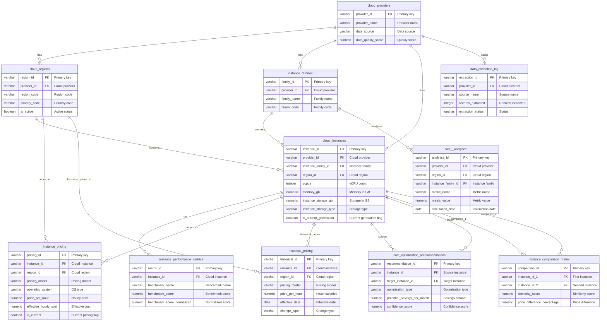

# Database Deliverable: db-14 - Cloud Instance Cost Database

**Database:** db-14
**Type:** Cloud Instance Cost Database
**Created:** 2026-02-05
**Status:** Complete

---

## Table of Contents

1. [Database Overview](#database-overview)
2. [Database Schema Documentation](#database-schema-documentation)
3. [SQL Queries](#sql-queries)
4. [Usage Instructions](#usage-instructions)

---

## Database Overview

### Description

This database provides comprehensive cloud instance cost analysis and optimization across AWS, GCP, and Azure. The database enables cost optimization, cross-cloud comparisons, and intelligent recommendations for cloud infrastructure decisions. It includes instance specifications, pricing data, performance metrics, historical pricing trends, and cost optimization recommendations.

### Key Features

- **Multi-Cloud Support**: Comprehensive data for AWS, GCP, and Azure instances
- **Pricing Models**: On-demand, reserved instances, spot instances, and savings plans
- **Performance Metrics**: CoreMark scores, FFmpeg FPS, and other benchmark data
- **Historical Pricing**: Track pricing changes over time for trend analysis
- **Cost Optimization**: AI-generated recommendations for cost savings
- **Cross-Provider Comparisons**: Instance matching and comparison matrices
- **Regional Analysis**: Pricing variations across regions and availability zones

### Database Platforms Supported

- **PostgreSQL**: Full support with standard SQL features
- **Databricks**: Compatible with Delta Lake and standard SQL
- **Databricks**: Full support with standard SQL features

### Data Sources

- **Vantage.sh**: Comprehensive cloud instance comparison with performance benchmarks
- **Infracost Cloud Pricing API**: GraphQL API with 3M+ prices
- **CloudPrice Developer Portal**: Unified pricing APIs
- **AWS APIs**: Price List API, EC2 Describe Instances API
- **Azure APIs**: Retail Prices API, VM Sizes API
- **GCP APIs**: Billing Catalog API, Compute Machine Types API
- **Data.gov**: Federal cloud spending datasets

---

## Database Schema Documentation

### Schema Overview

The database consists of **11 tables** organized into logical groups:

1. **Provider Metadata**: `cloud_providers`, `cloud_regions`, `instance_families`
2. **Instance Data**: `cloud_instances`, `instance_performance_metrics`
3. **Pricing Data**: `instance_pricing`, `historical_pricing`
4. **Optimization**: `cost_optimization_recommendations`, `instance_comparison_matrix`
5. **Analytics**: `cost__analytics`
6. **Operations**: `data_extraction_log`

### Table Relationships

```
cloud_providers (provider_id)
    ├── cloud_regions (provider_id)
    ├── instance_families (provider_id)
    ├── cloud_instances (provider_id)
    └── data_extraction_log (provider_id)

cloud_regions (region_id)
    ├── cloud_instances (region_id)
    ├── instance_pricing (region_id)
    └── historical_pricing (region_id)

instance_families (family_id)
    ├── cloud_instances (instance_family_id)
    └── cost__analytics (instance_family_id)

cloud_instances (instance_id)
    ├── instance_performance_metrics (instance_id)
    ├── instance_pricing (instance_id)
    ├── historical_pricing (instance_id)
    ├── cost_optimization_recommendations (instance_id, target_instance_id)
    └── instance_comparison_matrix (instance_id_1, instance_id_2)
```

### Entity-Relationship Diagram



---

## SQL Queries

This database includes **30 extremely complex SQL queries** designed for production use with business-oriented use cases. All queries are:

- **Cross-database compatible**: Work on PostgreSQL
- **Production-grade**: Use advanced SQL patterns including CTEs, recursive CTEs, window functions, and complex aggregations
- **Business-focused**: Each query addresses specific client use cases (cost optimization, migration planning, right-sizing, etc.)
- **Fully runnable**: No placeholders - ready to execute
- **Well-documented**: Each query includes business use case, description, complexity notes, and expected output

### Query List

The complete list of 30 queries is available in `queries/queries.md`. Each query includes:

1. **Query Number and Title**
2. **Use Case**: Real-world application scenario
3. **Description**: What the query achieves
4. **Business Value**: What the query produces for clients
5. **Purpose**: Why this query is valuable
6. **Complexity**: Technical details (CTEs, window functions, aggregations, etc.)
7. **SQL Code**: Complete, runnable SQL
8. **Expected Output**: Description of result set

### Query Categories

The queries cover the following business use cases:

1. **Cost Optimization** (Queries 1, 3, 4, 6, 7, 10, 11, 13, 16, 17, 18, 19, 20, 23, 24, 27)
   - Multi-provider cost-performance analysis
   - Reserved instance ROI analysis
   - Spot instance cost-benefit analysis
   - Regional pricing optimization
   - Instance right-sizing recommendations
   - Cost anomaly detection
   - Storage and network cost optimization

2. **Financial Planning** (Queries 2, 8, 9, 22, 25)
   - Historical pricing trend analysis
   - Cost forecasting
   - Long-term cost projections
   - Cost allocation analysis
   - Lifecycle cost analysis

3. **Migration Planning** (Queries 5, 8, 14, 15, 17, 28, 29)
   - Cross-provider instance matching
   - Multi-cloud migration cost analysis
   - Instance deprecation impact analysis
   - Cross-region cost comparison
   - Instance upgrade path analysis

4. **Risk Management** (Queries 4, 12, 14, 28)
   - Spot instance interruption risk analysis
   - Spot instance price volatility analysis
   - Regional risk assessment

5. **Analytics & ** (Queries 5, 21, 24, 26, 30)
   - Performance-cost correlation analysis
   - Instance comparison matrix generation
   - Recursive instance dependency analysis
   - Comprehensive cost  dashboard

### Accessing Queries

**Location**: `queries/queries.md`

**Format**: Each query is numbered sequentially (Query 1 through Query 30) and includes:
- Business use case description
- Complete SQL code in code blocks
- Detailed technical descriptions
- Complexity annotations
- Expected output descriptions

---

## Usage Instructions

### For Data Scientists

#### Prerequisites

1. **Database Access**: Ensure you have access to the database instance (PostgreSQL)
2. **Credentials**: Obtain database connection credentials
3. **Schema**: Ensure all tables are created and populated with data

#### Running Queries

1. **Open Query File**: Navigate to `queries/queries.md`
2. **Select Query**: Choose the query number you want to execute
3. **Review Business Case**: Understand the use case and expected output
4. **Copy SQL**: Copy the SQL code from the code block
5. **Execute**: Run the query in your database client:
   - **PostgreSQL**: Use `psql` or pgAdmin
   - **Databricks**: Use Databricks SQL editor or notebook
   - **Databricks**: Use Databricks web interface or SnowSQL

#### Understanding Results

- Each query includes a "Use Case" section explaining the real-world application
- Review the "Business Value" section to understand what the query produces
- Check the "Expected Output" section for result set descriptions
- Cost queries return pricing and optimization recommendations

### For Database Administrators

#### Schema Setup

1. **Create Tables**: Execute the schema creation scripts from `data/schema.sql`
2. **Create Indexes**: Ensure all indexes are created for optimal performance
3. **Load Data**: Populate tables with cloud instance data:
   - Provider and region metadata
   - Instance specifications
   - Pricing data
   - Performance metrics
4. **Verify**: Run validation queries to ensure data integrity

#### Performance Considerations

- **Indexes**: Critical for query performance (indexes on provider_id, region_id, instance_id)
- **Partitioning**: Consider partitioning large tables (`instance_pricing`, `historical_pricing`) by date
- **Analytics**: Use `cost__analytics` table for pre-computed aggregations
- **Monitoring**: Monitor query execution times, especially for complex joins

#### Cross-Database Compatibility

- **Data Types**: Uses standard SQL types compatible across all platforms
- **Functions**: Standard SQL functions work across all platforms
- Test queries on your target database before production use

#### Data Loading

1. **Provider Data**: Load cloud provider metadata
2. **Instance Data**: Load instance specifications from APIs or exports
3. **Pricing Data**: Load pricing data from APIs or exports
4. **Performance Metrics**: Load benchmark data from sources like Vantage.sh
5. **Monitoring**: Track data extraction using `data_extraction_log` table

---

## Additional Resources

- **Schema Documentation**: See `docs/SCHEMA.md` for detailed schema information
- **Data Dictionary**: See `docs/DATA_DICTIONARY.md` for column-level documentation
- **Validation Reports**: See `results/` directory for query validation results
- **Query Metadata**: See `queries/queries.json` for programmatic access to queries
- **ETL Pipeline**: See `research/etl_elt_pipeline.ipynb` for data ingestion workflows
- **Source Metadata**: See `research/source_metadata.json` for data source tracking

---

**Last Updated**: 2026-02-05
**Version**: 1.0
