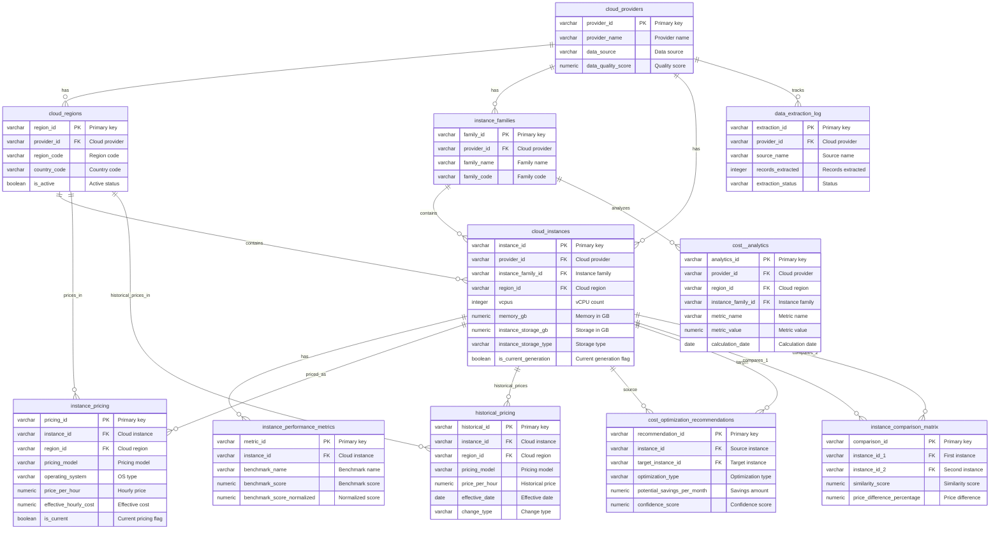

# Database Schema Documentation - db-14

**Created:** 2026-02-05

## Schema Overview

The Cloud Instance Cost  Database consists of 11 main tables designed to store and analyze cloud instance pricing, specifications, and performance data across AWS, GCP, and Azure.

## Tables

### cloud_providers
Stores cloud provider metadata (AWS, GCP, Azure).

**Key Columns:**
- `provider_id` (VARCHAR, PK) - 'aws', 'gcp', 'azure'
- `provider_name` (VARCHAR) - 'AWS', 'GCP', 'Azure'
- `provider_display_name` (VARCHAR)
- `api_base_url` (VARCHAR)
- `pricing_api_endpoint` (VARCHAR)
- `data_source` (VARCHAR) - 'vantage.sh', 'official_api', 'scraped'
- `data_quality_score` (NUMERIC)

### cloud_regions
Stores region metadata for all cloud providers.

**Key Columns:**
- `region_id` (VARCHAR, PK)
- `provider_id` (VARCHAR, FK → cloud_providers)
- `region_code` (VARCHAR) - 'us-east-1', 'us-central1', 'eastus'
- `region_name` (VARCHAR)
- `country_code` (VARCHAR)
- `continent` (VARCHAR)
- `is_active` (BOOLEAN)
- `availability_zones_count` (INTEGER)

### instance_families
Stores instance family metadata (General Purpose, Compute Optimized, etc.).

**Key Columns:**
- `family_id` (VARCHAR, PK)
- `provider_id` (VARCHAR, FK → cloud_providers)
- `family_name` (VARCHAR) - 'General Purpose', 'Compute Optimized', 'Memory Optimized'
- `family_code` (VARCHAR) - 'm5', 'c5', 'r5' for AWS
- `use_case_category` (VARCHAR)
- `target_workloads` (TEXT)

### cloud_instances
Core table storing all cloud instance specifications.

**Key Columns:**
- `instance_id` (VARCHAR, PK)
- `provider_id` (VARCHAR, FK → cloud_providers)
- `instance_name` (VARCHAR) - 'm5.large', 'n1-standard-4', 'Standard_D2s_v3'
- `api_name` (VARCHAR)
- `instance_family_id` (VARCHAR, FK → instance_families)
- `region_id` (VARCHAR, FK → cloud_regions)
- `vcpus` (INTEGER)
- `memory_gb` (NUMERIC)
- `instance_storage_gb` (NUMERIC)
- `instance_storage_type` (VARCHAR) - 'EBS', 'NVMe SSD', 'HDD', 'Local SSD'
- `network_performance` (VARCHAR)
- `network_bandwidth_gbps` (NUMERIC)
- `gpu_count` (INTEGER)
- `gpu_type` (VARCHAR)
- `architecture` (VARCHAR) - 'x86_64', 'arm64', 'amd64'
- `processor_type` (VARCHAR)
- `is_burstable` (BOOLEAN)
- `baseline_performance` (NUMERIC) - For burstable instances
- `is_current_generation` (BOOLEAN)
- `is_available` (BOOLEAN)
- `launch_date` (DATE)
- `deprecation_date` (DATE)

### instance_performance_metrics
Stores performance benchmark data (CoreMark, FFmpeg FPS, etc.).

**Key Columns:**
- `metric_id` (VARCHAR, PK)
- `instance_id` (VARCHAR, FK → cloud_instances)
- `benchmark_name` (VARCHAR) - 'CoreMark', 'FFmpeg FPS', 'SPECint', 'Geekbench'
- `benchmark_score` (NUMERIC)
- `benchmark_score_normalized` (NUMERIC) - Normalized across providers
- `test_date` (DATE)
- `source` (VARCHAR) - 'vantage.sh', 'official', 'third_party'
- `confidence_level` (NUMERIC)

### instance_pricing
Stores pricing data for all pricing models (on-demand, reserved, spot).

**Key Columns:**
- `pricing_id` (VARCHAR, PK)
- `instance_id` (VARCHAR, FK → cloud_instances)
- `region_id` (VARCHAR, FK → cloud_regions)
- `pricing_model` (VARCHAR) - 'on_demand', 'reserved_1yr', 'reserved_3yr', 'spot', 'savings_plan'
- `operating_system` (VARCHAR) - 'Linux', 'Windows', 'RHEL', 'SUSE'
- `currency` (VARCHAR) - Default 'USD'
- `price_per_hour` (NUMERIC)
- `price_per_month` (NUMERIC)
- `price_per_year` (NUMERIC)
- `upfront_cost` (NUMERIC) - For reserved instances
- `effective_hourly_cost` (NUMERIC) - Calculated effective cost
- `discount_percentage` (NUMERIC)
- `term_length_months` (INTEGER)
- `payment_option` (VARCHAR) - 'no_upfront', 'partial_upfront', 'all_upfront'
- `utilization_commitment` (NUMERIC) - For savings plans
- `is_current` (BOOLEAN)

### historical_pricing
Tracks pricing changes over time for trend analysis.

**Key Columns:**
- `historical_id` (VARCHAR, PK)
- `instance_id` (VARCHAR, FK → cloud_instances)
- `region_id` (VARCHAR, FK → cloud_regions)
- `pricing_model` (VARCHAR)
- `operating_system` (VARCHAR)
- `price_per_hour` (NUMERIC)
- `price_change_percentage` (NUMERIC)
- `price_change_amount` (NUMERIC)
- `effective_date` (DATE)
- `change_type` (VARCHAR) - 'price_increase', 'price_decrease', 'new_instance'
- `change_reason` (TEXT)

### cost_optimization_recommendations
Stores AI-generated cost optimization recommendations.

**Key Columns:**
- `recommendation_id` (VARCHAR, PK)
- `instance_id` (VARCHAR, FK → cloud_instances)
- `target_instance_id` (VARCHAR, FK → cloud_instances) - Recommended alternative
- `optimization_type` (VARCHAR) - 'rightsizing', 'reserved_instance', 'spot_instance', 'region_change'
- `current_cost_per_month` (NUMERIC)
- `recommended_cost_per_month` (NUMERIC)
- `potential_savings_per_month` (NUMERIC)
- `potential_savings_percentage` (NUMERIC)
- `confidence_score` (NUMERIC)
- `recommendation_reasoning` (TEXT)
- `implementation_complexity` (VARCHAR) - 'low', 'medium', 'high'
- `risk_level` (VARCHAR) - 'low', 'medium', 'high'
- `workload_compatibility_score` (NUMERIC)

### instance_comparison_matrix
Stores cross-provider instance comparisons.

**Key Columns:**
- `comparison_id` (VARCHAR, PK)
- `instance_id_1` (VARCHAR, FK → cloud_instances)
- `instance_id_2` (VARCHAR, FK → cloud_instances)
- `comparison_metric` (VARCHAR) - 'price_performance', 'cost_efficiency', 'spec_match'
- `similarity_score` (NUMERIC) - 0-100 similarity score
- `price_difference_percentage` (NUMERIC)
- `performance_difference_percentage` (NUMERIC)
- `vcpu_match` (BOOLEAN)
- `memory_match` (BOOLEAN)
- `storage_match` (BOOLEAN)
- `network_match` (BOOLEAN)

### data_extraction_log
Tracks data extraction operations from various sources.

**Key Columns:**
- `extraction_id` (VARCHAR, PK)
- `source_name` (VARCHAR) - 'vantage.sh', 'aws_api', 'gcp_api', 'azure_api'
- `source_url` (VARCHAR)
- `extraction_type` (VARCHAR) - 'api', 'scraping', 'export', 'manual'
- `provider_id` (VARCHAR, FK → cloud_providers)
- `records_extracted` (INTEGER)
- `records_successful` (INTEGER)
- `records_failed` (INTEGER)
- `extraction_start_time` (TIMESTAMP_NTZ)
- `extraction_end_time` (TIMESTAMP_NTZ)
- `extraction_duration_seconds` (INTEGER)
- `extraction_status` (VARCHAR) - 'success', 'failed', 'partial'

### cost__analytics
Pre-aggregated analytics for fast querying.

**Key Columns:**
- `analytics_id` (VARCHAR, PK)
- `provider_id` (VARCHAR, FK → cloud_providers)
- `region_id` (VARCHAR, FK → cloud_regions)
- `instance_family_id` (VARCHAR, FK → instance_families)
- `metric_name` (VARCHAR) - 'avg_price_per_vcpu', 'avg_price_per_gb_memory', 'price_performance_ratio'
- `metric_value` (NUMERIC)
- `metric_unit` (VARCHAR)
- `calculation_date` (DATE)
- `sample_size` (INTEGER)
- `percentile_25`, `percentile_50`, `percentile_75`, `percentile_90`, `percentile_95`, `percentile_99` (NUMERIC)
- `min_value`, `max_value` (NUMERIC)
- `std_deviation` (NUMERIC)

## Entity-Relationship Diagram

## Indexes

The database includes comprehensive indexes for optimal query performance:
- Provider, region, and family indexes for fast filtering
- Instance specification indexes (vcpus, memory) for matching queries
- Pricing indexes for cost analysis queries
- Performance metric indexes for benchmark queries
- Historical pricing indexes for trend analysis

## Relationships

- **cloud_providers** → **cloud_regions**: One-to-many (provider has multiple regions)
- **cloud_providers** → **instance_families**: One-to-many (provider has multiple families)
- **cloud_providers** → **cloud_instances**: One-to-many (provider has multiple instances)
- **cloud_regions** → **cloud_instances**: One-to-many (region contains multiple instances)
- **cloud_regions** → **instance_pricing**: One-to-many (region has multiple pricing entries)
- **instance_families** → **cloud_instances**: One-to-many (family contains multiple instances)
- **cloud_instances** → **instance_performance_metrics**: One-to-many (instance has multiple metrics)
- **cloud_instances** → **instance_pricing**: One-to-many (instance has multiple pricing models)
- **cloud_instances** → **cost_optimization_recommendations**: One-to-many (instance has multiple recommendations)
- **cloud_instances** → **instance_comparison_matrix**: Many-to-many (instances compared to other instances)

---
**Last Updated:** 2026-02-05
