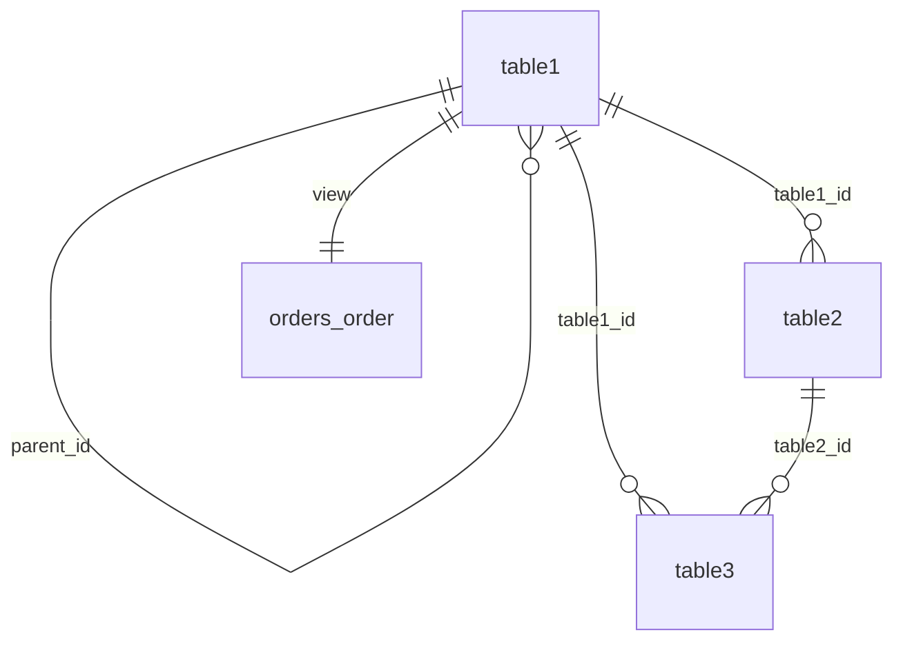

## db-3 Simplified Schema Overview

This document describes the **deployed schema** for db-3 (Hierarchical Orders). The schema is a simplified subset derived from the LinkWay production database, reduced from 65 tables to 3 base tables plus one view.

---

## Deployed Tables and View

### 1. `table1` (Main hierarchy table)

Root table for hierarchical order data. Used by all queries via the `orders_order` view.

| Column      | Type                     | Nullable | Description                          |
|-------------|--------------------------|----------|--------------------------------------|
| `id`        | BIGINT                   | NO (PK)  | Primary key.                         |
| `parent_id` | BIGINT                   | YES (FK) | Parent row in same table (hierarchy).|
| `name`      | VARCHAR(255)             | NO       | Name/label.                           |
| `value`     | NUMERIC(15,2)            | YES      | Numeric value (e.g. total_amount).    |
| `category`  | VARCHAR(100)             | YES      | Category (e.g. status).              |
| `date_col`  | DATE                     | YES      | Date field.                          |
| `created_at`| TIMESTAMP                | YES      | Creation timestamp.                   |
| `updated_at`| TIMESTAMP                | YES      | Last update timestamp.                |

**Constraints:** `parent_id` → `table1(id)` ON DELETE SET NULL.

---

### 2. `table2` (Related table)

Child of `table1`. Used by some queries.

| Column          | Type          | Nullable | Description                    |
|-----------------|---------------|----------|--------------------------------|
| `id`            | BIGINT        | NO (PK)  | Primary key.                   |
| `table1_id`     | BIGINT        | NO (FK)  | Parent row in table1.          |
| `related_value` | NUMERIC(15,2) | YES      | Related numeric value.         |
| `description`   | TEXT          | YES      | Long text (cross-platform).     |
| `date_col`      | DATE          | YES      | Date field.                    |
| `created_at`    | TIMESTAMP     | YES      | Creation timestamp.             |

**Constraints:** `table1_id` → `table1(id)` ON DELETE CASCADE.

---

### 3. `table3` (Additional related table)

Child of both `table1` and `table2`.

| Column         | Type          | Nullable | Description                |
|----------------|---------------|----------|----------------------------|
| `id`           | BIGINT        | NO (PK)  | Primary key.               |
| `table1_id`    | BIGINT        | NO (FK)  | Parent row in table1.      |
| `table2_id`    | BIGINT        | NO (FK)  | Parent row in table2.      |
| `metric_value` | NUMERIC(15,2) | YES      | Metric value.              |
| `status`       | VARCHAR(50)   | YES      | Status.                    |
| `created_at`   | TIMESTAMP     | YES      | Creation timestamp.         |

**Constraints:** `table1_id` → `table1(id)`, `table2_id` → `table2(id)` ON DELETE CASCADE.

---

### 4. `orders_order` (View)

View that maps `table1` to the `orders_order` shape expected by all 30 production queries.

| Column        | Type    | Source mapping                                      |
|---------------|---------|-----------------------------------------------------|
| `id`          | BIGINT  | `table1.id`                                        |
| `seller_id`   | BIGINT  | `COALESCE(table1.parent_id, table1.id)`            |
| `created_at`  | TIMESTAMP | `COALESCE(table1.created_at, table1.date_col)`   |
| `total_amount`| NUMERIC | `COALESCE(table1.value, 0)`                        |
| `status`      | VARCHAR | `COALESCE(table1.category, 'pending')`             |

---

## ERD (Simplified)

---

## ACID and Referential Integrity

- **Atomicity / Consistency:** Primary keys and NOT NULL on required FKs.
- **Isolation:** Standard transaction isolation (PostgreSQL default).
- **Durability:** WAL and persistent storage.
- **Referential integrity:** All FKs have explicit ON DELETE behavior (SET NULL for hierarchy root, CASCADE for children).

---

## Indexes

- `idx_table1_parent_id`, `idx_table1_category`, `idx_table1_date_col`
- `idx_table2_table1_id`
- `idx_table3_table1_id`, `idx_table3_table2_id`

---

For the full LinkWay production schema (65+ tables), see `DATA_DICTIONARY.md`.
