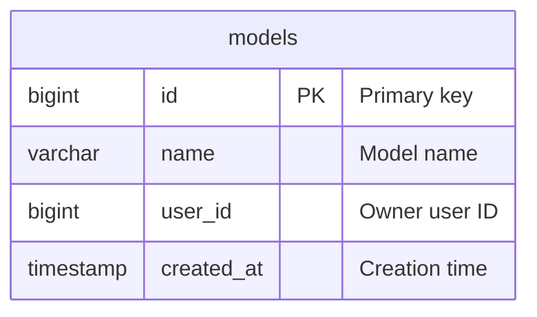

# db-4 SharedAI Models - Database Schema

## Overview

db-4 is a minimal SharedAI-style analytics database with a single `models` table. All 30 queries reference `models` for time-series, window functions, and aggregations.

## Schema: public

| Table | Description |
| :--- | :--- |
| **[models](DATA_DICTIONARY.md#models)** | AI model metadata: id, name, user_id, created_at |

## Entity Relationship

## Indexes

- `idx_models_created_at` on `models(created_at)`
- `idx_models_user_id` on `models(user_id)`
- `idx_models_name` on `models(name)`

## Platform Compatibility

- **PostgreSQL**: Full support (schema.sql, data.sql)
