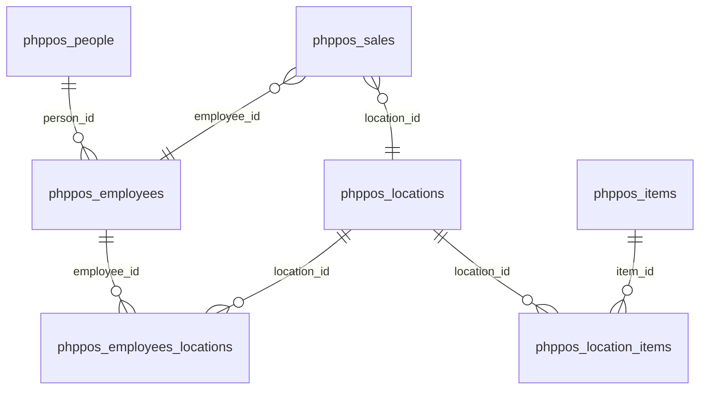

# DB-5 Schema Overview – Lucasa POS Retail

This document describes the **logical schema** of the db-5 POS (Point-of-Sale) database. It is a minimal phppos schema for PostgreSQL, containing only the tables needed for gov-rebuilt data and queries.

**Database:** db-5 (Lucasa POS Retail)  
**Source:** Anonymized retail Point-of-Sale dataset from a family business in Kenya  
**Engine:** PostgreSQL (InnoDB-compatible)

---

## Main Domains

### People & Employees
- `phppos_people` — Base table for all persons (customers, employees, suppliers).
- `phppos_employees` — Employee accounts linked to people.
- `phppos_employees_locations` — Many-to-many: employees assigned to locations.

### Products & Inventory
- `phppos_items` — Product/item master data.
- `phppos_locations` — Store location definitions.
- `phppos_location_items` — Location-specific inventory quantities.

### Sales
- `phppos_sales` — Main sales transaction header.

---

## Data Flow

```
┌─────────────────────────────────────────────────────────────────────────┐
│                           phppos_people                                  │
│         (person_id PK, first_name, last_name, email, address, etc.)       │
└─────────────────────────────────────┬───────────────────────────────────┘
                                     │
                                     │ person_id
                                     ▼
┌─────────────────────────────────────────────────────────────────────────┐
│                         phppos_employees                                 │
│              (person_id FK, username, password, balance, deleted)        │
└─────────────────────────────────────┬───────────────────────────────────┘
                                     │
          ┌──────────────────────────┼──────────────────────────┐
          │ employee_id              │                          │
          ▼                          │                          │
┌─────────────────────┐              │              ┌─────────────────────┐
│ phppos_employees_   │              │              │    phppos_sales      │
│ locations           │              │              │ (sale_id, employee_id,│
│ (employee_id,       │              └──────────────│  sale_time, customer_ │
│  location_id)       │                            │  id, payment_type,   │
└─────────────────────┘                            │  location_id)       │
          │                                        └─────────────────────┘
          │ location_id                                      │
          ▼                                                  │ location_id
┌─────────────────────────────────────────────────────────────────────────┐
│                         phppos_locations                                 │
│    (location_id PK, name, address, default_tax_*, deleted)              │
└─────────────────────────────────────┬───────────────────────────────────┘
                                      │
                                      │ location_id, item_id
                                      ▼
┌─────────────────────────────────────────────────────────────────────────┐
│                      phppos_location_items                               │
│              (location_id, item_id, quantity)                            │
└─────────────────────────────────────┬───────────────────────────────────┘
                                      │ item_id
                                      ▼
┌─────────────────────────────────────────────────────────────────────────┐
│                          phppos_items                                    │
│  (item_id PK, name, category, cost_price, unit_price, deleted, etc.)     │
└─────────────────────────────────────────────────────────────────────────┘
```

---

## Table Relationships (ERD)



---

## Primary Join Keys

```
phppos_people.person_id ─────── phppos_employees.person_id
phppos_employees (person_id) ── phppos_employees_locations.employee_id
phppos_locations.location_id ─ phppos_employees_locations.location_id
phppos_locations.location_id ─ phppos_location_items.location_id
phppos_items.item_id ───────── phppos_location_items.item_id
phppos_sales.employee_id ───── phppos_employees (via person_id / employee linkage)
phppos_sales.location_id ───── phppos_locations.location_id
```

---

## Core Tables

### 1. `phppos_people`
Base table for persons. One row per customer, employee, or supplier.

- **PK:** `person_id`
- **Key columns:** `first_name`, `last_name`, `phone_number`, `email`, `address_1`, `address_2`, `city`, `state`, `zip`, `country`, `comments`

### 2. `phppos_employees`
Employee accounts linked to people.

- **FK:** `person_id` → `phppos_people(person_id)`
- **Key columns:** `username`, `password`, `balance`, `deleted`, `hide_from_switch_user`
- **Note:** In phppos, employees are identified by `person_id`; `employee_id` is typically the same as `person_id` in application logic.

### 3. `phppos_employees_locations`
Assigns employees to locations.

- **FK:** `employee_id` → `phppos_employees.person_id` (or equivalent)
- **FK:** `location_id` → `phppos_locations.location_id`

### 4. `phppos_items`
Product catalog.

- **PK:** `item_id`
- **Key columns:** `name`, `category`, `description`, `cost_price`, `unit_price`, `allow_alt_description`, `is_serialized`, `override_default_tax`, `is_service`, `deleted`

### 5. `phppos_locations`
Store locations.

- **PK:** `location_id`
- **Key columns:** `name`, `address`, `phone`, `fax`, `email`, `default_tax_1_rate` … `default_tax_5_rate`, `deleted`

### 6. `phppos_location_items`
Location-specific inventory quantities.

- **FK:** `location_id` → `phppos_locations.location_id`
- **FK:** `item_id` → `phppos_items.item_id`
- **Key columns:** `quantity`

### 7. `phppos_sales`
Sales transaction header.

- **PK:** `sale_id`
- **FK:** `employee_id` → `phppos_employees`
- **FK:** `location_id` → `phppos_locations.location_id`
- **Key columns:** `sale_time`, `customer_id`, `payment_type`

---

## ACID & Integrity Notes

- **Atomicity:** Transactions are handled by the database engine.
- **Consistency:** Foreign keys and constraints enforce referential integrity.
- **Isolation:** Default transaction isolation applies.
- **Durability:** Committed data is persisted.

For detailed column definitions, see `DATA_DICTIONARY.md`.
