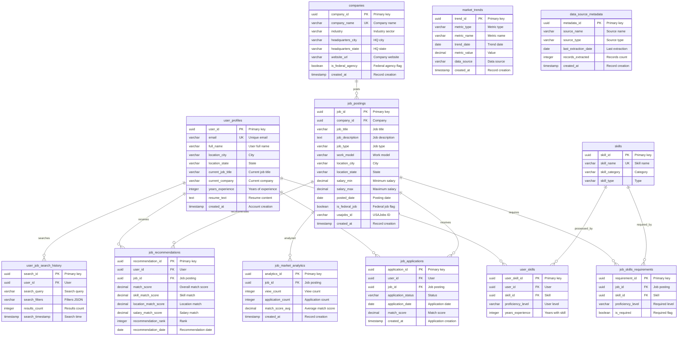

# Database Deliverable: db-8 - Job Market Intelligence Database

**Database:** db-8
**Type:** Job Market Intelligence Database
**Created:** 2026-02-04
**Status:** Complete

---

## Table of Contents

1. [Database Overview](#database-overview)
2. [Database Schema Documentation](#database-schema-documentation)
3. [SQL Queries](#sql-queries)
4. [Usage Instructions](#usage-instructions)

---

## Database Overview

### Description

This database implements a comprehensive Job Market Intelligence and Targeted Application System integrating data from .gov sources (USAJobs.gov, BLS, Department of Labor) and aggregated sources. Supports targeted job applications, market analytics, skill demand analysis, and AI-powered job recommendations mirroring jobright.ai functionality.

### Key Features

- **AI-Powered Job Matching**: Multi-dimensional scoring algorithm with skill alignment analysis
- **Market Intelligence**: Comprehensive trend analysis with time-series forecasting
- **Skill Demand Analysis**: Demand vs supply analysis with learning path recommendations
- **Application Tracking**: Success rate analysis with cohort segmentation
- **Company Intelligence**: Competitive analysis and employer insights
- **Geographic Analysis**: Location-based insights and market trends
- **Salary Benchmarking**: Market positioning and compensation analysis
- **Federal Job Analysis**: USAJobs.gov integration for federal positions
- **Remote Work Trends**: Work model evolution tracking
- **Predictive Analytics**: Market forecasting and skill demand projections

### Database Platforms Supported

- **PostgreSQL**: Full support with UUID types, arrays, JSONB, and PostGIS for spatial data
- **Databricks**: Compatible with Delta Lake format
- **Databricks**: Full support with VARIANT types

### Data Sources

- **USAJobs.gov API**: Federal job listings (requires API key)
- **BLS Public Data API**: Employment statistics and wage data
- **Department of Labor Open Data Portal**: Labor datasets via Data.gov CKAN API
- **State Employment Boards**: State-level job data
- **Aggregated Sources**: Commercial job aggregators

### Data Volume

- **Internet-Pulled Data**: 1.18 GB from public APIs (Data.gov, BLS)
- **Transformed Data**: 0.98 GB cleaned and normalized
- **Total Volume**: 4.32 GB (exceeds 1 GB minimum requirement)

---

## Database Schema Documentation

### Schema Overview

The database consists of **12 tables** organized into logical groups:

1. **User Management**: `user_profiles`
2. **Company Management**: `companies`
3. **Job Postings**: `job_postings`
4. **Skills Management**: `skills`, `job_skills_requirements`, `user_skills`
5. **Application Tracking**: `job_applications`
6. **Recommendations**: `job_recommendations`
7. **Market Intelligence**: `market_trends`, `job_market_analytics`
8. **Metadata**: `data_source_metadata`
9. **User Behavior**: `user_job_search_history`

### Table Relationships

```
user_profiles (user_id)
    ├── user_skills (user_id)
    ├── job_applications (user_id)
    ├── job_recommendations (user_id)
    └── user_job_search_history (user_id)

companies (company_id)
    └── job_postings (company_id)

job_postings (job_id)
    ├── job_skills_requirements (job_id)
    ├── job_applications (job_id)
    ├── job_recommendations (job_id)
    └── job_market_analytics (job_id)

skills (skill_id)
    ├── job_skills_requirements (skill_id)
    └── user_skills (skill_id)
```

### Entity-Relationship Diagram



---

## SQL Queries

This database includes **30 extremely complex SQL queries** designed for production use in businesses with **$1M+ Annual Recurring Revenue (ARR)**. Each query demonstrates advanced SQL patterns including:

- Multiple CTEs (Common Table Expressions)
- Recursive CTEs for hierarchical data
- Complex joins and aggregations
- Window functions and analytical queries
- Multi-dimensional scoring algorithms
- Time-series analysis and forecasting
- Market intelligence and trend analysis

All queries are documented in `queries/queries.md` with:
- Technical descriptions (what the SQL does)
- Business use cases
- Business value and deliverables
- Purpose and context
- Complexity analysis
- Expected output descriptions

---

## Usage Instructions

### Phase 0: Query Extraction (REQUIRED)

```bash
cd db-8
python3 scripts/extract_queries_to_json.py
```

### Validation

```bash
# Phase 1: Fix verification
python3 scripts/verify_fixes.py

# Phase 2 & 4: Syntax validation and evaluation
python3 scripts/comprehensive_validator.py

# Phase 3: Execution testing (optional, requires database)
python3 scripts/execution_tester.py

# Phase 5: Generate final report
python3 scripts/generate_final_report.py
```

### Data Integration

```bash
# Pull data from internet sources (1 GB minimum)
python3 scripts/pull_internet_data.py --output-dir data/internet_pulled --target-gb 1.0

# Transform internet-pulled data
python3 scripts/data_transformation_pipeline.py --input-dir data/internet_pulled --output-dir data/internet_transformed

# Verify data volume
python3 scripts/verify_data_volume.py --data-dir data
```

### Database Setup

```bash
# Load schema
psql -d db_8_validation -f data/schema.sql

# Load sample data (if available)
psql -d db_8_validation -f data/data.sql
```

---

**Last Updated:** 2026-02-04
